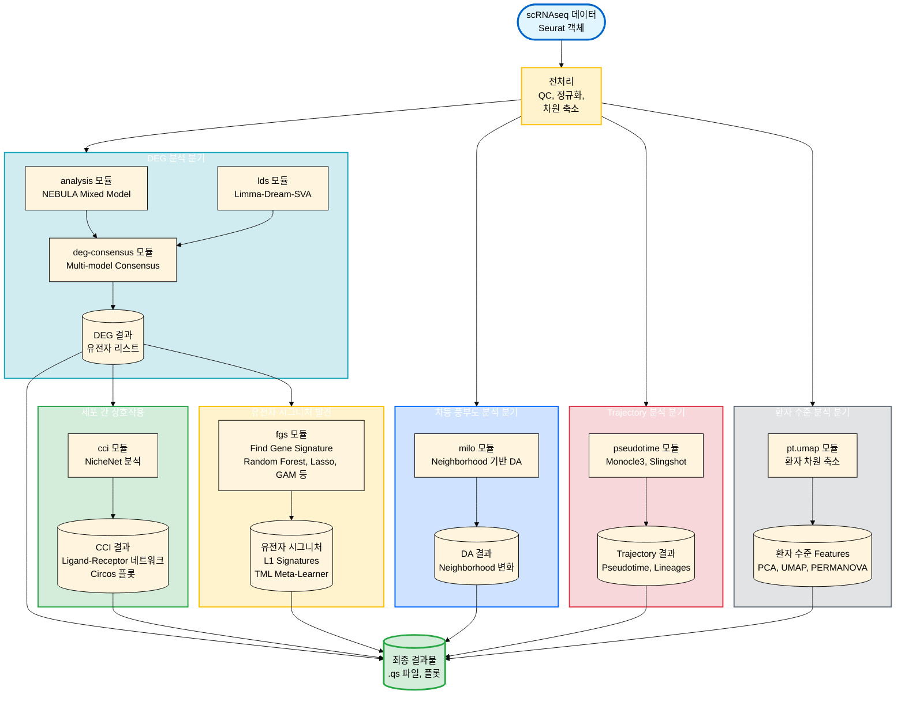

# myR 패키지: 단일세포 RNA 시퀀싱 분석 통합 가이드

이 문서는 `myR` 패키지의 전체 분석 모듈 통합 가이드입니다. 단일세포 RNA 시퀀싱(scRNAseq) 데이터 분석 파이프라인에서 각 모듈의 역할, 입력/출력, 그리고 모듈 간 관계를 설명합니다.

## 1. 개요 (Overview)

`myR`는 단일세포 RNA 시퀀싱 데이터를 위한 통합 분석 패키지입니다. 차등 발현 분석(DEG), 세포 간 상호작용(CCI), 차등 풍부도 분석, 환자 수준 분석, trajectory 분석 등 다양한 분석 모듈을 제공합니다.

### 주요 특징
- **통합 파이프라인**: Seurat 객체를 중심으로 한 일관된 데이터 구조
- **다양한 분석 방법론**: Pseudobulk, Mixed Model, Single-cell 등 다양한 DEG 방법론 지원
- **Consensus 분석**: 여러 방법론의 결과를 통합하여 신뢰도 높은 결과 도출
- **시각화**: 논문 수준의 플롯 자동 생성

## 2. 모듈 개요 및 워크플로우 (Module Overview & Workflow)

### 2.1 전체 분석 파이프라인



### 2.2 모듈별 상세 정보

| 모듈 | 목적 | 입력 | 출력 | 주요 방법론 |
|------|------|------|------|------------|
| **analysis** | Mixed-Effects Model DEG | Seurat 객체, Formula | DEG 결과 (.qs) | NEBULA, muscat |
| **deg-consensus** | Multi-model DEG Consensus | Seurat 객체, 여러 DEG 결과 | Consensus DEG 리스트 | limma, edgeR, DESeq2, muscat, nebula, dream |
| **lds** | SVA 보정 LMM DEG | Seurat/DGEList, Formula | MArrayLM 객체, SV 행렬 | limma-dream, SVA |
| **milo** | 차등 풍부도 | Seurat 객체 | DA 결과 (.qs) | MiloR, GLM |
| **cci** | 세포 간 상호작용 | Seurat 객체, DEG 리스트 | Ligand-Receptor 네트워크 | NicheNet |
| **fgs** | 유전자 시그니처 발견 | Seurat 객체, Target 변수 | 유전자 시그니처, TML 모델 | Random Forest, Lasso, GAM, PCA, NMF |
| **pt.umap** | 환자 수준 분석 | Seurat 객체 | 환자 Features, PCA/UMAP | CLR 변환, Signature Scores |
| **pseudotime** | Trajectory 추론 | Seurat 객체 | Pseudotime, Lineages | Monocle3, Slingshot, GAM |

## 3. 모듈 상세 (Module Details)

### 3.1 DEG 분석 모듈

#### analysis 모듈
- **목적**: 환자 수준의 변동성을 고려한 Mixed-Effects Model 기반 DEG 분석
- **입력**: Seurat 객체, Formula (예: `~ g3 + sex + anno3.scvi + (1|GEM/hos_no)`)
- **출력**: NEBULA 결과 요약 (.qs), 통계 테이블
- **특징**: Nested Random Effect 지원, 복잡한 실험 설계 지원
- **상세 문서**: `docs/analysis/ANALYSIS_INTEGRATED_GUIDE_KR.md`

#### deg-consensus 모듈
- **목적**: 여러 DEG 방법론의 결과를 통합하여 Consensus DEG 리스트 생성
- **입력**: Seurat 객체 또는 사전 계산된 DEG 리스트들
- **출력**: Consensus DEG 리스트, Agreement Scores, 시각화 플롯
- **특징**: 10개 이상의 방법론 지원, Agreement Score 기반 필터링
- **상세 문서**: `docs/deg-consensus-dev/DEG_CONSENSUS_INTEGRATED_GUIDE_KR.md`

#### lds 모듈
- **목적**: SVA를 이용한 숨겨진 공변량 탐지 및 Limma-Dream 기반 LMM DEG 분석
- **입력**: Seurat/DGEList/Matrix, Formula, 메타데이터
- **출력**: MArrayLM 객체, SV 행렬, 상관관계 히트맵
- **특징**: GeoMx 데이터에 적합, 잔차 분산 기반 SV 탐지
- **상세 문서**: `docs/lds/LDS_INTEGRATED_GUIDE_KR.md`

### 3.2 차등 풍부도 모듈

#### milo 모듈
- **목적**: Neighborhood 기반 차등 풍부도(Differential Abundance) 분석
- **입력**: Seurat 객체, 환자/샘플 ID, 클러스터 ID, Target 변수
- **출력**: DA 결과 (.qs), UMAP 플롯, Beeswarm 플롯
- **특징**: kNN 그래프 기반 Neighborhood 생성, Block Method 지원
- **상세 문서**: `docs/milo/MILO_INTEGRATED_GUIDE_KR.md`

### 3.3 Trajectory 분석 모듈

#### pseudotime 모듈
- **목적**: 세포 분화 경로 추론 및 Pseudotime 기반 유전자 동역학 분석
- **입력**: Seurat 객체, 메타데이터 (시간 변수 등)
- **출력**: Pseudotime, Lineages, 유전자 동역학 결과
- **특징**: Monocle3, Slingshot 지원, GAM 기반 동역학 모델링
- **상세 문서**: `docs/pseudotime-dev/PSEUDOTIME_INTEGRATED_GUIDE_KR.md`

### 3.4 환자 수준 분석 모듈

#### pt.umap 모듈
- **목적**: 셀 레벨 데이터를 환자 수준으로 집계하여 차원 축소 및 이상 탐지
- **입력**: Seurat 객체, 클러스터 ID, 환자 ID
- **출력**: 환자 수준 Features, PCA/UMAP, PERMANOVA 결과
- **특징**: Frequency View, Signature View, Latent View 지원
- **상세 문서**: `docs/pt.umap/PT_UMAP_INTEGRATED_GUIDE_KR.md`

### 3.5 세포 간 상호작용 모듈

#### cci 모듈
- **목적**: NicheNet 기반 세포 간 상호작용 분석 (Ligand-Receptor-Target 네트워크)
- **입력**: Seurat 객체, DEG 리스트 (Receiver 클러스터)
- **출력**: Ligand-Receptor 네트워크, Circos 플롯, 히트맵
- **특징**: DEG 리스트 직접 입력 지원, 자동 Sender 식별
- **상세 문서**: `docs/cci/CCI_INTEGRATED_GUIDE_KR.md`

### 3.6 유전자 시그니처 발견 모듈

#### fgs 모듈
- **목적**: 그룹을 구분하는 유전자 시그니처 발견 및 Meta-Learner 구축
- **입력**: Seurat 객체, Target 변수, Control 변수
- **출력**: L1 Signatures (각 방법론별), TML 모델 (L2), 유전자 중요도
- **특징**: Random Forest, Lasso, GAM, PCA, NMF 등 다양한 방법론 지원
- **상세 문서**: `docs/fgs/FGS_TML_INTEGRATED_GUIDE_KR.md`

## 4. 일반적인 분석 워크플로우 (Typical Analysis Workflows)

### 4.1 DEG 분석 워크플로우
```
1. 전처리 (QC, 정규화)
   ↓
2. analysis 모듈 (NEBULA) 또는 lds 모듈 (Limma-Dream-SVA)
   ↓
3. deg-consensus 모듈 (여러 방법론 통합)
   ↓
4. DEG 리스트 활용:
   - cci 모듈 (세포 간 상호작용 분석)
   - fgs 모듈 (시그니처 발견)
```

### 4.2 종합 분석 워크플로우
```
1. 전처리
   ↓
2. 병렬 분석:
   - DEG 분석 (analysis, deg-consensus)
   - 차등 풍부도 분석 (milo)
   - Trajectory 분석 (pseudotime)
   - 환자 수준 분석 (pt.umap)
   ↓
3. 통합:
   - CCI 분석 (cci) - DEG 결과 활용
   - 시그니처 발견 (fgs) - DEG 결과 활용
   ↓
4. 최종 결과물: .qs 파일, 플롯
```

## 5. 데이터 형식 및 요구사항 (Data Format & Requirements)

### 공통 입력 형식
- **Seurat 객체**: `.qs` 포맷으로 저장된 Seurat 객체
- **메타데이터 컬럼**:
  - `hos_no` 또는 `patient_id`: 환자/샘플 식별자
  - `anno3.scvi` 또는 `cluster_id`: 클러스터 정보
  - `g3` 또는 `target_var`: 주요 그룹 변수
  - 기타 공변량: `sex`, `age`, `batch` 등

### 출력 형식
- **결과 객체**: `.qs` 포맷 (R 객체 저장)
- **플롯**: `.png`, `.pdf` 포맷
- **통계 테이블**: CSV 또는 R 데이터프레임

## 6. 빠른 시작 (Quick Start)

### 기본 DEG 분석
```r
# 1. 패키지 로드
devtools::load_all("/path/to/myR")

# 2. 데이터 로드
sobj <- qs::qread("path/to/seurat_object.qs")

# 3. 분석 실행 (NEBULA)
source("scripts/analysis/run_formula1_analysis.R")

# 4. Consensus 실행
source("scripts/deg-consensus-dev/run_consensus_simple.R")
```

### CCI 분석
```r
# 1. DEG 리스트 준비 (analysis 또는 deg-consensus 결과)
deg_df <- read.csv("deg_results.csv")

# 2. CCI 분석 실행
source("myR/R/cci/run_cci_analysis.R")
results <- run_cci_analysis(
  sobj = sobj,
  deg_df = deg_df,
  receiver_cluster = "CD4+ T-cells"
)
```

## 7. 모듈 문서 (Module Documentation)

각 모듈의 상세한 사용법, 파라미터, 예제는 다음 문서를 참조하세요:

| 모듈 | 영문 가이드 | 한글 가이드 |
|------|------------|-------------|
| **analysis** | `docs/analysis/ANALYSIS_INTEGRATED_GUIDE.md` | `docs/analysis/ANALYSIS_INTEGRATED_GUIDE_KR.md` |
| **deg-consensus** | `docs/deg-consensus-dev/DEG_CONSENSUS_INTEGRATED_GUIDE.md` | `docs/deg-consensus-dev/DEG_CONSENSUS_INTEGRATED_GUIDE_KR.md` |
| **lds** | `docs/lds/LDS_INTEGRATED_GUIDE.md` | `docs/lds/LDS_INTEGRATED_GUIDE_KR.md` |
| **milo** | `docs/milo/MILO_INTEGRATED_GUIDE.md` | `docs/milo/MILO_INTEGRATED_GUIDE_KR.md` |
| **cci** | `docs/cci/CCI_INTEGRATED_GUIDE.md` | `docs/cci/CCI_INTEGRATED_GUIDE_KR.md` |
| **fgs** | `docs/fgs/FGS_TML_INTEGRATED_GUIDE.md` | `docs/fgs/FGS_TML_INTEGRATED_GUIDE_KR.md` |
| **pt.umap** | `docs/pt.umap/PT_UMAP_INTEGRATED_GUIDE.md` | `docs/pt.umap/PT_UMAP_INTEGRATED_GUIDE_KR.md` |
| **pseudotime** | `docs/pseudotime-dev/PSEUDOTIME_INTEGRATED_GUIDE.md` | `docs/pseudotime-dev/PSEUDOTIME_INTEGRATED_GUIDE_KR.md` |

## 8. 모범 사례 (Best Practices)

1. **데이터 검증**: 각 모듈 실행 전 필수 메타데이터 컬럼 확인
2. **결과 저장**: 중간 결과는 `.qs` 포맷으로 저장하여 재사용
3. **메모리 관리**: 대규모 데이터셋 분석 시 다운샘플링으로 먼저 테스트
4. **Consensus 활용**: 단일 방법론보다 `deg-consensus`를 통한 통합 결과 사용 권장
5. **문서 참조**: 각 모듈의 통합 가이드에서 상세 파라미터 및 주의사항 확인

## 9. 문제 해결 (Troubleshooting)

### 공통 이슈
- **메모리 부족**: 데이터 다운샘플링 또는 배치 처리
- **의존성 오류**: `renv::activate()` 후 패키지 재설치
- **결과 불일치**: 각 모듈의 버전 및 파라미터 확인

### 모듈별 이슈
각 모듈의 통합 가이드에서 "Critical Warnings" 섹션을 참조하세요.

## 10. 참고 자료 (References)

- **Seurat**: https://satijalab.org/seurat/
- **NEBULA**: https://github.com/lhe17/nebula
- **NicheNet**: https://github.com/saeyslab/nichenetr
- **MiloR**: https://bioconductor.org/packages/MiloR/
- **Monocle3**: https://cole-trapnell-lab.github.io/monocle3/
- **Slingshot**: https://bioconductor.org/packages/Slingshot/

---

**최종 업데이트**: 2025-01-XX  
**패키지 버전**: `myR/DESCRIPTION` 참조

