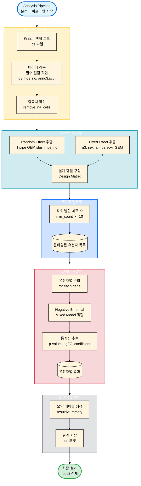

# Analysis Module 통합 가이드

이 문서는 `analysis` 모듈의 통합 가이드입니다. NEBULA 및 muscat을 이용한 차등 발현 분석(DEA) 파이프라인을 설명합니다.

## 1. 소개 (Introduction)

### 목적
단일세포 RNA 시퀀싱 데이터에서 환자(Subject) 수준의 변동성을 고려하여, 그룹 간 차등 발현 유전자(DEG)를 정확하게 검출하는 것이 목표입니다.

### 핵심 기능
*   **Mixed-Effects Model**: NEBULA 패키지를 사용하여 환자 간 변이(Random Effect)를 모델링합니다.
*   **유연한 Formula**: 복잡한 실험 설계(교호작용, 공변량 보정)를 지원합니다.
*   **대화형/배치 실행**: 경량 테스트부터 전체 데이터 분석까지 다양한 실행 모드를 제공합니다.

### Formula 1
현재 표준 분석에 사용되는 Formula는 다음과 같습니다:
```r
~ g3 + sex + anno3.scvi + GEM + g3:anno3.scvi + sex:anno3.scvi + (1|GEM/hos_no)
```
*   **g3**: 주요 그룹 변수 (Target)
*   **sex**: 성별 (Covariate)
*   **anno3.scvi**: 세포 타입 (Covariate)
*   **GEM**: 배치 (Fixed Effect로 처리)
*   **(1|GEM/hos_no)**: Nested Random Effect (환자는 GEM에 종속)

## 2. 워크플로우 시각화 (Workflow Visualization)



### 2.1 분석 파이프라인

1.  **데이터 로드**: Seurat 객체(`.qs`) 로드
2.  **데이터 검증**: 필수 컬럼(`g3`, `hos_no`, `anno3.scvi` 등) 및 결측치 확인
3.  **Formula 파싱**: Random Effect와 Fixed Effect 분리, 설계 행렬 구성
4.  **NEBULA 실행**: 각 유전자별 Negative Binomial Mixed Model 적합
5.  **결과 저장**: `.qs` 포맷으로 결과 요약 및 통계 저장

### 2.2 실행 방법

**1. 경량 테스트 (권장)**
빠르게 파이프라인 동작을 검증합니다.
```bash
Rscript scripts/analysis/test_formula1_light.R
```

**2. 전체 데이터 분석**
전체 데이터셋에 대해 분석을 수행합니다 (수 시간 소요 가능).
```bash
Rscript scripts/analysis/run_formula1_analysis.R
```

**3. 인터랙티브 실행**
R 세션에서 직접 함수를 호출하여 분석합니다.
```r
source("scripts/analysis/run_formula1_interactive.R")
result <- run_formula1_analysis_interactive()
```

## 3. 방법론 (Methodology)

### NEBULA 모델 구조
NEBULA (Negative Binomial mixed-effects model)는 다음과 같은 수식을 따릅니다:

$$Y_{ij} \sim \text{NB}(\mu_{ij}, \phi)$$
$$\log(\mu_{ij}) = \log(\text{offset}_{ij}) + X_{ij}^T \beta + b_i$$

*   $Y_{ij}$: 유전자 $j$, 세포 $i$의 Count
*   $X_{ij}$: Fixed Effects (그룹, 성별, 배치 등)
*   $b_i$: Random Effect (환자 특이적 변이, $b_i \sim N(0, \sigma^2_b)$)

### 완전 분리 (Complete Separation) 문제
*   **현상**: 특정 Fixed Effect 조합에 데이터가 하나도 없는 경우 (예: 특정 GEM에는 g3=1인 환자만 존재).
*   **문제**: 설계 행렬이 특이(Singular)해져 계수 추정이 불가능합니다.
*   **해결**: 
    *   Random Effect와 Fixed Effect 간의 완전 분리는 문제되지 않습니다 (환자 내 변이가 아닌 환자 간 비교이므로).
    *   Fixed Effect 간 완전 분리가 발생하면 해당 공변량을 제거하거나, 데이터셋을 필터링해야 합니다.

## 4. 문제 해결 (Troubleshooting)

### 1. "Formula에 random effects가 없습니다"
*   Formula에 `(1|...)` 구문이 포함되어 있는지 확인하세요.
*   NEBULA는 최소 1개의 Random Effect를 요구합니다.

### 2. "설계 행렬이 특이(singular)합니다"
*   완전 분리 문제가 발생했습니다. 교호작용 항을 단순화하거나, `min_count`를 높여 희소 유전자를 제외하세요.

### 3. 메모리 부족 / 긴 실행 시간
*   `light_test = TRUE`로 먼저 테스트하세요.
*   `min_count`를 20 이상으로 높이세요.
*   대용량 데이터는 클러스터별로 나누어 분석하는 것을 고려하세요.

## 5. 부록 (Appendix)

### 주요 파라미터
*   `min_count`: 최소 발현 세포 수 (기본값: 10). 이보다 적은 세포에서 발현된 유전자는 제외.
*   `remove_na_cells`: NA 값을 포함한 세포 제거 여부 (기본값: TRUE).
*   `layer`: 분석할 Assay Layer (기본값: "counts").

### 결과 파일 구조
*   `result$summary`: 유전자별 통계 (p-value, logFC 등).
*   `result$formula`: 사용된 Formula.
*   `result$fixed_effects`: 추정된 Fixed Effects 계수 목록.

