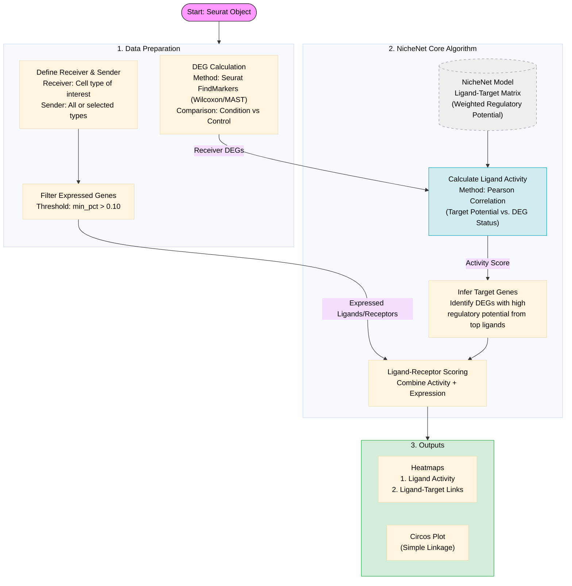
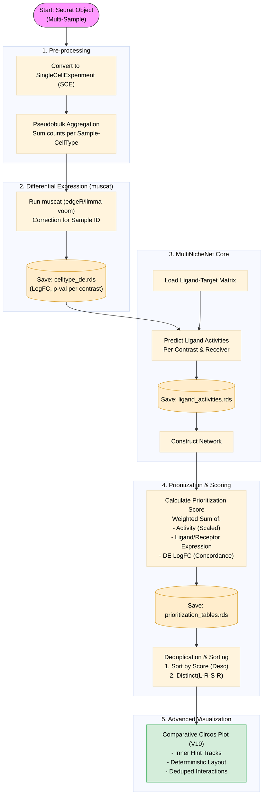

# Cell-to-Cell Interaction (CCI) Analysis 통합 가이드

이 문서는 Cell-to-Cell Interaction (CCI) 분석 모듈의 통합 가이드입니다. NicheNet을 기반으로 하여 ligand-receptor 상호작용을 분석하고, 사전 계산된 DEG 리스트를 활용하여 유연한 분석을 지원합니다.

## 1. 소개 (Introduction)

### 목적
단일세포 RNA 시퀀싱(scRNAseq) 데이터에서 세포 간 상호작용을 분석하여, 특정 조건(예: 질병 vs 정상)에서 **Receiver 세포**의 유전자 발현 변화(DEG)를 유도하는 **Sender 세포**와 **Ligand**를 식별합니다.

### 핵심 기능
1.  **DEG 리스트 직접 입력**: `FindMarkers`, `limma`, `edgeR` 등 다양한 방법으로 계산된 DEG 리스트를 직접 입력받아 분석합니다.
2.  **자동 Sender 식별**: Receiver를 제외한 모든 클러스터를 자동으로 Sender로 설정하거나, 사용자가 지정할 수 있습니다.
3.  **NicheNet 통합**: NicheNet 데이터베이스를 활용하여 Ligand-Receptor-Target 유전자 네트워크를 구축합니다.
4.  **논문 수준 시각화**: Circos plot, 히트맵 등 다양한 시각화 결과물을 자동 생성합니다.

### 주요 용어
*   **Sender**: 신호(Ligand)를 보내는 세포 유형.
*   **Receiver**: 신호(Ligand)를 받아 반응하는 세포 유형. Target Gene의 발현 변화(DEG)가 관찰되는 세포입니다.
*   **Ligand**: Sender 세포에서 분비되어 Receiver 세포의 Receptor와 결합하는 물질.
*   **Receptor**: Receiver 세포 표면에 존재하며 Ligand와 결합하는 단백질.
*   **Target Gene**: Ligand-Receptor 상호작용에 의해 발현이 조절되는 하위 유전자 (DEG).

## 2. 워크플로우 시각화 (Workflow Visualization)

### 2.1. Basic NicheNet Workflow (Standard/Single-Condition)

이 워크플로우는 **단일 조건** 또는 **단순 비교**(예: Normal vs Tumor)에서 특정 Receiver 세포의 DEG를 설명하는 Ligand를 찾을 때 사용됩니다.



### 2.2. MultiNicheNet Workflow (Complex/Multi-Sample)

이 워크플로우는 **Multi-Sample/Multi-Group** 데이터셋(IS2 vs IS3 등)에서 샘플 간 변동성을 고려한 통계적 비교 분석을 수행합니다. 현재 개발 중인 고도화 파이프라인입니다.



## 3. 개발 로그 및 개선사항 (Development Log & Improvements)

### 주요 변경 사항
*   **v1.0 (2025-11-14)**: 초기 구현. DEG 리스트 직접 입력 지원, 모듈화된 구조(준비, 분석, 저장) 구축.
*   **최적화**:
    *   `receiver_de_table` 재사용: 동일 Receiver에 대해 DEG 계산 반복 방지.
    *   메모리 관리: 중간 결과 저장 후 대용량 객체 정리(`rm`, `gc`).
    *   컬럼 매핑: 다양한 DEG 테이블 포맷(`avg_log2FC` vs `logFC` 등) 호환 지원.

### 해결된 이슈
*   **발현 유전자 필터링 오류**: `Idents(sobj)` 설정 누락으로 인한 0개 유전자 반환 문제 해결.
*   **DEG 필터링 문제**: 조정된 p-value가 1.0을 초과하는 경우에 대비하여 cutoff 완화(`1.1`).
*   **NicheNet 데이터 다운로드**: 로컬 경로(`/data/user3/git_repo/human`) 우선 사용 및 자동 다운로드 지원.

## 4. 사용자 가이드 및 주의사항 (User Guide & Warnings)

### 기본 사용법

```r
source("myR/R/cci/run_cci_analysis.R")
library(qs)

# 1. 데이터 로드
sobj <- qs::qread("/data/user3/sobj/IS6_sex_added_251110.qs")

# 2. DEG 리스트 준비 (예시)
deg_df <- data.frame(
  gene = c("GENE1", "GENE2", "GENE3"),
  cluster = "CD4+ T-cells",
  avg_log2FC = c(1.5, 2.0, -1.2),
  p_val_adj = c(0.001, 0.0001, 0.01)
)

# 3. 분석 실행
results <- run_cci_analysis(
  sobj = sobj,
  cluster_col = "anno3.scvi",
  deg_df = deg_df,
  receiver_cluster = "CD4+ T-cells",
  sender_clusters = c("Monocytes", "NK Cells"), # NULL이면 자동 식별
  condition_col = "g3",
  condition_oi = "2",
  condition_ref = "1",
  species = "human",
  output_dir = "/data/user3/sobj/cci_output"
)
```

### Critical Warnings (주의사항)
1.  **메모리 사용량**: NicheNet 분석은 메모리를 많이 사용하므로, 대규모 데이터셋 분석 시 주의하십시오. 다운샘플링 데이터로 먼저 테스트하는 것을 권장합니다.
2.  **DEG 매칭**: `deg_df`의 `cluster` 컬럼 값은 `receiver_cluster` 파라미터와 정확히 일치해야 합니다.
3.  **데이터 경로**: NicheNet 데이터가 없는 경우 최초 실행 시 다운로드를 시도하며 시간이 소요됩니다. 사내 서버 경로(`/data/user3/git_repo/human`)를 활용하세요.

## 5. 방법론 (Methodology)

### 분석 로직
1.  **입력 검증**: Seurat 객체와 DEG 리스트의 정합성 확인.
2.  **Receiver DEG 추출**: 입력된 `deg_df`에서 Receiver 클러스터에 해당하는 DEG 추출.
3.  **Sender 식별**: 지정된 Sender 또는 전체 클러스터에서 Sender 후보 식별.
4.  **발현 필터링**: Sender와 Receiver에서 일정 비율(`min_pct_expressed`) 이상 발현되는 유전자만 선별.
5.  **NicheNet 분석**:
    *   Ligand-Target Potential 점수 계산.
    *   Ligand Activity 예측 및 우선순위화.
    *   Top Ligand의 Target Gene 네트워크 추론.
6.  **결과 저장 및 시각화**: 결과 객체(.qs) 및 Plot 생성.

## 6. 부록 (Appendix)

### 출력 파일 구조
*   `nichenet_results.qs`: 전체 분석 결과 객체.
*   `NicheNet_Ligand_Target_Heatmap.png`: 주요 Ligand와 Target 유전자 간의 관계.
*   `NicheNet_Circos_LR.pdf`: Ligand-Receptor 상호작용 Circos plot.
*   `analysis_summary.qs`: 분석 메타데이터 요약.

### 관련 스크립트
*   `myR/R/cci/run_cci_analysis.R`: 메인 분석 함수.
*   `scripts/cci/test_is5_downsample.R`: 다운샘플링 데이터 테스트 스크립트.

