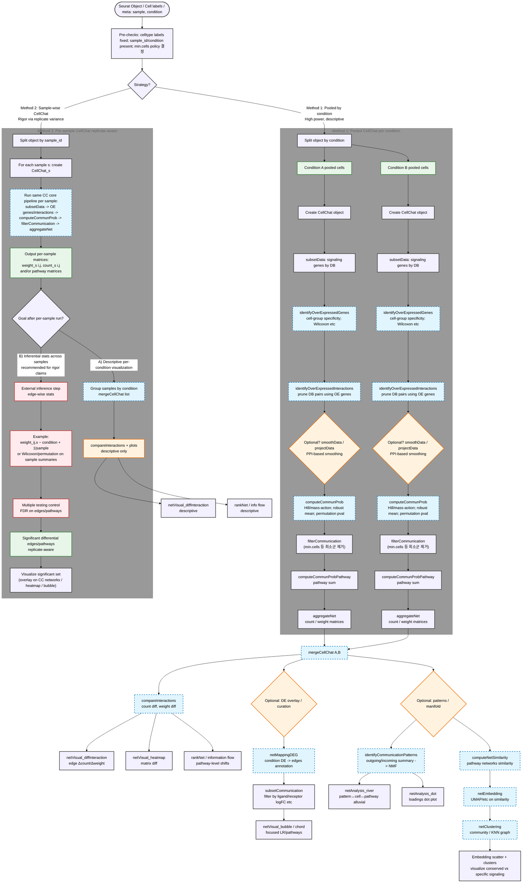

# CellChat Data Transformation Flow

This document outlines the step-by-step transformation of data within the CellChat pipeline, focusing on input/output logic rather than implementation details.

## 1. Initialization
**Input**: Seurat Object (`sobj`)
**Function**: `createCellChat(object = sobj, group.by = "...")`
**Transformation**:
- Extracts Norm Data -> `cc@data` (LogNormalized matrix)
- Extracts Metadata -> `cc@meta`
- Extracts Identities -> `cc@idents`

## 2. Ligand-Receptor Identification (Preprocessing)
### A. Identify Over-expressed Genes
**Function**: `identifyOverExpressedGenes(cc)`
**Logic**: 
- Validates "expressed" genes (e.g., detected in >10% of cells in a group).
- Performs **Wilcoxon Rank Sum Test** (One-vs-Rest) for each cell group.
- P-value threshold ($P < 0.05$).
**Output**: `cc@var.features$features` (List of significant DEGs per group).

### B. Identify Over-expressed Interactions
**Function**: `identifyOverExpressedInteractions(cc)`
**Logic**:
- Mapping: Matches identified DEGs (from A) to Ligand-Receptor pairs in `cc@DB`.
- Constraint: Both Ligand AND Receptor must be DEGs (or "expressed" depending on parameters).
**Output**: `cc@LR$LRsig` (Subset of DB containing only valid LR pairs for this dataset).
- *This is the candidate list for probability calculation.*

## 3. Probability Calculation (Core Logic)
### A. Compute Communication Probability
**Function**: `computeCommunProb(cc, type = "triMean")`
**Logic**:
1. **Expression Value**: Uses *Trimean* (Q1, Q2, Q3 weighted avg) of expression per cell group.
   - $AvgExp = (Q1 + 2 \cdot Q2 + Q3) / 4$
2. **Law of Mass Action**:
   - $Prob_{i,j} = \frac{L_i \cdot R_j}{K_h + L_i \cdot R_j}$ (Hill function)
   - Where $L_i$ = Ligand exp in Group i, $R_j$ = Receptor exp in Group j.
3. **Significance Test (Permutation)**:
   - Randomly permute cell labels (Sender/Receiver identities).
   - Re-calculate Prob many times (e.g., 100).
   - Count how many times random Prob > observed Prob -> P-value.
   - Set Prob to 0 if $P > 0.05$.
**Output**: `cc@net$prob` (3D Array: `Sources` x `Targets` x `LR_Pairs`).

### B. Filter Communication
**Function**: `filterCommunication(cc, min.cells = 10)`
**Logic**:
- Set interactions to 0 if the cell group has fewer than `min.cells`.
**Output**: Updates `cc@net$prob`.

## 4. Aggregation (Post-Processing)
### A. Aggregate Network
**Function**: `aggregateNet(cc)`
**Logic**:
- Sums/Averages probabilities across all LR pairs to get Group-to-Group strength.
**Output**: 
- `cc@net$count`: Number of significant interactions ($P < 0.05$).
- `cc@net$weight`: Sum of interaction probabilities.

### B. Merge CellChats (For Comparison)
**Function**: `mergeCellChat(list(cc1, cc2))`
**Logic**:
- Merges `net` slots from multiple objects into a list or array.
- Enables differential analysis (e.g., `cc2 - cc1`).

---
**Summary**:
`Seurat` -> `DEGs` -> `Valid LRs` -> `Probabilities (Hill + Permutation)` -> `Significant Network` -> `Visualizations`

---

## 5. Metric Interpretation Guide

### A. `identifyCommunicationPatterns` Heatmap: **Contribution**
- **Cell Patterns (행)**: 각 cell type이 해당 pattern에 얼마나 기여하는지 (NMF W matrix)
- **Communication Patterns (열)**: 각 signaling pathway가 해당 pattern에 기여하는 정도 (NMF H matrix)
- **값 범위**: 0~1, 높을수록 해당 pattern의 핵심 요소

### B. `netAnalysis_river` (Sankey Diagram)
- Ribbon **두께** = Cell type ↔ Pattern ↔ Signaling 간 연결 강도 (contribution)
- 두꺼울수록 해당 조합이 특정 pattern을 특징짓는 핵심 요소

### C. `netAnalysis_dot` Contribution
- Dot **크기** = contribution 값
- Dot **색상** = contribution 강도 (연속 스케일)

### D. `netVisual_diffInteraction` 화살표
- **빨간색**: 두 번째 그룹 (Stroke) 방향으로 **증가**
- **파란색**: 첫 번째 그룹 (Control) 방향으로 **증가** (= Stroke에서 감소)
- **두께**: 차이의 절대값 (count 또는 weight)
- **방향**: Sender → Receiver

### E. `rankNet` RIF 및 색상
- **RIF (Relative Information Flow)**: 각 signaling pathway의 총 통신 확률 합
- **그룹별 색** (파랑/빨강): 해당 그룹에서 **유의하게 활성화**된 pathway
- **검정색**: 두 그룹 간 통계적 차이 없음 (`do.stat = TRUE` 시 Wilcoxon test)

### F. `netVisual_bubble` Communication Prob
- **점 크기**: Communication probability (Hill function 결과)
- **X축**: Sender|Receiver cell pair
- **Y축**: L-R pair (pathway 내)
- **`thresh`**: P-value 필터 (단, merged object에서 무효할 수 있음)

### G. `netVisual_heatmap` Relative Values
- **Relative value**: (Group2 - Group1) / max(|diff|) 정규화
- **음수**: Control 방향 증가 (Stroke에서 감소)
- **양수**: Stroke 방향 증가
- **축 Bar graph**: 누적 incoming/outgoing strength (음수 가능)

### H. `netVisual_aggregate` 주의사항
- **Merged object에서 사용 불가**: `mergeCellChat` 결과는 `@netP$Control`, `@netP$Stroke` 구조
- **해결책**: 개별 object (`cc1` 또는 `cc2`)에서 호출
```r
netVisual_aggregate(cc2, signaling = "MIF", layout = "circle")  # Stroke만
```



