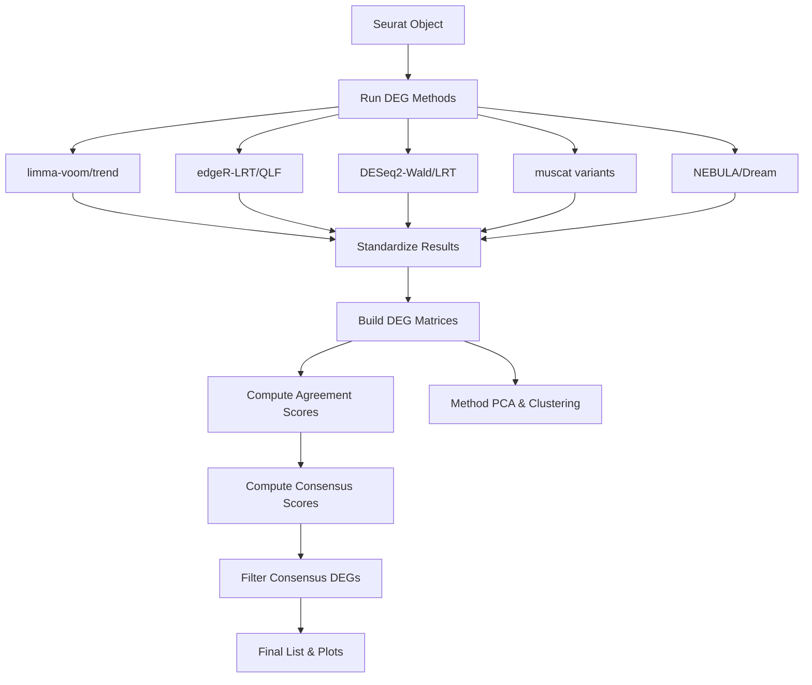

# Multi-Model DEG Consensus Module Integrated Guide

이 문서는 Multi-Model DEG Consensus (deg-consensus) 모듈의 통합 가이드입니다. 여러 DEG 분석 방법론을 결합하여 신뢰도 높은 Consensus Signature를 도출하는 과정을 설명합니다.

## 1. Introduction (소개)

### 목적
limma, edgeR, DESeq2, muscat, nebula, dream 등 다양한 DEG 분석 방법론을 동일한 데이터셋에 적용하고, 그 결과를 통합하여 방법론 간의 일치도(Agreement)를 기반으로 강력한 Consensus DEG 리스트를 생성합니다.

### 핵심 기능
1.  **통합 실행 엔진**: `run_deg_consensus()` 함수 하나로 10개 이상의 DEG 방법론을 일괄 실행합니다.
2.  **결과 표준화**: 각기 다른 포맷의 결과(p-value, logFC 등)를 공통 포맷으로 변환합니다.
3.  **Consensus 알고리즘**:
    *   **Agreement Score**: 유전자별로 몇 개의 방법론이 유의하다고 판단했는지(0~1) 계산.
    *   **Weighted Scoring**: 방법론별 가중치를 반영한 Consensus Score 산출.
4.  **자동 시각화**: Volcano plot, Heatmap, Method PCA, Gene UMAP 등을 자동 생성.

## 2. Workflow Visualization (시각화)



## 3. Methodology (방법론)

### 지원하는 DEG 방법론
*   **limma 계열**: `limma-voom`, `limma-trend` (Pseudobulk)
*   **edgeR 계열**: `edgeR-LRT`, `edgeR-QLF` (Pseudobulk)
*   **DESeq2 계열**: `DESeq2-Wald`, `DESeq2-LRT` (Pseudobulk)
*   **muscat 계열**: `muscat` 래퍼를 통한 edgeR/DESeq2/limma 실행
*   **Mixed-Model 계열**:
    *   `nebula`: Single-cell 수준의 Negative Binomial Mixed Model
    *   `dream`: Pseudobulk 수준의 Linear Mixed Model (VariancePartition)

### Consensus 알고리즘
각 유전자 $g$에 대해:
1.  **Significance Matrix ($S_{gm}$)**: 방법론 $m$에서 유의하면 1, 아니면 0.
2.  **Agreement Score ($A_g$)**: $\frac{1}{M} \sum_{m} S_{gm}$ (유의한 방법론 비율).
3.  **Consensus Score ($C_g$)**: $A_g \times |\text{Weighted Mean Beta}_g|$.
4.  **Filtering**: $A_g \ge \text{threshold}$ 이고 최소 $k$개 이상의 방법론에서 유의한 경우 선정.

## 4. User Guide & Warnings (사용자 가이드)

### 실행 방법

**1. R 세션 시작 및 로드**
```r
devtools::load_all("/home/user3/data_user3/git_repo/mylit/myR")
source("scripts/deg-consensus-dev/run_consensus_simple.R")
```

**2. 기본 실행 (Simple)**
```r
# Seurat 객체가 'is5' 변수로 로드되어 있다고 가정
# 자동으로 주요 방법론 실행 및 결과 저장
source("scripts/deg-consensus-dev/run_consensus_simple.R")
```

**3. 고급 실행 (함수 직접 호출)**
```r
methods_to_run <- c("limma-trend", "edgeR-QLF", "nebula")
result <- run_deg_consensus(
  sobj = sobj,
  contrast = "2 - 1",
  methods = methods_to_run,
  cluster_id = "anno3.scvi",
  sample_id = "hos_no",
  group_id = "g3"
)
```

### Critical Warnings (주의사항)
1.  **실행 시간**: NEBULA, Dream 등 Mixed Model은 계산 비용이 높습니다. 테스트 시에는 제외하거나 작은 데이터셋을 사용하세요.
2.  **메모리**: 많은 방법론을 동시에 돌리면 메모리 사용량이 급증할 수 있습니다.
3.  **Pseudobulk 요건**: 클러스터 당 최소 샘플 수(`min_samples_per_group`)가 부족하면 해당 클러스터 분석은 건너뜁니다 (기본값: 2).

## 5. Appendix (부록)

### 주요 스크립트 위치
*   `scripts/deg-consensus-dev/run_consensus_simple.R`: 최소 실행 예제.
*   `scripts/deg-consensus-dev/run_consensus_analysis.R`: 전체 분석 파이프라인.
*   `scripts/deg-consensus-dev/test_step_by_step.R`: 단계별 디버깅용.

### 결과 파일
*   `deg_consensus_final_result.qs`: 최종 결과 객체.
*   `consensus_plots/`: Volcano plot, Heatmap 등 시각화 결과.

