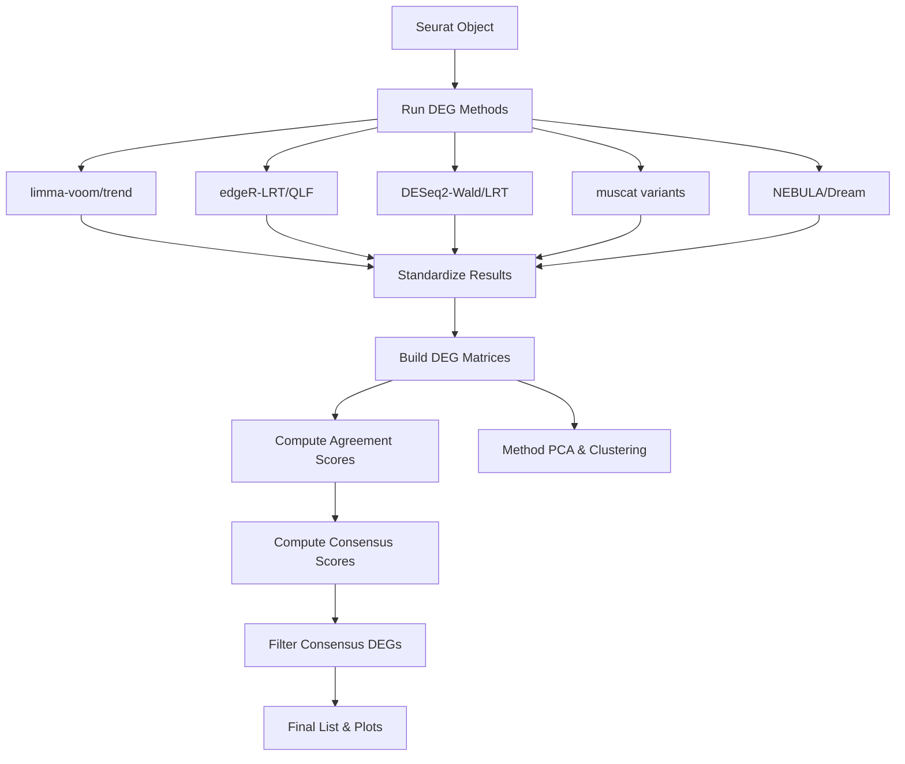

# Multi-Model DEG Consensus Module Integrated Guide

This document is the integrated guide for the Multi-Model DEG Consensus (deg-consensus) module. It describes the process of deriving reliable Consensus Signatures by combining multiple DEG analysis methodologies.

## 1. Introduction

### Purpose
Applies various DEG analysis methodologies (limma, edgeR, DESeq2, muscat, nebula, dream, etc.) to the same dataset and integrates the results to generate a robust Consensus DEG list based on inter-methodology agreement.

### Key Features
1.  **Unified Execution Engine**: Executes 10+ DEG methodologies in batch with a single `run_deg_consensus()` function.
2.  **Result Standardization**: Converts results in different formats (p-value, logFC, etc.) to a common format.
3.  **Consensus Algorithm**:
    *   **Agreement Score**: Calculates how many methodologies consider each gene significant (0~1).
    *   **Weighted Scoring**: Computes Consensus Score reflecting methodology-specific weights.
4.  **Automatic Visualization**: Automatically generates Volcano plots, Heatmaps, Method PCA, Gene UMAP, etc.

## 2. Workflow Visualization (시각화)



## 3. Methodology

### Supported DEG Methodologies
*   **limma series**: `limma-voom`, `limma-trend` (Pseudobulk)
*   **edgeR series**: `edgeR-LRT`, `edgeR-QLF` (Pseudobulk)
*   **DESeq2 series**: `DESeq2-Wald`, `DESeq2-LRT` (Pseudobulk)
*   **muscat series**: Runs edgeR/DESeq2/limma through `muscat` wrapper
*   **Mixed-Model series**:
    *   `nebula`: Single-cell level Negative Binomial Mixed Model
    *   `dream`: Pseudobulk level Linear Mixed Model (VariancePartition)

### Consensus Algorithm
For each gene $g$:
1.  **Significance Matrix ($S_{gm}$)**: 1 if significant in methodology $m$, 0 otherwise.
2.  **Agreement Score ($A_g$)**: $\frac{1}{M} \sum_{m} S_{gm}$ (proportion of significant methodologies).
3.  **Consensus Score ($C_g$)**: $A_g \times |\text{Weighted Mean Beta}_g|$.
4.  **Filtering**: Selected if $A_g \ge \text{threshold}$ and significant in at least $k$ methodologies.

## 4. User Guide & Warnings

### Execution Methods

**1. Start R Session and Load**
```r
devtools::load_all("/home/user3/data_user3/git_repo/mylit/myR")
source("scripts/deg-consensus-dev/run_consensus_simple.R")
```

**2. Basic Execution (Simple)**
```r
# Assuming Seurat object is loaded as 'is5' variable
# Automatically runs major methodologies and saves results
source("scripts/deg-consensus-dev/run_consensus_simple.R")
```

**3. Advanced Execution (Direct Function Call)**
```r
methods_to_run <- c("limma-trend", "edgeR-QLF", "nebula")
result <- run_deg_consensus(
  sobj = sobj,
  contrast = "2 - 1",
  methods = methods_to_run,
  cluster_id = "anno3.scvi",
  sample_id = "hos_no",
  group_id = "g3"
)
```

### Critical Warnings
1.  **Execution Time**: Mixed Models like NEBULA and Dream are computationally expensive. Exclude them during testing or use small datasets.
2.  **Memory**: Running many methodologies simultaneously can cause memory usage to spike.
3.  **Pseudobulk Requirements**: If the minimum number of samples per cluster (`min_samples_per_group`) is insufficient, that cluster's analysis is skipped (default: 2).

## 5. Appendix

### Key Script Locations
*   `scripts/deg-consensus-dev/run_consensus_simple.R`: Minimal execution example.
*   `scripts/deg-consensus-dev/run_consensus_analysis.R`: Full analysis pipeline.
*   `scripts/deg-consensus-dev/test_step_by_step.R`: Step-by-step debugging.

### Result Files
*   `deg_consensus_final_result.qs`: Final result object.
*   `consensus_plots/`: Visualization results including Volcano plots, Heatmaps, etc.

