# Multi-Model DEG Consensus Module Integrated Guide

This document is the integrated guide for the Multi-Model DEG Consensus (deg-consensus) module. It describes the process of deriving reliable Consensus Signatures by combining multiple DEG analysis methodologies.

## 1. Introduction

### Purpose
Applies various DEG analysis methodologies (limma, edgeR, DESeq2, muscat, nebula, dream, etc.) to the same dataset and integrates the results to generate a robust Consensus DEG list based on inter-methodology agreement.

### Key Features
1.  **Unified Execution Engine**: Executes 10+ DEG methodologies in batch with a single `run_deg_consensus()` function.
2.  **Result Standardization**: Converts results in different formats (p-value, logFC, etc.) to a common format.
3.  **Consensus Algorithm**:
    *   **Agreement Score**: Calculates how many methodologies consider each gene significant (0~1).
    *   **Weighted Scoring**: Computes Consensus Score reflecting methodology-specific weights.
4.  **Automatic Visualization**: Automatically generates Volcano plots, Heatmaps, Method PCA, Gene UMAP, etc.

## 2. Workflow Visualization (시각화)

```mermaid
%%{init: {'theme':'base', 'themeVariables': {'primaryEdgeColor':'#000000', 'primaryEdgeThickness':4, 'primaryTextColor':'#000000', 'primaryBorderColor':'#000000', 'edgeLabelBackground':'#ffffff', 'tertiaryColor':'#000000'}}}%%
flowchart TD
    Start([DEG Consensus Pipeline<br/>DEG Consensus 파이프라인])
    Start --> SeuratObj
    
    subgraph Input["1. 입력 데이터"]
        direction TB
        SeuratObj[("Seurat Object<br/>단일세포 데이터")]
        SeuratObj --> InputData[("입력 데이터")]
    end
    
    InputData --> RunMethods
    
    subgraph RunMethods["2. DEG 방법론 실행"]
        direction TB
        MethodLoop[방법론 순회<br/>for each method]
        
        MethodLoop --> MethodSelect{방법론<br/>선택}
        
        MethodSelect -->|Pseudobulk| PBMethods
        MethodSelect -->|Single-cell| SCMethods
        MethodSelect -->|Mixed Model| MMMethods
        
        subgraph PBMethods["Pseudobulk Methods"]
            direction TB
            LimmaVoom["limma-voom<br/>limma-trend"]
            EdgeRLRT["edgeR-LRT<br/>edgeR-QLF"]
            DESeq2Wald["DESeq2-Wald<br/>DESeq2-LRT"]
            Muscat["muscat variants<br/>edgeR slash DESeq2 slash limma"]
            LimmaVoom --> PBResults[("Pseudobulk<br/>결과")]
            EdgeRLRT --> PBResults
            DESeq2Wald --> PBResults
            Muscat --> PBResults
        end
        
        subgraph SCMethods["Single-cell Methods"]
            direction TB
            Nebula["nebula<br/>Negative Binomial<br/>Mixed Model"]
            Nebula --> SCResults[("Single-cell<br/>결과")]
        end
        
        subgraph MMMethods["Mixed Model Methods"]
            direction TB
            Dream["dream<br/>Linear Mixed Model<br/>VariancePartition"]
            Dream --> MMResults[("Mixed Model<br/>결과")]
        end
        
        PBResults --> AllResults
        SCResults --> AllResults
        MMResults --> AllResults
    end
    
    AllResults[("모든 방법론<br/>결과")] --> Standardize
    
    subgraph Standardize["3. 결과 표준화"]
        direction TB
        ParseFormat["포맷 파싱<br/>p-value, logFC<br/>컬럼명 자동 인식"]
        ParseFormat --> CommonFormat["공통 포맷 변환<br/>gene, logFC, pvalue,<br/>pvalue_adj, method"]
        CommonFormat --> Standardized[("표준화된<br/>결과")]
    end
    
    Standardized --> BuildMatrix
    
    subgraph BuildMatrix["4. DEG 행렬 구성"]
        direction TB
        GeneMethodMatrix["gene times method 행렬<br/>beta, pvalue, logp,<br/>significance"]
        GeneMethodMatrix --> Matrices[("DEG 행렬들")]
    end
    
    Matrices --> Agreement
    
    subgraph Agreement["5. Agreement Score 계산"]
        direction TB
        SigMatrix["Significance Matrix<br/>S_gm: 유의=1, 비유의=0"]
        SigMatrix --> AgreeScore["Agreement Score<br/>A_g equals mean of S_gm<br/>유의한 방법론 비율"]
        AgreeScore --> AgreementScores[("Agreement<br/>Scores")]
    end
    
    Matrices --> Consensus
    
    subgraph Consensus["6. Consensus Score 계산"]
        direction TB
        WeightedBeta["Weighted Mean Beta<br/>방법론별 가중치 반영"]
        WeightedBeta --> ConsensusScore["Consensus Score<br/>C_g equals A_g times weighted_beta"]
        AgreementScores --> ConsensusScore
        ConsensusScore --> ConsensusScores[("Consensus<br/>Scores")]
    end
    
    Matrices --> MethodAnalysis
    
    subgraph MethodAnalysis["7. 방법론 분석<br/>(선택적)"]
        direction TB
        MethodPCA["Method PCA<br/>방법론 간 유사성"]
        MethodCluster["Method Clustering<br/>계층적 클러스터링"]
        Matrices --> MethodPCA
        Matrices --> MethodCluster
    end
    
    ConsensusScores --> Filter
    
    subgraph Filter["8. Consensus DEG 필터링"]
        direction TB
        FilterAgree["Agreement Threshold<br/>A_g greater than or equal to threshold"]
        FilterMethods["Min Methods<br/>n_significant greater than or equal to k"]
        FilterAgree --> FinalList
        FilterMethods --> FinalList
        FinalList[("최종 Consensus<br/>DEG 리스트")]
    end
    
    FinalList --> Visualize
    
    subgraph Visualize["9. 시각화"]
        direction TB
        Volcano["Volcano Plot<br/>logFC vs minus log10 of p"]
        Heatmap["Heatmap<br/>gene times method"]
        GeneUMAP["Gene UMAP<br/>유전자 공간"]
        FinalList --> Volcano
        FinalList --> Heatmap
        FinalList --> GeneUMAP
    end
    
    Visualize --> Save
    
    subgraph Save["10. 결과 저장"]
        direction TB
        SaveQs["결과 객체 저장<br/>.qs"]
        SavePlots["플롯 저장<br/>.png"]
        SaveQs --> FinalResult[("최종 결과")]
        SavePlots --> FinalResult
    end
    
    FinalResult --> End([완료])
    
    style Start fill:#e1f5ff,stroke:#0066cc,stroke-width:3px
    style End fill:#d4edda,stroke:#28a745,stroke-width:3px
    style Input fill:#fff3cd,stroke:#ffc107,stroke-width:2px
    style RunMethods fill:#d1ecf1,stroke:#17a2b8,stroke-width:2px
    style Standardize fill:#cfe2ff,stroke:#0d6efd,stroke-width:2px
    style BuildMatrix fill:#f8d7da,stroke:#dc3545,stroke-width:2px
    style Agreement fill:#e2e3e5,stroke:#6c757d,stroke-width:2px
    style Consensus fill:#d1ecf1,stroke:#17a2b8,stroke-width:2px
    style MethodAnalysis fill:#fff3cd,stroke:#ffc107,stroke-width:2px
    style Filter fill:#cfe2ff,stroke:#0d6efd,stroke-width:2px
    style Visualize fill:#f8d7da,stroke:#dc3545,stroke-width:2px
    style Save fill:#e2e3e5,stroke:#6c757d,stroke-width:2px
```



## 3. Methodology (방법론)

### 지원하는 DEG 방법론
*   **limma 계열**: `limma-voom`, `limma-trend` (Pseudobulk)
*   **edgeR 계열**: `edgeR-LRT`, `edgeR-QLF` (Pseudobulk)
*   **DESeq2 계열**: `DESeq2-Wald`, `DESeq2-LRT` (Pseudobulk)
*   **muscat 계열**: `muscat` 래퍼를 통한 edgeR/DESeq2/limma 실행
*   **Mixed-Model 계열**:
    *   `nebula`: Single-cell 수준의 Negative Binomial Mixed Model
    *   `dream`: Pseudobulk 수준의 Linear Mixed Model (VariancePartition)

### Consensus 알고리즘
각 유전자 $g$에 대해:
1.  **Significance Matrix ($S_{gm}$)**: 방법론 $m$에서 유의하면 1, 아니면 0.
2.  **Agreement Score ($A_g$)**: $\frac{1}{M} \sum_{m} S_{gm}$ (유의한 방법론 비율).
3.  **Consensus Score ($C_g$)**: $A_g \times |\text{Weighted Mean Beta}_g|$.
4.  **Filtering**: $A_g \ge \text{threshold}$ 이고 최소 $k$개 이상의 방법론에서 유의한 경우 선정.

## 4. User Guide & Warnings (사용자 가이드)

### 실행 방법

**1. R 세션 시작 및 로드**
```r
devtools::load_all("/home/user3/data_user3/git_repo/mylit/myR")
source("scripts/deg-consensus-dev/run_consensus_simple.R")
```

**2. Basic Execution (Simple)**
```r
# Assuming Seurat object is loaded as 'is5' variable
# Automatically runs major methodologies and saves results
source("scripts/deg-consensus-dev/run_consensus_simple.R")
```

**3. Advanced Execution (Direct Function Call)**
```r
methods_to_run <- c("limma-trend", "edgeR-QLF", "nebula")
result <- run_deg_consensus(
  sobj = sobj,
  contrast = "2 - 1",
  methods = methods_to_run,
  cluster_id = "anno3.scvi",
  sample_id = "hos_no",
  group_id = "g3"
)
```

### Critical Warnings
1.  **Execution Time**: Mixed Models like NEBULA and Dream are computationally expensive. Exclude them during testing or use small datasets.
2.  **Memory**: Running many methodologies simultaneously can cause memory usage to spike.
3.  **Pseudobulk Requirements**: If the minimum number of samples per cluster (`min_samples_per_group`) is insufficient, that cluster's analysis is skipped (default: 2).

## 5. Appendix

### Key Script Locations
*   `scripts/deg-consensus-dev/run_consensus_simple.R`: Minimal execution example.
*   `scripts/deg-consensus-dev/run_consensus_analysis.R`: Full analysis pipeline.
*   `scripts/deg-consensus-dev/test_step_by_step.R`: Step-by-step debugging.

### Result Files
*   `deg_consensus_*_final_result.qs`: Final result object.
*   `deg_consensus_*_consensus_scores.qs`: Consensus scores object.
*   `deg_consensus_*_skipped_clusters.qs`: Skipped clusters information.
*   `deg_consensus_*_nebula_result.qs`: NEBULA analysis results (separate execution).
*   `consensus_plots/`: Visualization results including Volcano plots, Heatmaps, etc.

## 6. Method-Specific Issues and Troubleshooting

### 6.1 muscat Methods

**Issue**: muscat methods may fail on small clusters.

**Error Message**:
```
Specified filtering options result in no genes in any clusters being tested.
```

**Cause**:
- muscat requires sufficient pseudobulk samples per group.
- After splitting by cluster, each group (g3=1, g3=2) needs at least 2 pseudobulk samples.
- Example: 33 cells may not provide enough samples per group.

**Solution**:
- Analysis continues with other methods (limma, edgeR, DESeq2) even if muscat fails.
- Small clusters can be analyzed without muscat methods.
- Minimum requirement: ~50+ cells per cluster, at least 2 samples per group

### 6.2 NEBULA Method

**Issue**: NEBULA does not work well with cluster-split data.

**Causes**:
1. **Complete Separation**: Between `GEM` and `g3` variables, causing singular design matrix
2. **Insufficient samples**: After splitting by cluster, sample size may be too small
3. **Pipeline structure**: NEBULA works better on full data considering clusters

**Solution**:
- Run NEBULA **separately on full data** (recommended).
- Exclude `GEM` from `covar_effects`, use only `sex` (to avoid collinearity).
- Execute separately from cluster-wise pipeline.

### 6.3 DESeq2 Methods

**Issue**: Pseudobulk data may not be integers.

**Error Message**:
```
some values in assay are not integers
```

**Cause**: Pseudobulking may produce non-integer values, but DESeq2 requires integer counts.

**Solution**: Automatically handled by `round()` function in the code.

### 6.4 dream Method

**Current Status**: dream method did not work well originally and is currently excluded from the pipeline.

**Recommendation**: Not recommended for use at this time. Separate implementation and testing required if needed.

### 6.5 Small Cluster Handling

**Issue**: Some methods may fail on small clusters.

**Solution**:
- Clusters with < 10 cells are automatically skipped.
- Analysis continues with other methods even if muscat fails.
- Skipped cluster information is saved in `*_skipped_clusters.qs` file.

**Minimum Requirements**:
- **Absolute minimum**: 10 cells (very small clusters are skipped)
- **Recommended minimum**: 50 cells (all methods work normally)
- **Samples per group**: At least 2 samples per group (g3=1, g3=2) required

