# Multi-Model DEG Consensus Module 통합 가이드

이 문서는 Multi-Model DEG Consensus (deg-consensus) 모듈의 통합 가이드입니다. 여러 DEG 분석 방법론을 결합하여 신뢰도 높은 Consensus Signature를 도출하는 과정을 설명합니다.

## 1. 소개 (Introduction)

### 목적
limma, edgeR, DESeq2, muscat, nebula, dream 등 다양한 DEG 분석 방법론을 동일한 데이터셋에 적용하고, 그 결과를 통합하여 방법론 간의 일치도(Agreement)를 기반으로 강력한 Consensus DEG 리스트를 생성합니다.

### 핵심 기능
1.  **통합 실행 엔진**: `run_deg_consensus()` 함수 하나로 10개 이상의 DEG 방법론을 일괄 실행합니다.
2.  **결과 표준화**: 각기 다른 포맷의 결과(p-value, logFC 등)를 공통 포맷으로 변환합니다.
3.  **Consensus 알고리즘**:
    *   **Agreement Score**: 유전자별로 몇 개의 방법론이 유의하다고 판단했는지(0~1) 계산.
    *   **Weighted Scoring**: 방법론별 가중치를 반영한 Consensus Score 산출.
4.  **자동 시각화**: Volcano plot, Heatmap, Method PCA, Gene UMAP 등을 자동 생성.

## 2. 워크플로우 시각화 (Workflow Visualization)

```mermaid
%%{init: {'theme':'base', 'themeVariables': {'primaryEdgeColor':'#000000', 'primaryEdgeThickness':4, 'primaryTextColor':'#000000', 'primaryBorderColor':'#000000', 'edgeLabelBackground':'#ffffff', 'tertiaryColor':'#000000'}}}%%
flowchart TD
    Start([DEG Consensus Pipeline<br/>DEG Consensus 파이프라인])
    Start --> SeuratObj
    
    subgraph Input["1. 입력 데이터"]
        direction TB
        SeuratObj[("Seurat Object<br/>단일세포 데이터")]
        SeuratObj --> InputData[("입력 데이터")]
    end
    
    InputData --> RunMethods
    
    subgraph RunMethods["2. DEG 방법론 실행"]
        direction TB
        MethodLoop["방법론 순회<br/>for each method"]
        
        MethodLoop --> MethodSelect{방법론<br/>선택}
        
        MethodSelect -->|Pseudobulk| PBMethods
        MethodSelect -->|Single-cell| SCMethods
        MethodSelect -->|Mixed Model| MMMethods
        
        subgraph PBMethods["Pseudobulk Methods"]
            direction TB
            LimmaVoom["limma-voom<br/>limma-trend"]
            EdgeRLRT["edgeR-LRT<br/>edgeR-QLF"]
            DESeq2Wald["DESeq2-Wald<br/>DESeq2-LRT"]
            Muscat["muscat variants<br/>edgeR slash DESeq2 slash limma"]
            LimmaVoom --> PBResults[("Pseudobulk<br/>결과")]
            EdgeRLRT --> PBResults
            DESeq2Wald --> PBResults
            Muscat --> PBResults
        end
        
        subgraph SCMethods["Single-cell Methods"]
            direction TB
            Nebula["nebula<br/>Negative Binomial<br/>Mixed Model"]
            Nebula --> SCResults[("Single-cell<br/>결과")]
        end
        
        subgraph MMMethods["Mixed Model Methods"]
            direction TB
            Dream["dream<br/>Linear Mixed Model<br/>VariancePartition"]
            Dream --> MMResults[("Mixed Model<br/>결과")]
        end
        
        PBResults --> AllResults
        SCResults --> AllResults
        MMResults --> AllResults
    end
    
    AllResults[("모든 방법론<br/>결과")] --> Standardize
    
    subgraph Standardize["3. 결과 표준화"]
        direction TB
        ParseFormat["포맷 파싱<br/>p-value, logFC<br/>컬럼명 자동 인식"]
        ParseFormat --> CommonFormat["공통 포맷 변환<br/>gene, logFC, pvalue,<br/>pvalue_adj, method"]
        CommonFormat --> Standardized[("표준화된<br/>결과")]
    end
    
    Standardized --> BuildMatrix
    
    subgraph BuildMatrix["4. DEG 행렬 구성"]
        direction TB
        GeneMethodMatrix["gene times method 행렬<br/>beta, pvalue, logp,<br/>significance"]
        GeneMethodMatrix --> Matrices[("DEG 행렬들")]
    end
    
    Matrices --> Agreement
    
    subgraph Agreement["5. Agreement Score 계산"]
        direction TB
        SigMatrix["Significance Matrix<br/>S_gm: 유의=1, 비유의=0"]
        SigMatrix --> AgreeScore["Agreement Score<br/>A_g equals mean of S_gm<br/>유의한 방법론 비율"]
        AgreeScore --> AgreementScores[("Agreement<br/>Scores")]
    end
    
    Matrices --> Consensus
    
    subgraph Consensus["6. Consensus Score 계산"]
        direction TB
        WeightedBeta["Weighted Mean Beta<br/>방법론별 가중치 반영"]
        WeightedBeta --> ConsensusScore["Consensus Score<br/>C_g equals A_g times weighted_beta"]
        AgreementScores --> ConsensusScore
        ConsensusScore --> ConsensusScores[("Consensus<br/>Scores")]
    end
    
    Matrices --> MethodAnalysis
    
    subgraph MethodAnalysis["7. 방법론 분석<br/>(선택적)"]
        direction TB
        MethodPCA["Method PCA<br/>방법론 간 유사성"]
        MethodCluster["Method Clustering<br/>계층적 클러스터링"]
        Matrices --> MethodPCA
        Matrices --> MethodCluster
    end
    
    ConsensusScores --> Filter
    
    subgraph Filter["8. Consensus DEG 필터링"]
        direction TB
        FilterAgree["Agreement Threshold<br/>A_g greater than or equal to threshold"]
        FilterMethods["Min Methods<br/>n_significant greater than or equal to k"]
        FilterAgree --> FinalList
        FilterMethods --> FinalList
        FinalList[("최종 Consensus<br/>DEG 리스트")]
    end
    
    FinalList --> Visualize
    
    subgraph Visualize["9. 시각화"]
        direction TB
        Volcano["Volcano Plot<br/>logFC vs minus log10 of p"]
        Heatmap["Heatmap<br/>gene times method"]
        GeneUMAP["Gene UMAP<br/>유전자 공간"]
        FinalList --> Volcano
        FinalList --> Heatmap
        FinalList --> GeneUMAP
    end
    
    Visualize --> Save
    
    subgraph Save["10. 결과 저장"]
        direction TB
        SaveQs["결과 객체 저장<br/>.qs"]
        SavePlots["플롯 저장<br/>.png"]
        SaveQs --> FinalResult[("최종 결과")]
        SavePlots --> FinalResult
    end
    
    FinalResult --> End([완료])
    
    style Start fill:#e1f5ff,stroke:#0066cc,stroke-width:3px
    style End fill:#d4edda,stroke:#28a745,stroke-width:3px
    style Input fill:#fff3cd,stroke:#ffc107,stroke-width:2px
    style RunMethods fill:#d1ecf1,stroke:#17a2b8,stroke-width:2px
    style Standardize fill:#cfe2ff,stroke:#0d6efd,stroke-width:2px
    style BuildMatrix fill:#f8d7da,stroke:#dc3545,stroke-width:2px
    style Agreement fill:#e2e3e5,stroke:#6c757d,stroke-width:2px
    style Consensus fill:#d1ecf1,stroke:#17a2b8,stroke-width:2px
    style MethodAnalysis fill:#fff3cd,stroke:#ffc107,stroke-width:2px
    style Filter fill:#cfe2ff,stroke:#0d6efd,stroke-width:2px
    style Visualize fill:#f8d7da,stroke:#dc3545,stroke-width:2px
    style Save fill:#e2e3e5,stroke:#6c757d,stroke-width:2px
```



## 3. 방법론 (Methodology)

### 지원하는 DEG 방법론
*   **limma 계열**: `limma-voom`, `limma-trend` (Pseudobulk)
*   **edgeR 계열**: `edgeR-LRT`, `edgeR-QLF` (Pseudobulk)
*   **DESeq2 계열**: `DESeq2-Wald`, `DESeq2-LRT` (Pseudobulk)
*   **muscat 계열**: `muscat` 래퍼를 통한 edgeR/DESeq2/limma 실행
*   **Mixed-Model 계열**:
    *   `nebula`: Single-cell 수준의 Negative Binomial Mixed Model
    *   `dream`: Pseudobulk 수준의 Linear Mixed Model (VariancePartition)

### Consensus 알고리즘
각 유전자 $g$에 대해:
1.  **Significance Matrix ($S_{gm}$)**: 방법론 $m$에서 유의하면 1, 아니면 0.
2.  **Agreement Score ($A_g$)**: $\frac{1}{M} \sum_{m} S_{gm}$ (유의한 방법론 비율).
3.  **Meta-analysis of p-values**: 여러 방법론의 p-value를 통합:
    *   **Stouffer's Z-score** (default): 방향성을 고려한 Z-score 통합
    *   **Fisher's combined p-value**: 카이제곱 통합
    *   **Inverse variance weighting**: 표준오차 기반 가중 통합 (SE 행렬 필요)
4.  **Effect size 통합**: 여러 방법론의 logFC를 통합:
    *   **Simple mean** (default): 단순 평균
    *   **Weighted mean**: 방법론별 가중치 반영
    *   **Inverse variance weighted**: 표준오차 기반 가중 평균 (SE 행렬 필요)
5.  **Consensus Score ($C_g$)**: $A_g \times |\text{Weighted Mean Beta}_g| \times -\log_{10}(\text{meta\_p})$.
6.  **Variability metrics**: 
    *   `sd_beta`: 방법론 간 logFC의 표준편차
    *   `sd_pvalue`: 방법론 간 p-value의 표준편차
7.  **Filtering**: $A_g \ge \text{threshold}$ 이고 최소 $k$개 이상의 방법론에서 유의한 경우 선정.

## 4. 사용자 가이드 및 주의사항 (User Guide & Warnings)

### 실행 방법

**1. R 세션 시작 및 로드**
```r
devtools::load_all("/home/user3/data_user3/git_repo/mylit/myR")
source("scripts/deg-consensus-dev/run_consensus_simple.R")
```

**2. 기본 실행 (Simple)**
```r
# Seurat 객체가 'is5' 변수로 로드되어 있다고 가정
# 자동으로 주요 방법론 실행 및 결과 저장
source("scripts/deg-consensus-dev/run_consensus_simple.R")
```

**3. 고급 실행 (함수 직접 호출)**
```r
methods_to_run <- c("limma-trend", "edgeR-QLF", "nebula")
result <- run_deg_consensus(
  sobj = sobj,
  contrast = "2 - 1",
  methods = methods_to_run,
  cluster_id = "anno3.scvi",
  sample_id = "hos_no",
  group_id = "g3"
)
```

**4. Consensus Score 계산 (고급 옵션)**
```r
# 메타 분석 방법 선택
consensus_scores <- compute_consensus_scores(
  deg_matrices = matrices,
  agreement_scores = agreement_scores,
  meta_p_method = "stouffer",        # "stouffer", "fisher", "inverse_variance"
  mean_beta_method = "simple_mean",  # "simple_mean", "weighted_mean", "inverse_variance_weighted"
  se_matrix = NULL                   # inverse_variance 방법 사용 시 필요
)

# 결과에는 다음 metrics가 포함됩니다:
# - mean_beta: 방법론 간 logFC 평균
# - sd_beta: 방법론 간 logFC 표준편차
# - mean_pvalue: 방법론 간 p-value 평균
# - sd_pvalue: 방법론 간 p-value 표준편차
# - meta_p: 메타 분석 p-value
# - meta_p_adj: BH 조정된 meta_p
# - weighted_beta: 가중 평균 logFC
# - consensus_score: 최종 consensus 점수
```

**5. 클러스터별 결과 통합 (Meta-level 분석)**
```r
# 여러 클러스터의 DEG consensus 결과를 gene-level로 통합
library(dplyr)

# 클러스터별 consensus_scores 준비
deg_list <- setNames(
  lapply(names(deg_consensus_list), function(x) {
    deg_consensus_list[[x]][["consensus_scores"]] %>%
      mutate(
        cluster = x,
        p_val = meta_p,
        p_val_adj = meta_p_adj,
        avg_log2FC = mean_beta
      )
  }),
  names(deg_consensus_list)
)

# 클러스터별 결과 통합
meta_deg <- aggregate_cluster_deg_consensus(
  deg_list = deg_list,
  meta_p_method = "stouffer",        # 클러스터 간 p-value 통합 방법
  mean_beta_method = "simple_mean", # 클러스터 간 effect size 통합 방법
  cluster_weights = NULL             # 클러스터별 가중치 (선택사항)
)

# 결과에는 다음 정보가 포함됩니다:
# - n_clusters: 유전자가 나타난 클러스터 수
# - mean_mean_beta: 클러스터 간 mean_beta의 평균
# - sd_mean_beta: 클러스터 간 mean_beta의 표준편차
# - meta_meta_p: 클러스터 간 meta_p의 메타 분석 결과
# - meta_meta_p_adj: BH 조정된 meta_meta_p
# - sd_meta_p: 클러스터 간 meta_p의 표준편차
# - concordance: mean_beta가 mean_mean_beta와 같은 부호인 비율
# - cluster_*: 각 클러스터별 포함 여부 (0/1)
```

### Critical Warnings (주의사항)
1.  **실행 시간**: NEBULA, Dream 등 Mixed Model은 계산 비용이 높습니다. 테스트 시에는 제외하거나 작은 데이터셋을 사용하세요.
2.  **메모리**: 많은 방법론을 동시에 돌리면 메모리 사용량이 급증할 수 있습니다.
3.  **Pseudobulk 요건**: 클러스터 당 최소 샘플 수(`min_samples_per_group`)가 부족하면 해당 클러스터 분석은 건너뜁니다 (기본값: 2).

## 5. 고급 기능 (Advanced Features)

### 5.1 메타 분석 방법 선택

`compute_consensus_scores()` 함수는 여러 방법론의 결과를 통합하는 다양한 방법을 제공합니다:

**p-value 통합 방법 (`meta_p_method`)**:
- **`stouffer`** (default): Stouffer's Z-score 방법. 방향성을 고려하여 효과 크기의 부호를 반영합니다.
- **`fisher`**: Fisher's combined p-value test. 카이제곱 통합을 사용합니다.
- **`inverse_variance`**: Inverse variance weighting. 표준오차(SE) 행렬이 필요하며, 더 정확한 가중치를 제공합니다.

**Effect size 통합 방법 (`mean_beta_method`)**:
- **`simple_mean`** (default): 방법론 간 logFC의 단순 평균.
- **`weighted_mean`**: 방법론별 가중치를 반영한 가중 평균.
- **`inverse_variance_weighted`**: 표준오차 기반 가중 평균. SE 행렬이 필요합니다.

### 5.2 클러스터별 결과 통합

`aggregate_cluster_deg_consensus()` 함수는 여러 클러스터의 DEG consensus 결과를 gene-level로 통합합니다:

**주요 기능**:
- 모든 클러스터에서 나타나는 유전자 식별
- 클러스터 간 일관성 평가 (concordance)
- 클러스터별 포함 여부 추적
- 메타 분석을 통한 통합 통계량 계산

**사용 시나리오**:
- 여러 세포 타입에서 공통으로 차등 발현되는 유전자 찾기
- 클러스터 간 일관성 높은 DEG 우선순위화
- 전체 데이터셋 수준의 메타 분석 수행

### 5.3 Variability Metrics

`compute_consensus_scores()` 결과에는 방법론 간 변동성을 측정하는 metrics가 포함됩니다:

- **`sd_beta`**: 방법론 간 logFC의 표준편차. 값이 클수록 방법론 간 일치도가 낮습니다.
- **`sd_pvalue`**: 방법론 간 p-value의 표준편차. 방법론 간 유의성 판단의 일관성을 나타냅니다.

이러한 metrics는 consensus 결과의 신뢰도를 평가하는 데 유용합니다.

## 6. 부록 (Appendix)

### 주요 스크립트 위치
*   `scripts/deg-consensus/run_consensus_simple.R`: 최소 실행 예제.
*   `scripts/deg-consensus/run_consensus_analysis.R`: 전체 분석 파이프라인.
*   `scripts/deg-consensus/run_consensus_analysis_fdr.R`: FDR 기반 분석 파이프라인.

### 주요 함수 위치
*   `myR/R/deg_consensus/run_deg_consensus.R`: 메인 실행 함수
*   `myR/R/deg_consensus/deg_consensus_analysis.R`: Consensus 분석 함수 (`compute_consensus_scores`, `compute_agreement_scores` 등)
*   `myR/R/deg_consensus/aggregate_cluster_deg_consensus.R`: 클러스터 통합 함수
*   `myR/R/deg_consensus/deg_consensus_pipeline.R`: 전체 파이프라인 래퍼

### 결과 파일
*   `deg_consensus_*_final_result.qs`: 최종 결과 객체.
*   `deg_consensus_*_consensus_scores.qs`: Consensus scores 객체.
*   `consensus_plots/`: Volcano plot, Heatmap 등 시각화 결과.

