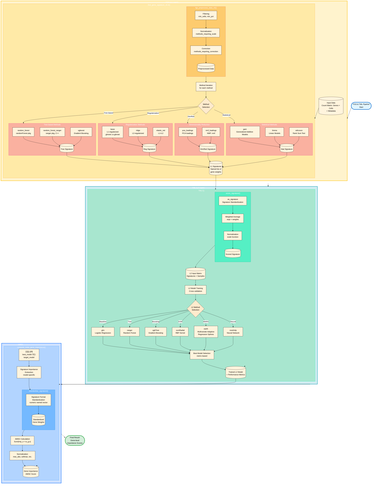

# FGS & TML Integrated Guide

## 1. Introduction
This document provides a comprehensive guide to the **Find Gene Signature (FGS)** and **Targeted Meta Learner (TML)** frameworks, including their methodology, usage, and recent improvements.

- **FGS (L1 Layer)**: Identifies gene signatures that distinguish sample groups (e.g., cell clusters) using various feature selection methods.
- **TML (L2 Layer)**: An ensemble meta-learner that combines L1 signatures to predict a target variable, improving robustness and accuracy.
- **CMGI (Compute Meta Gene Importance)**: A method to derive gene-level importance from the TML model, explaining *which* genes drive the prediction.
- **AMSC (Aggregated Meta Signature Contribution)**: The specific metric used in CMGI.

## 2. Workflow Visualization



---

## 3. Development Log & Recent Improvements

### Version 5.4 (Current)
*   **L1 Method Fixes**:
    *   **`random_forest_ranger`**: Fixed name mapping issue where importance scores were assigned to wrong genes. Verified to match `random_forest` results (Jaccard Index 1.0).
    *   **`nmf_loadings`**: Fixed `do.call` scope issue by explicitly passing the `NMF::nmf` function.
*   **TML & CMGI Improvements**:
    *   **L2 Model Support**: Fixed `compute_meta_gene_importance` for `ranger` (added importance extraction) and `earth` (added package dependency).
    *   **Normalization**: Implemented model-specific normalization (`max_abs`, `min_max`, `softmax`, etc.) in TML7 to handle different scales of L1 weights.
    *   **Robustness**: Improved name matching between L1 signatures and L2 importance names (handling `make.names` and backticks).

### Version 5.5 (Dev)
*   **Traceability**: `TML7` now explicitly generates and returns cross-validation fold indices (`cv_folds`) in the result object. This allows users to identify which samples were used for training/validation in each fold, aiding in outlier analysis.
*   **NMF Stability**: Replaced `do.call` with `rlang::exec` for more robust NMF function calls.
*   **Helper Functions**: Added `plot_tml_metrics` and `analyze_tml_outliers` in `utils_tml.R`.

### Key Commit History
*   `Fix compute_meta_gene_importance function definition syntax` (Recent)
*   `Integrate TML7 Phase 1 (Normalization) into signature.R`
*   `Update progress report and scripts (Ranger vs RF verified)`

---

## 3. User Guide & Best Practices

### ⚠️ Critical Warnings

1.  **CPU Resource Management (Taskset)**
    *   **Issue**: Many L1/L2 methods (e.g., `xgboost`, `ranger`) use C++ backends that may ignore R-level CPU limits or OpenMP settings. This can lead to CPU saturation and system unresponsiveness.
    *   **Solution**: **ALWAYS** use `taskset` when running scripts to strictly limit CPU core usage at the OS level.
    *   **Example**:
        ```bash
        # Limit to cores 0-15 (16 cores)
        taskset -c 0-15 Rscript run_analysis.R
        ```

2.  **Environment Management (renv)**
    *   **Issue**: Missing or conflicting package versions can break the pipeline (e.g., `earth` package missing).
    *   **Solution**: Always activate the project environment before running analysis.
    *   **Example**:
        ```r
        renv::activate("/home/user3/GJC_KDW_250721")
        ```

### Usage Guide

#### FGS (Find Gene Signature)
Input: Count matrix (Genes x Cells), Sample ID, Target Variable (e.g., 'g3'), Control Vars.
Output: A list of gene signatures (named vectors of weights) for each method.

```r
fgsa <- find_gene_signature_v5.4(
  sobj,
  target_var = "g3",
  control_vars = "hos_no",
  n_features = 200,
  method = c("random_forest_ranger", "lasso", "nmf_loadings", ...)
)
```

#### TML (Targeted Meta Learner)
Input: FGS result (`l1_signatures`), Holdout Data.
Output: Trained meta-model, L2 importance, and performance metrics.

```r
tmla <- TML7(
  l1_signatures = fgsa,
  holdout_data = sobj,
  target_var = "g3"
)
```

#### CMGI (Compute Meta Gene Importance)
Input: TML result.
Output: Gene-level contribution scores.

```r
# Default (max_abs normalization)
cmgi_res <- compute_meta_gene_importance(tmla)

# With specific normalization (e.g., for probability interpretation)
cmgi_res_soft <- compute_meta_gene_importance(tmla, normalization_method = "softmax")
```

---

## 4. Methodology Details

### CMGI & AMSC
**CMGI** calculates the contribution of each gene to the final prediction by propagating importance back from the L2 model to the L1 signatures and then to the genes.

**AMSC (Aggregated Meta Signature Contribution)** is the metric:
$$ \text{AMSC}_g = \sum_{s \in S} (\text{Imp}_s \times w_{g,s}) $$
Where:
*   $\text{Imp}_s$: Importance of signature $s$ in the L2 model (normalized).
*   $w_{g,s}$: Weight of gene $g$ in signature $s$.

**Reliability**:
*   Provides a transparent explanation of the "Black Box" ensemble.
*   High AMSC indicates a gene is consistently important across multiple high-performing L1 methods.

---

## 5. Appendix: Methods Reference

### FGS Methods (L1 Layer)

| Method | Description | Pros | Cons |
| :--- | :--- | :--- | :--- |
| **random_forest** | Traditional Random Forest (randomForest pkg). | Robust, non-linear. | Slow on large data. |
| **random_forest_ranger** | Fast Random Forest implementation (ranger pkg). | **Very Fast** (C++), parallel. | - |
| **xgboost** | Gradient Boosting Trees. | High performance. | Tuning required. |
| **lasso** | L1-regularized Logistic Regression. | Sparse (feature selection). | Linear only. |
| **ridge** | L2-regularized Logistic Regression. | Handles multicollinearity. | Keeps all features. |
| **elastic_net** | Combination of Lasso and Ridge. | Balanced. | - |
| **pca_loadings** | Principal Component Analysis loadings. | Unsupervised, captures variance. | Not target-specific. |
| **nmf_loadings** | Non-negative Matrix Factorization. | Parts-based representation. | Slow. |
| **gam** | Generalized Additive Models. | Non-linear relationships. | Computationally expensive. |
| **limma** | Linear Models for Microarray/RNA-seq. | Standard for DE analysis. | Linear. |
| **wilcoxon** | Wilcoxon Rank Sum Test. | Simple, non-parametric. | Univariate only. |

### TML Methods (L2 Layer)

| Method | Description | Key Features |
| :--- | :--- | :--- |
| **glm** | Logistic Regression. | Interpretable (Log-odds). Baseline. |
| **ranger** | Random Forest (ranger). | Non-linear, captures interactions. |
| **svmRadial** | Support Vector Machine (RBF kernel). | Complex boundaries. |
| **xgbTree** | Gradient Boosting. | High accuracy. |
| **earth** | Multivariate Adaptive Regression Splines (MARS). | Captures non-linearities and interactions explicitly. |
| **nnet** | Neural Network. | Non-linear. |

---

## 6. Helper Functions Assessment
*   **Current Status**: Helper functions (e.g., `standardise_signature`) are embedded within `signature.R`.
*   **Assessment**: While functional, extracting them to a dedicated `utils_signature.R` would improve code readability and testability, especially as the logic for normalization and name mapping grows more complex.
