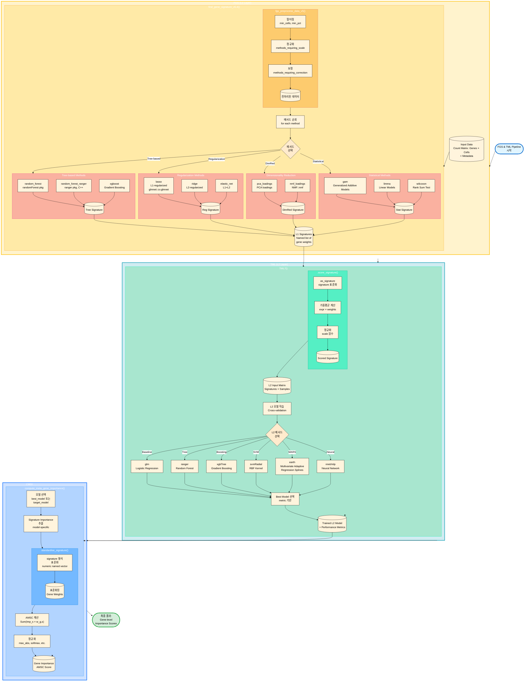

# FGS & TML 통합 가이드

## 1. 소개 (Introduction)
이 문서는 **Find Gene Signature (FGS)** 및 **Targeted Meta Learner (TML)** 프레임워크에 대한 포괄적인 가이드로, 방법론, 사용법 및 최근 개선 사항을 다룹니다.

- **FGS (L1 Layer)**: 다양한 특징 선택(feature selection) 방법을 사용하여 샘플 그룹(예: 세포 클러스터)을 구별하는 유전자 시그니처를 식별합니다.
- **TML (L2 Layer)**: L1 시그니처들을 결합하여 타겟 변수를 예측하는 앙상블 메타 학습기(meta-learner)로, 견고성(robustness)과 정확도를 향상시킵니다.
- **CMGI (Compute Meta Gene Importance)**: TML 모델로부터 유전자 수준의 중요도를 도출하여, *어떤* 유전자가 예측을 주도하는지 설명하는 방법입니다.
- **AMSC (Aggregated Meta Signature Contribution)**: CMGI에서 사용되는 구체적인 지표입니다.

## 2. 워크플로우 시각화 (Workflow Visualization)



---

## 3. 개발 로그 및 최근 개선 사항

### 버전 5.4 (현재)
*   **L1 메서드 수정**:
    *   **`random_forest_ranger`**: 중요도 점수가 잘못된 유전자에 할당되던 이름 매핑 문제를 수정했습니다. `random_forest` 결과와 일치함을 검증했습니다 (Jaccard Index 1.0).
    *   **`nmf_loadings`**: `NMF::nmf` 함수를 명시적으로 전달하여 `do.call` 스코프 문제를 해결했습니다.
*   **TML & CMGI 개선**:
    *   **L2 모델 지원**: `ranger` (중요도 추출 추가) 및 `earth` (패키지 의존성 추가)에 대한 `compute_meta_gene_importance` 지원을 수정했습니다.
    *   **정규화 (Normalization)**: L1 가중치의 서로 다른 스케일을 처리하기 위해 TML7에 모델별 정규화(`max_abs`, `min_max`, `softmax` 등)를 구현했습니다.
    *   **견고성**: L1 시그니처와 L2 중요도 이름 간의 매칭 로직을 개선했습니다 (`make.names` 및 백틱 처리).

### 주요 커밋 이력
*   `Fix compute_meta_gene_importance function definition syntax` (최근)
*   `Integrate TML7 Phase 1 (Normalization) into signature.R`
*   `Update progress report and scripts (Ranger vs RF verified)`

---

## 4. 사용자 가이드 및 모범 사례

### ⚠️ 중요 경고 (Critical Warnings)

1.  **CPU 자원 관리 (Taskset)**
    *   **문제**: 많은 L1/L2 메서드(예: `xgboost`, `ranger`)는 R 수준의 CPU 제한이나 OpenMP 설정을 무시하는 C++ 백엔드를 사용합니다. 이는 CPU 포화 및 시스템 응답 불가 상태를 유발할 수 있습니다.
    *   **해결책**: 스크립트 실행 시 **항상** `taskset`을 사용하여 OS 수준에서 CPU 코어 사용을 엄격히 제한하십시오.
    *   **예시**:
        ```bash
        # 0-15번 코어(16개)로 제한
        taskset -c 0-15 Rscript run_analysis.R
        ```

2.  **환경 관리 (renv)**
    *   **문제**: 패키지 버전이 누락되거나 충돌하면 파이프라인이 중단될 수 있습니다 (예: `earth` 패키지 누락).
    *   **해결책**: 분석을 실행하기 전에 항상 프로젝트 환경을 활성화하십시오.
    *   **예시**:
        ```r
        renv::activate("/home/user3/GJC_KDW_250721")
        ```

### 사용 가이드

#### FGS (Find Gene Signature)
입력: 카운트 행렬 (Genes x Cells), 샘플 ID, 타겟 변수 (예: 'g3'), 통제 변수.
출력: 각 메서드별 유전자 시그니처 목록 (가중치가 포함된 벡터).

```r
fgsa <- find_gene_signature_v5.4(
  sobj,
  target_var = "g3",
  control_vars = "hos_no",
  n_features = 200,
  method = c("random_forest_ranger", "lasso", "nmf_loadings", ...)
)
```

#### TML (Targeted Meta Learner)
입력: FGS 결과 (`l1_signatures`), 홀드아웃 데이터.
출력: 학습된 메타 모델, L2 중요도, 성능 지표.

```r
tmla <- TML7(
  l1_signatures = fgsa,
  holdout_data = sobj,
  target_var = "g3"
)
```

#### CMGI (Compute Meta Gene Importance)
입력: TML 결과.
출력: 유전자 수준 기여도 점수.

```r
# 기본값 (max_abs 정규화)
cmgi_res <- compute_meta_gene_importance(tmla)

# 특정 정규화 사용 (예: 확률 해석용)
cmgi_res_soft <- compute_meta_gene_importance(tmla, normalization_method = "softmax")
```

---

## 5. 방법론 상세 (Methodology Details)

### CMGI & AMSC
**CMGI**는 L2 모델의 중요도를 L1 시그니처로, 다시 유전자로 역전파하여 최종 예측에 대한 각 유전자의 기여도를 계산합니다.

**AMSC (Aggregated Meta Signature Contribution)**는 그 지표입니다:
$$ \text{AMSC}_g = \sum_{s \in S} (\text{Imp}_s \times w_{g,s}) $$
여기서:
*   $\text{Imp}_s$: L2 모델에서 시그니처 $s$의 중요도 (정규화됨).
*   $w_{g,s}$: 시그니처 $s$에서 유전자 $g$의 가중치.

**신뢰도**:
*   "블랙박스" 앙상블 모델에 대한 투명한 설명을 제공합니다.
*   높은 AMSC는 해당 유전자가 여러 고성능 L1 메서드에서 일관되게 중요하다는 것을 의미합니다.

---

## 6. 부록: 메서드 참조 (Appendix)

### FGS 메서드 (L1 Layer)

| 메서드 | 설명 | 장점 | 단점 |
| :--- | :--- | :--- | :--- |
| **random_forest** | 전통적인 Random Forest (randomForest 패키지). | 견고함, 비선형성. | 대용량 데이터에서 느림. |
| **random_forest_ranger** | 고속 Random Forest 구현 (ranger 패키지). | **매우 빠름** (C++), 병렬 처리. | - |
| **xgboost** | Gradient Boosting Trees. | 고성능. | 튜닝 필요. |
| **lasso** | L1-정규화 로지스틱 회귀. | 희소성 (특징 선택). | 선형 관계만 포착. |
| **ridge** | L2-정규화 로지스틱 회귀. | 다중공선성 처리. | 모든 특징 유지. |
| **elastic_net** | Lasso와 Ridge의 결합. | 균형 잡힘. | - |
| **pca_loadings** | 주성분 분석 (PCA) 로딩값. | 비지도 학습, 분산 포착. | 타겟 비특이적. |
| **nmf_loadings** | 비음수 행렬 분해 (NMF). | 부분 기반 표현 (Parts-based). | 느림. |
| **gam** | 일반화 가법 모델 (GAM). | 비선형 관계. | 계산 비용 높음. |
| **limma** | 마이크로어레이/RNA-seq용 선형 모델. | DE 분석 표준. | 선형. |
| **wilcoxon** | 윌콕슨 순위 합 검정. | 단순함, 비모수적. | 단변량(Univariate)만 가능. |

### TML 메서드 (L2 Layer)

| 메서드 | 설명 | 주요 특징 |
| :--- | :--- | :--- |
| **glm** | 로지스틱 회귀. | 해석 가능 (Log-odds). 기준 모델. |
| **ranger** | Random Forest (ranger). | 비선형성, 상호작용 포착. |
| **svmRadial** | 서포트 벡터 머신 (RBF 커널). | 복잡한 경계면. |
| **xgbTree** | Gradient Boosting. | 높은 정확도. |
| **earth** | 다변량 적응 회귀 스플라인 (MARS). | 비선형성 및 상호작용을 명시적으로 포착. |
| **nnet** | 신경망 (Neural Network). | 비선형성. |

---

## 7. 헬퍼 함수 평가
*   **현재 상태**: 헬퍼 함수들(예: `standardise_signature`)이 `signature.R` 내부에 포함되어 있습니다.
*   **평가**: 기능상 문제는 없으나, 정규화 및 이름 매핑 로직이 복잡해짐에 따라 별도의 `utils_signature.R`로 분리하면 코드 가독성과 테스트 용이성이 향상될 것입니다.
