# Limma-Dream-SVA (LDS) 파이프라인 통합 가이드

이 문서는 LDS (Limma-Dream-SVA) 파이프라인 모듈의 통합 가이드입니다. SVA를 이용한 공변량 탐지 및 Limma-Dream을 이용한 Mixed-Model DEG 분석 방법을 설명합니다.

## 1. 소개 (Introduction)

### 목적
단일세포 RNA-seq 또는 GeoMx Digital Spatial Profiling 데이터에서 다중 임의 효과(예: 환자, 배치)를 포함한 선형혼합모형(LMM)을 피팅하고, SVA(Surrogate Variable Analysis)로 숨겨진 공변량을 탐지하여 보정합니다.

### 핵심 기능
*   **SVA 통합**: 잔차 분산을 설명하는 Surrogate Variable를 자동 탐지 및 보정.
*   **Limma-Dream**: 다중 임의 효과를 포함한 Linear Mixed Model 피팅.
*   **유연한 Formula**: lme4 수식 문법 지원 (`(1|patient) + (1|batch)`).

## 2. 워크플로우 시각화 (Workflow Visualization)

```mermaid
%%{init: {'theme':'base', 'themeVariables': {'primaryEdgeColor':'#000000', 'primaryEdgeThickness':4, 'primaryTextColor':'#000000', 'primaryBorderColor':'#000000', 'edgeLabelBackground':'#ffffff', 'tertiaryColor':'#000000'}}}%%
flowchart TD
    Start([LDS Pipeline<br/>LDS 파이프라인 시작])
    Start --> Input
    
    subgraph Input["1. 입력 데이터"]
        direction TB
        SeuratInput[("Seurat Object<br/>또는 DGEList<br/>또는 Matrix")]
        MetaInput[("메타데이터<br/>Matrix 입력 시 필수")]
        SeuratInput --> InputData[("입력 데이터")]
        MetaInput --> InputData
    end
    
    InputData --> Extract
    
    subgraph Extract["2. 데이터 추출 및 검증"]
        direction TB
        ExtractCounts["Count 데이터 추출<br/>layer equals counts"]
        ValidateData["데이터 검증<br/>필수 컬럼 확인"]
        ExtractCounts --> ValidateData
        ValidateData --> ExtractedData[("추출된 데이터")]
    end
    
    ExtractedData --> ParseFormula
    
    subgraph ParseFormula["3. Formula 파싱"]
        direction TB
        ParseFE["고정 효과 추출<br/>Fixed Effects"]
        ParseRE["임의 효과 추출<br/>Random Effects<br/>1 pipe patient, 1 pipe batch"]
        ParseFE --> DesignMatrix["설계 행렬 구성<br/>Design Matrix"]
        ParseRE --> DesignMatrix
    end
    
    DesignMatrix --> DGEList
    
    subgraph DGEList["4. DGEList 생성 및 전처리"]
        direction TB
        CreateDGE["DGEList 생성"]
        CreateDGE --> FilterExpr["filterByExpr<br/>유전자 필터링<br/>min.count equals 10"]
        FilterExpr --> Normalize["calcNormFactors<br/>정규화"]
        Normalize --> DGEListData[("DGEList")]
    end
    
    DGEListData --> Voom
    
    subgraph Voom["5. Voom 변환"]
        direction TB
        VoomTransform["voom 변환<br/>log2 CPM plus 가중치"]
        VoomTransform --> VoomData[("EList 객체")]
    end
    
    VoomData --> SVA
    
    subgraph SVA["6. SVA (Surrogate Variable Analysis)"]
        direction TB
        FitFixed["고정 효과 모델 피팅<br/>잔차 계산"]
        FitFixed --> SVD["잔차 행렬 SVD<br/>R equals U times D times V transpose"]
        SVD --> DetectSV["SV 탐지<br/>Permutation Test<br/>p less than 0.05"]
        DetectSV --> SelectSV{SV 개수<br/>결정}
        SelectSV -->|n_sv 지정| UseSpecified["지정된 개수 사용"]
        SelectSV -->|자동| VarCutoff{sv_var_cutoff<br/>지정됨?}
        VarCutoff -->|Yes| VarBased["잔차 분산 비율<br/>누적 greater than or equal to cutoff"]
        VarCutoff -->|No| AllSV["전체 유의미한 SV"]
        UseSpecified --> SVMatrix[("SV 행렬")]
        VarBased --> SVMatrix
        AllSV --> SVMatrix
    end
    
    SVMatrix --> FinalFormula
    
    subgraph FinalFormula["7. 최종 Formula 생성"]
        direction TB
        CombineFormula["원본 Formula plus SV<br/>~ treatment plus SV1 plus SV2 plus ...<br/>plus 1 pipe patient plus 1 pipe batch"]
        CombineFormula --> FinalFormulaStr[("최종 Formula")]
    end
    
    FinalFormulaStr --> Dream
    
    subgraph Dream["8. Limma-Dream 파이프라인"]
        direction TB
        VoomDream["voomWithDreamWeights<br/>가중치 고려 voom"]
        VoomDream --> DreamFit["dream<br/>LMM 피팅<br/>lme4 수식"]
        DreamFit --> EBayes["eBayes<br/>Empirical Bayes<br/>조정"]
        EBayes --> DreamResults[("MArrayLM 객체")]
    end
    
    DreamResults --> Correlation
    
    subgraph Correlation["9. SVA 상관관계 분석<br/>(선택적)"]
        direction TB
        CorrCalc["메타데이터 times SV<br/>상관관계 계산"]
        CorrCalc --> CorrHeatmap["Heatmap 생성<br/>전체, 메타데이터 times SV,<br/>상위 10개"]
        CorrHeatmap --> CorrResults[("상관관계 결과")]
    end
    
    DreamResults --> Save
    CorrResults --> Save
    
    subgraph Save["10. 결과 저장"]
        direction TB
        SaveFit["fit 객체<br/>MArrayLM"]
        SaveSV["SV 행렬<br/>svs_used"]
        SaveHeatmap["Heatmap 파일<br/>.png"]
        SaveFit --> FinalResult[("최종 결과")]
        SaveSV --> FinalResult
        SaveHeatmap --> FinalResult
    end
    
    FinalResult --> End([완료])
    
    style Start fill:#e1f5ff,stroke:#0066cc,stroke-width:3px
    style End fill:#d4edda,stroke:#28a745,stroke-width:3px
    style Input fill:#fff3cd,stroke:#ffc107,stroke-width:2px
    style Extract fill:#d1ecf1,stroke:#17a2b8,stroke-width:2px
    style ParseFormula fill:#cfe2ff,stroke:#0d6efd,stroke-width:2px
    style DGEList fill:#f8d7da,stroke:#dc3545,stroke-width:2px
    style Voom fill:#e2e3e5,stroke:#6c757d,stroke-width:2px
    style SVA fill:#d1ecf1,stroke:#17a2b8,stroke-width:2px
    style FinalFormula fill:#fff3cd,stroke:#ffc107,stroke-width:2px
    style Dream fill:#cfe2ff,stroke:#0d6efd,stroke-width:2px
    style Correlation fill:#f8d7da,stroke:#dc3545,stroke-width:2px
    style Save fill:#e2e3e5,stroke:#6c757d,stroke-width:2px
```



## 3. 핵심 개념 (Core Concepts)

### SVA (Surrogate Variable Analysis)
SVA는 알려지지 않은 공변량(예: 기술적 배치 효과, 숨겨진 생물학적 요인)을 탐지하는 방법입니다. 잔차 분산(residual variance)을 설명하는 주성분을 찾아 모델에 보정 변수로 추가합니다.

### Limma-Dream
`dream`은 limma 패키지의 확장 기능으로, 다중 임의 효과를 포함한 LMM을 피팅할 수 있습니다:
*   **voomWithDreamWeights**: 가중치를 고려한 voom 변환
*   **dream**: LMM 피팅 (lme4 수식 지원)
*   **eBayes**: Empirical Bayes 조정

## 4. 사용자 가이드 (User Guide)

### 기본 사용법
```r
# Seurat 객체에서 실행
result <- LDS(
  sobj = seurat_obj,
  formula = ~ treatment + (1|patient) + (1|batch),
  n_sv = NULL,  # 자동 결정
  sv_var_cutoff = 0.5
)

# 결과 확인
top_genes <- limma::topTable(result$fit, number = 100)
head(top_genes)
```

### Critical Warnings (주의사항)
1.  **샘플 수**: GeoMx 데이터처럼 샘플 수가 적은 경우에 적합합니다.
2.  **SV 탐지**: 샘플 수가 너무 적으면 SV를 찾지 못할 수 있습니다.
3.  **메모리**: 큰 데이터셋의 경우 메모리 사용량이 많을 수 있습니다.

## 5. 부록 (Appendix)

### 주요 파라미터
*   `formula`: lme4 수식 (예: `~ treatment + (1|patient)`)
*   `n_sv`: 사용할 SV 개수 (NULL이면 자동 결정)
*   `sv_var_cutoff`: SV가 설명해야 할 잔차 분산 비율 (기본값: 0.5)

### 결과 파일 구조
*   `result$fit`: MArrayLM 객체 (limma의 `topTable()` 사용 가능)
*   `result$svs_used`: 실제 사용된 SV 행렬
*   `result$final_formula`: 최종 사용된 Formula

