# MiloR 차등 풍부도 분석 통합 가이드

이 문서는 MiloR 기반 차등 풍부도(Differential Abundance) 분석 모듈의 통합 가이드입니다.

## 1. 소개 (Introduction)

### 목적
단일세포 RNA 시퀀싱 데이터에서 세포 유형 또는 상태의 차등 풍부도(Differential Abundance, DA)를 분석하는 도구입니다. 이 패키지는 neighborhood 기반 접근법을 사용하여 공간적으로 인접한 세포 그룹의 풍부도 변화를 검출합니다.

### 핵심 개념
*   **Neighborhood (이웃)**: 각 세포 주변의 k-nearest neighbor 세포들로 구성된 지역적 세포 집단
*   **Block Method**: Neighborhood 간의 비독립성을 고려하기 위한 블록 생성 방법 (`"sample"`, `"community"`, `"none"`)

## 2. 워크플로우 시각화 (Workflow Visualization)

```mermaid
%%{init: {'theme':'base', 'themeVariables': {'primaryEdgeColor':'#000000', 'primaryEdgeThickness':4, 'primaryTextColor':'#000000', 'primaryBorderColor':'#000000', 'edgeLabelBackground':'#ffffff', 'tertiaryColor':'#000000'}}}%%
flowchart TD
    Start([Milo Pipeline<br/>Milo 파이프라인 시작])
    Start --> Convert
    
    subgraph Convert["1. Seurat → Milo 변환"]
        direction TB
        LoadSeurat["Seurat 객체 로드<br/>.qs 파일 또는<br/>메모리 객체"]
        LoadSeurat --> ToMilo["Milo 객체로 변환<br/>MiloR::Milo"]
        ToMilo --> MiloObj[("Milo 객체")]
    end
    
    MiloObj --> BuildGraph
    
    subgraph BuildGraph["2. kNN 그래프 구축"]
        direction TB
        ExtractReduction["차원 축소 추출<br/>graph_reduction<br/>기본: integrated.scvi"]
        ExtractReduction --> BuildKNN["kNN 그래프 구축<br/>k equals 30"]
        BuildKNN --> Graph[("kNN 그래프")]
    end
    
    Graph --> CreateNhoods
    
    subgraph CreateNhoods["3. Neighborhood 생성"]
        direction TB
        MakeNhoods["makeNhoods<br/>prop equals 0.1<br/>neighborhood 비율"]
        MakeNhoods --> Nhoods[("Neighborhood 목록")]
    end
    
    Nhoods --> CalcDist
    
    subgraph CalcDist["4. Neighborhood 거리 계산"]
        direction TB
        BuildNhoodGraph["nhoodGraph 구축"]
        BuildNhoodGraph --> CalcNhoodDist["neighborhood 간<br/>거리 계산"]
        CalcNhoodDist --> Distances[("거리 행렬")]
    end
    
    Distances --> TestDA
    
    subgraph TestDA["5. 차등 풍부도 검정"]
        direction TB
        TestNhoods["testNhoods<br/>GLM 기반 검정<br/>target_var 비교"]
        TestNhoods --> DAResults[("DA 결과<br/>logFC, p-value")]
    end
    
    DAResults --> ClusterBias
    
    subgraph ClusterBias["6. 클러스터 편중성 검정<br/>(선택적)"]
        direction TB
        TestBias["test_cluster_logfc_bias<br/>Block Permutation<br/>neff 보정"]
        TestBias --> BiasResults[("클러스터별<br/>편중성 결과")]
    end
    
    DAResults --> Visualize
    BiasResults --> Visualize
    
    subgraph Visualize["7. 시각화"]
        direction TB
        PlotUMAP["UMAP Plot<br/>환자/그룹별 색상"]
        PlotNhood["Nhood Graph<br/>neighborhood 연결"]
        PlotBeeswarm["Beeswarm Plot<br/>클러스터별 logFC"]
        DAResults --> PlotUMAP
        DAResults --> PlotNhood
        DAResults --> PlotBeeswarm
    end
    
    Visualize --> Save
    
    subgraph Save["8. 결과 저장"]
        direction TB
        SaveMilo["Milo 객체 저장<br/>.qs"]
        SaveResults["DA 결과 저장<br/>.qs"]
        SavePlots["플롯 저장<br/>.png, .pdf"]
        SaveMilo --> FinalResult[("최종 결과")]
        SaveResults --> FinalResult
        SavePlots --> FinalResult
    end
    
    FinalResult --> End([완료])
    
    style Start fill:#e1f5ff,stroke:#0066cc,stroke-width:3px
    style End fill:#d4edda,stroke:#28a745,stroke-width:3px
    style Convert fill:#fff3cd,stroke:#ffc107,stroke-width:2px
    style BuildGraph fill:#d1ecf1,stroke:#17a2b8,stroke-width:2px
    style CreateNhoods fill:#cfe2ff,stroke:#0d6efd,stroke-width:2px
    style CalcDist fill:#f8d7da,stroke:#dc3545,stroke-width:2px
    style TestDA fill:#e2e3e5,stroke:#6c757d,stroke-width:2px
    style ClusterBias fill:#d1ecf1,stroke:#17a2b8,stroke-width:2px
    style Visualize fill:#fff3cd,stroke:#ffc107,stroke-width:2px
    style Save fill:#cfe2ff,stroke:#0d6efd,stroke-width:2px
```



## 3. 주요 함수 (Functions)

### `run_milo_pipeline`
MiloR 차등 풍부도 분석의 전체 파이프라인을 실행하는 통합 함수입니다.

#### 주요 파라미터
*   `seurat_obj` / `seurat_qs_path`: Seurat 객체 또는 파일 경로
*   `patient_var`: 환자/샘플 식별자 컬럼명 (필수)
*   `cluster_var`: 클러스터 식별자 컬럼명 (필수)
*   `target_var`: 비교 대상 그룹 변수 (필수)
*   `batch_var`: 배치 효과 변수 (필수)
*   `k`: kNN 그래프의 k 값 (기본값: 30)
*   `prop`: Neighborhood 생성 비율 (기본값: 0.1)

### `test_cluster_logfc_bias`
클러스터별 logFC 편중성을 검정하는 함수입니다.

#### 주요 파라미터
*   `da_results`: `miloR::testNhoods()` 결과 데이터프레임
*   `milo`: Milo 객체
*   `block_method`: Block 생성 방법 (`"sample"`, `"community"`, `"none"`)
*   `test_methods`: 실행할 검정 방법 (기본값: `c("permutation", "neff")`)

## 4. 사용자 가이드 (User Guide)

### 기본 사용법
```r
# Seurat 객체에서 직접 실행
result <- run_milo_pipeline(
    seurat_obj = seurat_object,
    patient_var = "patient_id",
    cluster_var = "seurat_clusters",
    target_var = "treatment",
    batch_var = "batch"
)

# 클러스터 편중성 검정
cluster_bias <- test_cluster_logfc_bias(
    da_results = result$da_results,
    milo = result$milo,
    block_method = "sample",
    block_var = "patient_id"
)
```

### Critical Warnings (주의사항)
1.  **Block Method**: `"sample"` 방법을 사용할 때는 `block_var` 파라미터를 제공하는 것이 권장됩니다.
2.  **Neighborhood 비율**: `prop` 값이 너무 작으면 neighborhood 수가 부족할 수 있습니다.
3.  **메모리**: 큰 데이터셋의 경우 메모리 사용량이 많을 수 있습니다.

## 5. 부록 (Appendix)

### Block Method 상세 설명
*   **`"sample"`**: Block ID를 기반으로 같은 block에 속한 neighborhoods를 하나의 block으로 묶음 (권장)
*   **`"community"`**: nhoodGraph의 community detection을 사용하여 그래프 구조상 연결된 neighborhoods를 block으로 묶음
*   **`"none"`**: Blocking 없이 전체를 하나의 block으로 처리

### 검정 방법
*   **Block Permutation Test**: Block 구조를 보존하여 permutation test 수행 (권장)
*   **Correlation-adjusted t-test (neff)**: 그래프 구조를 직접 활용하여 상관관계를 고려한 t-test

