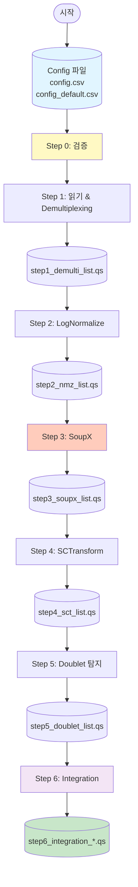

# 파이프라인 명령어 가이드

이 문서는 scRNAseq/Spatial Transcriptomics 데이터 분석 파이프라인의 주요 스크립트와 명령어를 정리한 가이드입니다.

## 목차

1. [전체 파이프라인 실행](#1-전체-파이프라인-실행)
2. [단계별 실행](#2-단계별-실행)
   - [Step 0: 검증](#20-step-0-검증)
   - [Step 1: 읽기 & Demultiplexing](#21-step-1-읽기--demultiplexing)
   - [Step 2: LogNormalize 정규화](#22-step-2-lognormalize-정규화)
   - [Step 3: SoupX (Ambient RNA 제거)](#23-step-3-soupx-ambient-rna-제거)
   - [Step 4: SCTransform 정규화](#24-step-4-sctransform-정규화)
   - [Step 5: Doublet 탐지](#25-step-5-doublet-탐지)
   - [Step 6: Integration](#26-step-6-integration)
3. [설정 파일](#3-설정-파일)
4. [데이터 저장 위치](#4-데이터-저장-위치)
5. [로그 파일](#5-로그-파일)

---

## 1. 전체 파이프라인 실행

모든 단계를 순차적으로 실행합니다.

### 명령어

```bash
cd /data/user3/git_repo/_wt/pipe

# 기본 실행
./scripts/pipe_wrapper.sh \
  --config config/config_complete2.csv \
  --run_id run1

# 특정 단계 건너뛰기
./scripts/pipe_wrapper.sh \
  --config config/config_complete2.csv \
  --run_id run1 \
  --skip_steps 3,4  # Step 3, 4 건너뛰기
```

### 옵션

| 옵션 | 설명 | 기본값 |
|------|------|--------|
| `--config, -c` | Config CSV 파일 경로 (필수) | - |
| `--run_id, -r` | Run ID | `run1` |
| `--skip_steps, -s` | 건너뛸 단계 목록 (쉼표 구분) | - |

### 실행 순서

1. Step 0: 검증
2. Step 1: 읽기 & Demultiplexing
3. Step 2: LogNormalize 정규화
4. Step 3: SoupX (Ambient RNA 제거)
5. Step 4: SCTransform 정규화
6. Step 5: Doublet 탐지
7. Step 6: Integration

---

## 2. 단계별 실행

각 단계를 개별적으로 실행할 수 있습니다.

### 2.0 Step 0: 검증

Config 파일과 입력 파일의 유효성을 검증합니다.

#### 명령어

```bash
Rscript scripts/pipe_validate.R \
  --config config/config_complete2.csv \
  --run_id run1
```

#### 옵션

| 옵션 | 설명 | 기본값 |
|------|------|--------|
| `--config, -c` | Config CSV 파일 경로 (필수) | - |
| `--run_id, -r` | Run ID | `run1` |

#### 검증 항목

- Config 파일 존재 및 형식 확인
- 입력 파일 경로 존재 확인
- Metadata 파일 및 컬럼 존재 확인
- Demultiplexing 파일 존재 확인 (해당하는 경우)

---

### 2.1 Step 1: 읽기 & Demultiplexing

Raw count matrix를 읽고 demultiplexing을 수행합니다.

#### 명령어

```bash
# 기본 실행
Rscript scripts/pipe1_read_demulti.R \
  --config config/config_complete2.csv \
  --run_id run1 \
  --input_step 0 \
  --output_step 1

# 테스트용 다운샘플링 (10%만 사용)
Rscript scripts/pipe1_read_demulti.R \
  --config config/config_complete2.csv \
  --run_id test_scvi \
  --input_step 0 \
  --output_step 1 \
  --downsample 0.1
```

#### 옵션

| 옵션 | 설명 | 기본값 |
|------|------|--------|
| `--config, -c` | Config CSV 파일 경로 (필수) | - |
| `--run_id, -r` | Run ID | `run1` |
| `--input_step, -i` | 입력 단계 번호 | `0` |
| `--output_step, -o` | 출력 단계 번호 | `1` |
| `--downsample, -d` | 다운샘플링 비율 (0-1, 테스트용) | - |

#### 지원하는 Demultiplexing 방법

- **SNP 기반**: `demuxalot` (demuxalot output 파일 필요)
- **HTO 기반**: `HTODemux` 또는 `MULTIseqDemux` (HTO assay 필요)

#### 출력

- **파일**: `/data/user3/sobj/pipe/{run_id}/step1/step1_demulti_list.qs`
- **내용**: Demultiplexing 완료된 Seurat 객체 리스트

---

### 2.2 Step 2: LogNormalize 정규화

LogNormalize 정규화 및 초기 클러스터링을 수행합니다 (SoupX 전용).

#### 명령어

```bash
Rscript scripts/pipe2_nmz_clustering.R \
  --config config/config_complete2.csv \
  --run_id run1 \
  --input_step 1 \
  --output_step 2
```

#### 옵션

| 옵션 | 설명 | 기본값 |
|------|------|--------|
| `--config, -c` | Config CSV 파일 경로 (필수) | - |
| `--run_id, -r` | Run ID | `run1` |
| `--input_step, -i` | 입력 단계 번호 | `1` |
| `--output_step, -o` | 출력 단계 번호 | `2` |

#### 처리 내용

- QC metrics 계산 (mitochondrial, ribosomal genes)
- QC 필터링 (선택적)
- LogNormalize 정규화
- Variable features 찾기
- 데이터 스케일링
- PCA 실행
- 클러스터링 (SoupX용)

#### 출력

- **파일**: `/data/user3/sobj/pipe/{run_id}/step2/step2_nmz_list.qs`
- **내용**: LogNormalize 및 클러스터링 완료된 Seurat 객체 리스트

---

### 2.3 Step 3: SoupX (Ambient RNA 제거)

SoupX를 사용하여 ambient RNA를 제거합니다.

#### 명령어

```bash
Rscript scripts/pipe3_ambient_removal.R \
  --config config/config_complete2.csv \
  --run_id run1 \
  --input_step 2 \
  --output_step 3
```

#### 옵션

| 옵션 | 설명 | 기본값 |
|------|------|--------|
| `--config, -c` | Config CSV 파일 경로 (필수) | - |
| `--run_id, -r` | Run ID | `run1` |
| `--input_step, -i` | 입력 단계 번호 | `2` |
| `--output_step, -o` | 출력 단계 번호 | `3` |

#### 처리 내용

- Raw count matrix 로드
- SoupChannel 생성
- 이전 단계의 클러스터 사용
- 오염 추정 (autoEstCont)
- Count 조정
- 진단 플롯 저장

#### 출력

- **파일**: `/data/user3/sobj/pipe/{run_id}/step3/step3_soupx_list.qs`
- **플롯**: `/data/user3/sobj/pipe/{run_id}/plots/SoupX_{sample_name}.pdf`
- **내용**: Ambient RNA 보정 완료된 Seurat 객체 리스트

---

### 2.4 Step 4: SCTransform 정규화

SCTransform을 사용하여 정규화를 수행합니다 (SoupX 후).

#### 명령어

```bash
Rscript scripts/pipe4_sctransform.R \
  --config config/config_complete2.csv \
  --run_id run1 \
  --input_step 3 \
  --output_step 4
```

#### 옵션

| 옵션 | 설명 | 기본값 |
|------|------|--------|
| `--config, -c` | Config CSV 파일 경로 (필수) | - |
| `--run_id, -r` | Run ID | `run1` |
| `--input_step, -i` | 입력 단계 번호 | `3` |
| `--output_step, -o` | 출력 단계 번호 | `4` |

#### 처리 내용

- SCTransform 실행 (glmGamPoi 방법)
- scale.data layer에서 PCA 실행

#### 출력

- **파일**: `/data/user3/sobj/pipe/{run_id}/step4/step4_sct_list.qs`
- **내용**: SCTransform 완료된 Seurat 객체 리스트 (stdev 포함)

---

### 2.5 Step 5: Doublet 탐지

scDblFinder를 사용하여 doublet을 탐지합니다.

#### 명령어

```bash
Rscript scripts/pipe5_doubletfinder.R \
  --config config/config_complete2.csv \
  --run_id run1 \
  --input_step 4 \
  --output_step 5
```

#### 옵션

| 옵션 | 설명 | 기본값 |
|------|------|--------|
| `--config, -c` | Config CSV 파일 경로 (필수) | - |
| `--run_id, -r` | Run ID | `run1` |
| `--input_step, -i` | 입력 단계 번호 | `4` |
| `--output_step, -o` | 출력 단계 번호 | `5` |

#### 처리 내용

- SingleCellExperiment로 변환
- scDblFinder 실행
- Doublet 점수 및 분류를 메타데이터에 추가
- 선택적으로 doublet 제거 (기본값: 모두 유지)

#### 출력

- **파일**: `/data/user3/sobj/pipe/{run_id}/step5/step5_doublet_list.qs`
- **플롯**: `/data/user3/sobj/pipe/{run_id}/plots/Doublet_{sample_name}.png`
- **내용**: Doublet detection 완료된 Seurat 객체 리스트

---

### 2.6 Step 6: Integration

여러 샘플을 통합합니다 (RPCA 또는 scVI).

#### 명령어

```bash
# scVI 통합 (권장: 작은 데이터셋에서도 robust)
Rscript scripts/pipe6_integration.R \
  --config config/config_complete2.csv \
  --run_id run1 \
  --input_step 5 \
  --output_step 6 \
  --method scVI

# RPCA 통합 (대안)
Rscript scripts/pipe6_integration.R \
  --config config/config_complete2.csv \
  --run_id run1 \
  --input_step 5 \
  --output_step 6 \
  --method RPCA
```

#### 옵션

| 옵션 | 설명 | 기본값 |
|------|------|--------|
| `--config, -c` | Config CSV 파일 경로 (필수) | - |
| `--run_id, -r` | Run ID | `run1` |
| `--input_step, -i` | 입력 단계 번호 | `5` |
| `--output_step, -o` | 출력 단계 번호 | `6` |
| `--method, -m` | Integration 방법 (`RPCA` 또는 `scVI`) | `RPCA` |

#### 처리 내용

**RPCA**:
1. 모든 샘플 병합
2. 배치(GEM)별로 분할
3. 각 배치 SCTransform (이미 Step 4에서 완료)
4. Integration anchors 찾기
5. 데이터 통합
6. Downstream 분석 (PCA, clustering, UMAP)

**scVI**:
1. 모든 샘플 병합
2. Python 환경 설정 (conda: scvi-env)
3. SeuratWrappers를 통한 scVIIntegration 실행
4. Downstream 분석 (PCA, clustering, UMAP)

#### 출력

- **파일 (RPCA)**: `/data/user3/sobj/pipe/{run_id}/step6/step6_integration_rpca.qs`
- **파일 (scVI)**: `/data/user3/sobj/pipe/{run_id}/step6/step6_integration_scvi.qs`
- **내용**: 단일 통합된 Seurat 객체

#### 주의사항

- **scVI**: Python 환경 (`scvi-env`) 및 `SeuratWrappers` 패키지 필요
- **Worker 수**: `config_default.csv`의 `integration_workers`로 조정 가능 (기본값: 6)
- **메모리**: 대용량 데이터의 경우 충분한 메모리 필요

---

## 3. 설정 파일

### 3.1 config.csv

샘플별 설정 파일입니다.

#### 주요 컬럼

| 컬럼 | 설명 | 예시 |
|------|------|------|
| `sample_name` | 샘플 이름 | `97_1` |
| `gem_name` | GEM 이름 | `GEM1` |
| `dir_input_filtered_barcode_matrix` | Filtered count matrix 경로 | `/data/.../filtered_feature_bc_matrix` |
| `dir_input_raw_barcode_matrix` | Raw count matrix 경로 | `/data/.../raw_feature_bc_matrix` |
| `dir_demultiplex_output` | Demultiplexing 결과 파일 경로 | `/home/user3/demux/xlot_1_posterior.csv` |
| `multiplex_method` | Multiplexing 방법 (`SNP` 또는 `HTO`) | `SNP` |
| `demultiplex_method` | Demultiplexing 방법 | `demuxalot` |
| `output_step*_*` | 각 단계별 출력 파일명 | `step1_demulti_list.qs` |

#### 예시

```csv
no,name,sample_name,gem_name,demultiplex_id,dir_input_filtered_barcode_matrix,dir_input_raw_barcode_matrix,dir_demultiplex_output,multiplex_method,demultiplex_method,output_step1_demulti,output_step2_nmz,output_step3_soupx,output_step4_sct,output_step5_doublet,output_step6_integration_scvi
1,97_1,97_1,GEM1,CD_24_14264_PBD_SRA_1,/data/.../filtered_feature_bc_matrix,/data/.../raw_feature_bc_matrix,/home/user3/demux/xlot_1_posterior.csv,SNP,demuxalot,step1_demulti_list.qs,step2_nmz_list.qs,step3_soupx_list.qs,step4_sct_list.qs,step5_doublet_list.qs,step6_integration_scvi.qs
```

### 3.2 config_default.csv

기본 파라미터 설정 파일입니다.

#### 주요 파라미터

| 파라미터 | 설명 | 기본값 |
|----------|------|--------|
| `output_base_dir` | 출력 기본 디렉터리 | `/data/user3/sobj/pipe` |
| `qc_min_nfeature` | 최소 detected genes 수 | `200` |
| `qc_max_nfeature` | 최대 detected genes 수 | `5000` |
| `qc_max_percent_mt` | 최대 mitochondrial % | `20` |
| `lognorm_scale_factor` | LogNormalize scale factor | `10000` |
| `sct_method` | SCTransform 방법 | `glmGamPoi` |
| `integration_workers` | Integration worker 수 | `6` |
| `scvi_conda_env` | scVI conda 환경 경로 | `/home/user3/miniconda3/envs/scvi-env/` |

---

## 4. 데이터 저장 위치

모든 중간 결과는 `qs` 형식으로 저장됩니다.

### 디렉터리 구조

```
/data/user3/sobj/pipe/
└── {run_id}/
    ├── step1/
    │   └── step1_demulti_list.qs          # Step 1 출력
    ├── step2/
    │   └── step2_nmz_list.qs              # Step 2 출력 (LogNormalize)
    ├── step3/
    │   └── step3_soupx_list.qs            # Step 3 출력 (SoupX)
    ├── step4/
    │   └── step4_sct_list.qs               # Step 4 출력 (SCTransform)
    ├── step5/
    │   └── step5_doublet_list.qs           # Step 5 출력 (Doublet Detection)
    ├── step6/
    │   ├── step6_integration_rpca.qs       # Step 6 출력 (RPCA)
    │   └── step6_integration_scvi.qs       # Step 6 출력 (scVI)
    └── plots/
        ├── SoupX_*.pdf                     # SoupX 진단 플롯
        └── Doublet_*.png                   # Doublet 탐지 플롯
```

### 파일 형식

- **`.qs`**: R 객체 직렬화 형식 (빠른 저장/로드)
- 각 파일은 Seurat 객체 리스트 또는 단일 Seurat 객체

---

## 5. 로그 파일

### 로그 위치

- **Run-specific log**: `logs/{run_id}/{run_id}_log.log`
- **Master log**: `logs/total.log`

### 로그 형식

```
[YYYY-MM-DD HH:MM:SS] [LEVEL] 메시지
```

예시:
```
[2025-12-02 17:44:10] [INFO] Step 6: Starting integration (scVI)
[2025-12-02 17:44:10] [INFO] Using 6 workers for parallel processing
[2025-12-02 17:44:12] [INFO] Loading input from: /data/user3/sobj/pipe/test_scvi/step5/step5_doublet_list.qs
```

---

## 전체 워크플로우



---

## 참고 자료

- **통합 가이드**: [`PIPE_INTEGRATED_GUIDE_KR.md`](PIPE_INTEGRATED_GUIDE_KR.md)
- **데이터 흐름**: [`DATA_FLOW.md`](DATA_FLOW.md)
- **테스트 로그**: [`TESTING_LOG.md`](TESTING_LOG.md)

---

## 빠른 참조

### 전체 파이프라인 실행

```bash
cd /data/user3/git_repo/_wt/pipe
./scripts/pipe_wrapper.sh --config config/config_complete2.csv --run_id run1
```

### Step 6만 실행 (이전 결과 재사용)

```bash
# test_scvi의 step5 결과를 사용하여 Step 6 실행
mkdir -p /data/user3/sobj/pipe/test_scvi/step5
ln -s /data/user3/sobj/pipe/test_scvi/step4/step4_doublet_list.qs \
      /data/user3/sobj/pipe/test_scvi/step5/step5_doublet_list.qs

Rscript scripts/pipe6_integration.R \
  --config config/config_complete2.csv \
  --run_id test_scvi \
  --input_step 5 \
  --output_step 6 \
  --method scVI
```

### 로그 확인

```bash
# Run-specific log
tail -f logs/test_scvi/test_scvi_log.log

# Master log
tail -f logs/total.log
```

