# 파이프라인 데이터 흐름 상세 가이드

## 1. 개요

이 문서는 파이프라인의 각 단계에서 데이터가 어떻게 저장되고 로드되는지 상세히 설명합니다.

## 2. 전체 데이터 흐름

```mermaid
flowchart LR
    A[Raw Data] --> B[Step 1:<br/>Read & Demultiplex]
    B --> B1[step1_demulti_list.qs]
    B1 --> C[Step 2:<br/>LogNormalize]
    C --> C1[step2_nmz_list.qs]
    C1 --> D[Step 3:<br/>SoupX]
    D --> D1[step3_soupx_list.qs]
    D1 --> E[Step 2:<br/>SCTransform]
    E --> E1[step2_nmz_list.qs<br/>덮어쓰기]
    E1 --> F[Step 4:<br/>Doublet Detection]
    F --> F1[step4_doublet_list.qs]
    F1 --> G[Step 5:<br/>Integration]
    G --> G1[step5_integration_*.qs]
    
    style B1 fill:#e8f5e9
    style C1 fill:#e8f5e9
    style D1 fill:#e8f5e9
    style E1 fill:#e8f5e9
    style F1 fill:#e8f5e9
    style G1 fill:#e8f5e9
```



## 3. Step별 상세 설명

### Step 1: Read & Demultiplexing

**입력**: 
- Raw count matrix (10X Genomics format)
- Demultiplexing 결과 파일 (SNP: demuxalot output, HTO: HTO assay)

**처리**:
- SNP 기반: `process_demuxalot()` → `get_barcode_mapping()` → Seurat 객체 생성
- HTO 기반: `process_hto_demux()` → HTODemux → Seurat 객체 생성

**출력**: 
- 파일: `{output_base_dir}/{run_id}/step1/step1_demulti_list.qs`
- 내용: Seurat 객체 리스트 (각 샘플당 하나의 객체)
- 구조: `list(sample1 = SeuratObject, sample2 = SeuratObject, ...)`

**코드 위치**: `scripts/pipe1_read_demulti.R`

### Step 2: Normalization & Clustering

**입력**: 
- 파일: `step1/step1_demulti_list.qs` (LogNormalize용)
- 또는: `step3/step3_soupx_list.qs` (SCTransform용)

**처리**:
- LogNormalize: `NormalizeData()` → `FindVariableFeatures()` → `ScaleData()` → `RunPCA()` → `FindClusters()`
- SCTransform: `SCTransform()` → `RunPCA()`

**출력**: 
- 파일: `{output_base_dir}/{run_id}/step2/step2_nmz_list.qs`
- 내용: Seurat 객체 리스트 (normalization 및 clustering 완료)
- **주의**: SCTransform 실행 시 동일한 파일을 덮어쓰기합니다

**코드 위치**: `scripts/pipe2_nmz_clustering.R`

### Step 3: SoupX Ambient RNA Removal

**입력**: 
- 파일: `step2/step2_nmz_list.qs`
- 추가: Raw count matrix (SoupX용)

**처리**:
- `SoupChannel()` 생성 → `autoEstCont()` → `adjustCounts()` → Seurat 객체 업데이트

**출력**: 
- 파일: `{output_base_dir}/{run_id}/step3/step3_soupx_list.qs`
- 내용: Seurat 객체 리스트 (ambient RNA 보정 완료)
- 플롯: `{output_base_dir}/{run_id}/plots/SoupX_{sample_name}.pdf`

**코드 위치**: `scripts/pipe3_ambient_removal.R`

### Step 4: Doublet Detection

**입력**: 
- 파일: `step2/step2_nmz_list.qs` (SCTransform 완료된 버전)

**처리**:
- `SCTransform()` (아직 안 했다면) → `as.SingleCellExperiment()` → `scDblFinder()` → 메타데이터에 doublet 정보 추가

**출력**: 
- 파일: `{output_base_dir}/{run_id}/step4/step4_doublet_list.qs`
- 내용: Seurat 객체 리스트 (doublet detection 완료)
- 플롯: `{output_base_dir}/{run_id}/plots/Doublet_{sample_name}.png`

**코드 위치**: `scripts/pipe4_doubletfinder.R`

### Step 5: Integration

**입력**: 
- 파일: `step4/step4_doublet_list.qs`

**처리**:
- 모든 샘플 병합 → Integration (RPCA 또는 scVI) → Downstream 분석 (PCA, UMAP, Clustering)

**출력**: 
- 파일: `{output_base_dir}/{run_id}/step5/step5_integration_rpca.qs` (RPCA)
- 또는: `{output_base_dir}/{run_id}/step5/step5_integration_scvi.qs` (scVI)
- 내용: 단일 통합된 Seurat 객체

**코드 위치**: `scripts/pipe5_integration.R`

## 4. 파일 경로 생성 함수

### `get_output_path()`

```r
get_output_path(run_id, step, filename, output_base_dir)
```

**예시**:
```r
get_output_path("test_scvi", 1, "step1_demulti_list.qs", "/data/user3/sobj/pipe")
# 결과: /data/user3/sobj/pipe/test_scvi/step1/step1_demulti_list.qs
```

### `load_intermediate()`

```r
load_intermediate(filepath, log_list)
```

**예시**:
```r
input_path <- get_output_path("test_scvi", 1, "step1_demulti_list.qs", "/data/user3/sobj/pipe")
sl <- load_intermediate(input_path, log_list)
```

## 5. 중간 결과 재사용

특정 step에서 실패한 경우, 이전 step의 출력 파일을 직접 로드하여 재시작할 수 있습니다:

```r
# Step 3부터 재시작
library(qs)
sl <- qs::qread("/data/user3/sobj/pipe/test_scvi/step3/step3_soupx_list.qs")

# Step 2 (SCTransform) 실행
# ... (pipe2_nmz_clustering.R 로직)
```

## 6. 로그 파일 위치

- **Run-specific log**: `logs/{run_id}/{run_id}_log.log`
- **Master log**: `logs/total.log`

각 스크립트는 `setup_logging()` 함수를 사용하여 로그를 설정합니다.

## 7. 주의사항

1. **Step 2 파일 덮어쓰기**: SCTransform 실행 시 `step2_nmz_list.qs`를 덮어쓰기하므로, LogNormalize 결과를 보존하려면 별도로 저장하세요.

2. **Step 5 중간 저장**: scVI integration 완료 후 `step5_integration_scvi.qs`에 중간 저장이 수행됩니다 (downstream 분석 전).

3. **파일 경로**: 모든 경로는 `output_base_dir` (기본값: `/data/user3/sobj/pipe`) 기준으로 생성됩니다.

4. **qs 패키지**: 모든 중간 결과는 `qs` 패키지를 사용하여 저장/로드되므로 빠른 직렬화가 가능합니다.

