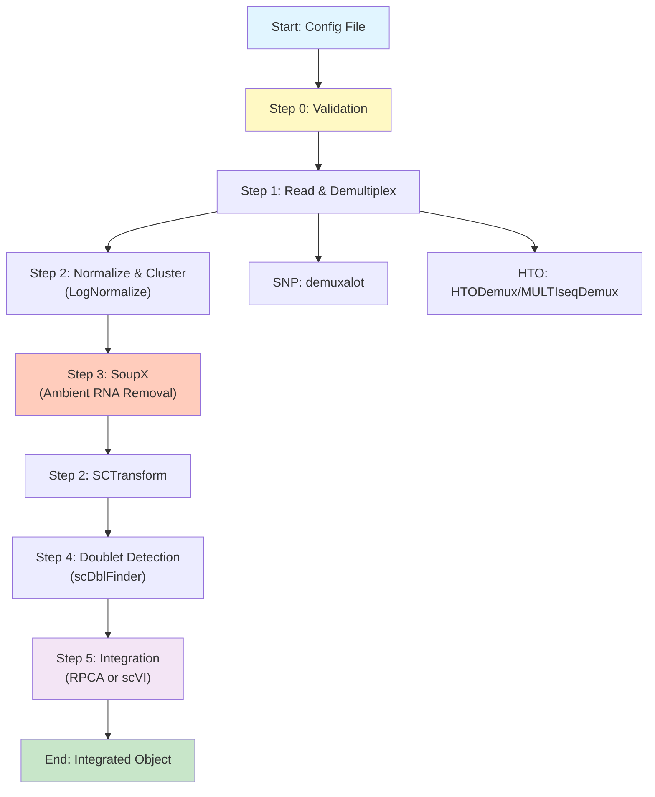

# Pipeline Integrated Guide

## 1. Introduction

The single-cell RNA-seq processing pipeline is a config-driven system that processes raw single-cell data through demultiplexing, quality control, normalization, ambient RNA correction, doublet detection, and integration. The pipeline supports both SNP-based and HTO-based multiplexing methods and provides multiple integration options (RPCA and scVI).

### Key Features

- **Config-driven**: All parameters, file paths, and method choices are specified in CSV configuration files
- **Modular design**: Each processing step is a separate script that can be run independently
- **Comprehensive logging**: Master log, run-specific logs, and step-level logs for debugging
- **Error handling**: Graceful error handling with informative messages
- **Data reuse**: Intermediate results are saved using fast serialization (qs) for easy resumption

### Core Terminology

- **GEM**: Gel Bead-in-Emulsion, a batch identifier for 10X Genomics data
- **SNP demultiplexing**: Sample assignment based on genetic variants using tools like demuxalot
- **HTO demultiplexing**: Sample assignment based on hashtag oligonucleotides (HTO) using Seurat's HTODemux or MULTIseqDemux
- **SoupX**: Ambient RNA contamination correction
- **scDblFinder**: Computational doublet detection
- **RPCA**: Reciprocal Principal Component Analysis for batch integration
- **scVI**: Single-cell Variational Inference for batch integration

## 2. Workflow Visualization



## 3. Development Log & Improvements

### Version 1.0 (Initial Implementation)
- Config-driven pipeline architecture
- Support for SNP (demuxalot) and HTO (HTODemux/MULTIseqDemux) demultiplexing
- LogNormalize and SCTransform normalization
- SoupX integration for ambient RNA correction
- scDblFinder for doublet detection
- RPCA and scVI integration methods
- Comprehensive logging system
- Validation script with friendly error messages

## 4. User Guide & Warnings

### Critical Warnings

1. **Memory Requirements**: Integration steps (especially scVI) require significant memory. Set `future.globals.maxSize` appropriately (default: 200GB).

2. **Python Environment**: scVI integration requires a conda environment with scvi-tools installed. Default path: `/home/user3/miniconda3/envs/scvi-env/`

3. **Doublet Removal**: By default, doublets are **NOT removed** (only tagged). Set `scdblfinder_remove_doublets=TRUE` in config to remove them.

4. **File Paths**: All file paths in config must be absolute paths or relative to the working directory.

5. **Seurat Version**: The pipeline is designed for Seurat v5.0.0+. Layer handling may differ in older versions.

### Usage

#### Basic Usage

```bash
cd /data/user3/git_repo/_wt/pipe
./scripts/pipe_wrapper.sh --config config/config.csv --run_id run1
```

#### Skip Specific Steps

```bash
./scripts/pipe_wrapper.sh --config config/config.csv --run_id run1 --skip_steps 3,4
```

#### Run Individual Steps

```bash
# Step 1: Demultiplexing
Rscript scripts/pipe1_read_demulti.R --config config/config.csv --run_id run1

# Step 2: Normalization (LogNormalize)
Rscript scripts/pipe2_nmz_clustering.R --config config/config.csv --run_id run1 \
  --input_step 1 --output_step 2 --nmz LogNormalize

# Step 3: SoupX
Rscript scripts/pipe3_ambient_removal.R --config config/config.csv --run_id run1 \
  --input_step 2 --output_step 3

# Step 2 again: SCTransform
Rscript scripts/pipe2_nmz_clustering.R --config config/config.csv --run_id run1 \
  --input_step 3 --output_step 2 --nmz SCTransform

# Step 4: Doublet detection
Rscript scripts/pipe4_doubletfinder.R --config config/config.csv --run_id run1 \
  --input_step 2 --output_step 4

# Step 5: Integration (RPCA)
Rscript scripts/pipe5_integration.R --config config/config.csv --run_id run1 \
  --input_step 4 --output_step 5 --method RPCA
```

### Configuration Files

#### config.csv

Main configuration file with one row per sample. Required columns:
- `no`: Sample number
- `name`: Sample identifier
- `sample_name`: Unique sample name
- `gem_name`: GEM/batch identifier
- `multiplex_method`: "SNP", "HTO", or "CMO"
- `demultiplex_method`: "demuxalot" (for SNP) or "HTODemux"/"MULTIseqDemux" (for HTO)
- `dir_input_filtered_barcode_matrix`: Path to filtered count matrix
- `dir_input_raw_barcode_matrix`: Path to raw count matrix (for SoupX)
- `dir_demultiplex_output`: Path to demultiplexing output (for SNP)
- `dir_meta_data`: Path to clinical metadata file

#### config_default.csv

Default parameter values used when not specified in config.csv. Includes:
- QC thresholds
- Normalization parameters
- Integration parameters
- Output file names

#### methods.csv

Method-specific parameters for reference.

## 5. Methodology

### Step 1: Demultiplexing

**SNP-based (demuxalot)**:
1. Load posterior probability matrix from demuxalot output
2. Assign cells to samples based on probability thresholds
3. Tag doublets (cells with "+" in sample name)
4. Create barcode mapping with metadata

**HTO-based**:
1. Load 10X data with HTO assay
2. Perform HTODemux or MULTIseqDemux
3. Assign cells to samples based on HTO signal
4. Tag doublets

### Step 2: Normalization & Clustering

**LogNormalize** (pre-SoupX):
- Normalize data with scale factor
- Find variable features
- Scale data
- Run PCA
- Cluster cells

**SCTransform** (post-SoupX):
- SCTransform with glmGamPoi method
- Run PCA on scale.data layer

### Step 3: SoupX

1. Load raw count matrix
2. Create SoupChannel
3. Set clusters from previous step
4. Estimate contamination (autoEstCont)
5. Adjust counts
6. Save diagnostic plots

### Step 4: Doublet Detection

1. Run SCTransform if not already done
2. Convert to SingleCellExperiment
3. Run scDblFinder
4. Add doublet scores and classifications to metadata
5. Optionally remove doublets (default: keep all)

### Step 5: Integration

**RPCA**:
1. Merge all samples
2. Split by batch (GEM)
3. SCTransform each batch
4. Find integration anchors
5. Integrate data
6. Run downstream analysis (PCA, clustering, UMAP)

**scVI**:
1. Merge all samples
2. Setup Python environment
3. Run scVIIntegration via SeuratWrappers
4. Run downstream analysis

## 6. Appendix

### Output Structure

```
/data/user3/sobj/pipe/
└── run1/
    ├── step1/
    │   └── step1_demulti_list.qs
    ├── step2/
    │   ├── step2_nmz_list.qs
    │   └── step2_sct_list.qs
    ├── step3/
    │   └── step3_soupx_list.qs
    ├── step4/
    │   └── step4_doublet_list.qs
    ├── step5/
    │   ├── step5_integration_rpca.qs
    │   └── step5_integration_scvi.qs
    └── plots/
        ├── SoupX_*.pdf
        └── Doublet_*.png
```

### Log Files

```
logs/
├── total.log                    # Master log
└── run1/
    ├── run1_log.log            # Run-specific log
    └── step*_log.log           # Step-specific logs (if implemented)
```

### Key Parameters

See `config_default.csv` for all configurable parameters. Key ones:
- `qc_min_nfeature`, `qc_max_nfeature`, `qc_max_percent_mt`: QC thresholds
- `sct_method`, `sct_vst_flavor`: SCTransform parameters
- `rpca_npcs`, `rpca_dims`: RPCA integration parameters
- `scvi_conda_env`, `scvi_python_path`: scVI Python environment

### Troubleshooting

1. **"No common cells found"**: Check barcode matching between count matrix and demux results
2. **"Batch column not found"**: Ensure GEM column exists in metadata
3. **scVI fails**: Verify Python environment and scvi-tools installation
4. **Memory errors**: Reduce `future.globals.maxSize` or process fewer samples at once

