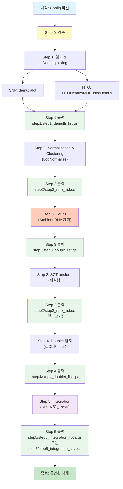

# 파이프라인 통합 가이드

## 1. 소개

단일세포 RNA-seq 처리 파이프라인은 raw 데이터로부터 demultiplexing, quality control, normalization, ambient RNA correction, doublet detection, integration까지 수행하는 config 기반 시스템입니다. SNP 기반 및 HTO 기반 multiplexing 방법을 모두 지원하며, 여러 integration 옵션(RPCA, scVI)을 제공합니다.

### 주요 기능

- **Config 기반**: 모든 파라미터, 파일 경로, 방법 선택이 CSV 설정 파일로 지정됨
- **모듈화 설계**: 각 처리 단계가 독립적으로 실행 가능한 별도 스크립트
- **포괄적 로깅**: 디버깅을 위한 master log, run-specific log, step-level log
- **에러 처리**: 친절한 메시지와 함께 graceful error handling
- **데이터 재사용**: 중간 결과를 빠른 직렬화(qs)로 저장하여 쉽게 재개 가능

### 핵심 용어

- **GEM**: Gel Bead-in-Emulsion, 10X Genomics 데이터의 배치 식별자
- **SNP demultiplexing**: demuxalot 같은 도구를 사용한 유전적 변이 기반 샘플 할당
- **HTO demultiplexing**: Seurat의 HTODemux 또는 MULTIseqDemux를 사용한 hashtag oligonucleotide 기반 샘플 할당
- **SoupX**: Ambient RNA 오염 보정
- **scDblFinder**: 계산적 doublet 탐지
- **RPCA**: 배치 통합을 위한 Reciprocal Principal Component Analysis
- **scVI**: 배치 통합을 위한 Single-cell Variational Inference

## 2. 워크플로우 시각화

### 2.1 전체 파이프라인 흐름



### 2.2 데이터 저장 구조

```
/data/user3/sobj/pipe/
└── {run_id}/
    ├── step1/
    │   └── step1_demulti_list.qs          # Step 1 출력: Demultiplexing 완료된 Seurat 객체 리스트
    ├── step2/
    │   └── step2_nmz_list.qs              # Step 2 출력: Normalization & Clustering 완료된 객체 리스트
    │                                       # (LogNormalize 후 저장, SCTransform 후 덮어쓰기)
    ├── step3/
    │   └── step3_soupx_list.qs            # Step 3 출력: SoupX 보정 완료된 객체 리스트
    ├── step4/
    │   └── step4_doublet_list.qs          # Step 4 출력: Doublet detection 완료된 객체 리스트
    ├── step5/
    │   ├── step5_integration_rpca.qs      # Step 5 출력: RPCA 통합 완료된 단일 객체
    │   └── step5_integration_scvi.qs      # Step 5 출력: scVI 통합 완료된 단일 객체
    └── plots/
        ├── SoupX_*.pdf                    # SoupX 진단 플롯
        └── Doublet_*.png                  # Doublet 탐지 플롯
```

### 2.3 각 Step의 입력/출력 파일

| Step | 입력 파일 | 출력 파일 | 설명 |
|------|----------|----------|------|
| Step 0 | - | - | Config 파일 검증만 수행 |
| Step 1 | - (raw data 직접 읽기) | `step1/step1_demulti_list.qs` | Raw count matrix + demultiplexing 결과 → Seurat 객체 리스트 |
| Step 2 (LogNormalize) | `step1/step1_demulti_list.qs` | `step2/step2_nmz_list.qs` | LogNormalize + PCA + Clustering |
| Step 3 | `step2/step2_nmz_list.qs` | `step3/step3_soupx_list.qs` | SoupX ambient RNA correction |
| Step 2 (SCTransform) | `step3/step3_soupx_list.qs` | `step2/step2_nmz_list.qs` | SCTransform (덮어쓰기) |
| Step 4 | `step2/step2_nmz_list.qs` | `step4/step4_doublet_list.qs` | scDblFinder doublet detection |
| Step 5 | `step4/step4_doublet_list.qs` | `step5/step5_integration_*.qs` | Integration (RPCA 또는 scVI) |

### 2.4 파일 경로 생성 로직

각 스크립트는 다음 함수를 사용하여 파일 경로를 생성합니다:

- **`get_output_path(run_id, step, filename, output_base_dir)`**: 
  - 경로: `{output_base_dir}/{run_id}/step{step}/{filename}`
  - 예: `/data/user3/sobj/pipe/test_scvi/step1/step1_demulti_list.qs`

- **`load_intermediate(filepath, log_list)`**: 
  - 이전 step의 출력 파일을 로드
  - 예: Step 2는 `step1/step1_demulti_list.qs`를 로드

### 2.5 로그 파일 구조

```
logs/
├── total.log                    # Master log (모든 run의 로그)
└── {run_id}/
    └── {run_id}_log.log         # Run-specific log
```

**참고**: 테스트 중 `/tmp/scvi_test2.log`를 확인한 것은 제가 직접 실행한 명령의 출력을 확인하기 위한 것이었습니다. 실제 파이프라인 로그는 `logs/{run_id}/{run_id}_log.log`에 저장됩니다.

## 3. 개발 로그 및 개선사항

### 버전 1.0 (초기 구현)
- Config 기반 파이프라인 아키텍처
- SNP (demuxalot) 및 HTO (HTODemux/MULTIseqDemux) demultiplexing 지원
- LogNormalize 및 SCTransform normalization
- SoupX를 통한 ambient RNA correction 통합
- scDblFinder를 통한 doublet detection
- RPCA 및 scVI integration 방법
- 포괄적 로깅 시스템
- 친절한 에러 메시지가 포함된 검증 스크립트

## 4. 사용자 가이드 및 주의사항

### 중요 경고

1. **메모리 요구사항**: Integration 단계(특히 scVI)는 상당한 메모리가 필요합니다. `future.globals.maxSize`를 적절히 설정하세요 (기본값: 200GB).

2. **Python 환경**: scVI integration은 scvi-tools가 설치된 conda 환경이 필요합니다. 기본 경로: `/home/user3/miniconda3/envs/scvi-env/`

3. **Doublet 제거**: 기본적으로 doublet은 **제거되지 않습니다** (태그만 붙음). config에서 `scdblfinder_remove_doublets=TRUE`로 설정하여 제거할 수 있습니다.

4. **파일 경로**: config의 모든 파일 경로는 절대 경로이거나 작업 디렉토리 기준 상대 경로여야 합니다.

5. **Seurat 버전**: 파이프라인은 Seurat v5.0.0+를 위해 설계되었습니다. 이전 버전에서는 layer 처리 방식이 다를 수 있습니다.

### 사용법

#### 방법 1: Wrapper 스크립트 사용 (권장)

전체 파이프라인을 한 번에 실행합니다:

```bash
cd /data/user3/git_repo/_wt/pipe

# 기본 실행 (RPCA integration)
./scripts/pipe_wrapper.sh --config config/config_complete2.csv --run_id run1

# scVI integration만 실행하려면 wrapper를 수정하거나 개별 스크립트 사용
```

**Wrapper 스크립트의 장점:**
- 모든 단계를 자동으로 순차 실행
- 각 단계의 성공/실패를 자동 확인
- 일관된 로깅 관리

#### 방법 2: 개별 스크립트 실행 (세밀한 제어)

각 단계를 개별적으로 실행하여 중간 결과를 확인하거나 특정 단계만 재실행할 수 있습니다:

```bash
cd /data/user3/git_repo/_wt/pipe

# Step 0: Validation (필수)
Rscript scripts/pipe_validate.R --config config/config_complete2.csv --run_id run1

# Step 1: Read Data & Demultiplexing
# --downsample 옵션: 테스트용으로 cell 수를 줄임 (0.1 = 10%, 0.01 = 1%)
Rscript scripts/pipe1_read_demulti.R \
  --config config/config_complete2.csv \
  --run_id run1 \
  --input_step 0 \
  --output_step 1 \
  --downsample 0.1  # 테스트용, 실제 분석 시에는 생략

# Step 2: Normalization & Clustering (LogNormalize - SoupX 전용)
Rscript scripts/pipe2_nmz_clustering.R \
  --config config/config_complete2.csv \
  --run_id run1 \
  --input_step 1 \
  --output_step 2 \
  --nmz LogNormalize

# Step 3: SoupX Ambient RNA Removal
Rscript scripts/pipe3_ambient_removal.R \
  --config config/config_complete2.csv \
  --run_id run1 \
  --input_step 2 \
  --output_step 3

# Step 2 (재실행): SCTransform (SoupX 후)
Rscript scripts/pipe2_nmz_clustering.R \
  --config config/config_complete2.csv \
  --run_id run1 \
  --input_step 3 \
  --output_step 2 \
  --nmz SCTransform

# Step 4: Doublet Detection (scDblFinder)
Rscript scripts/pipe4_doubletfinder.R \
  --config config/config_complete2.csv \
  --run_id run1 \
  --input_step 2 \
  --output_step 4

# Step 5: Integration
# scVI (권장: 작은 데이터셋에서도 robust)
Rscript scripts/pipe5_integration.R \
  --config config/config_complete2.csv \
  --run_id run1 \
  --input_step 4 \
  --output_step 5 \
  --method scVI

# RPCA (대안)
Rscript scripts/pipe5_integration.R \
  --config config/config_complete2.csv \
  --run_id run1 \
  --input_step 4 \
  --output_step 5 \
  --method RPCA
```

#### 테스트 vs 실제 분석

**테스트 실행 (빠른 검증):**
```bash
# 10% 다운샘플링으로 빠르게 테스트
Rscript scripts/pipe1_read_demulti.R \
  --config config/config_complete2.csv \
  --run_id test_scvi \
  --input_step 0 \
  --output_step 1 \
  --downsample 0.1
```

**실제 분석 (Full data):**
```bash
# --downsample 옵션 없이 실행
Rscript scripts/pipe1_read_demulti.R \
  --config config/config_complete2.csv \
  --run_id run1_full \
  --input_step 0 \
  --output_step 1
```

#### 특정 단계 건너뛰기 (Wrapper 사용 시)

```bash
./scripts/pipe_wrapper.sh \
  --config config/config.csv \
  --run_id run1 \
  --skip_steps 3,4  # Step 3, 4 건너뛰기
```

#### 중간 단계부터 재시작

이전 실행에서 Step 3까지 완료했다면, Step 4부터 시작:

```bash
# Step 4부터 시작 (Step 1-3는 이미 완료된 것으로 가정)
Rscript scripts/pipe4_doubletfinder.R \
  --config config/config_complete2.csv \
  --run_id run1 \
  --input_step 3 \
  --output_step 4
```
Rscript scripts/pipe2_nmz_clustering.R --config config/config.csv --run_id run1 \
  --input_step 1 --output_step 2 --nmz LogNormalize

# Step 3: SoupX
Rscript scripts/pipe3_ambient_removal.R --config config/config.csv --run_id run1 \
  --input_step 2 --output_step 3

# Step 2 다시: SCTransform
Rscript scripts/pipe2_nmz_clustering.R --config config/config.csv --run_id run1 \
  --input_step 3 --output_step 2 --nmz SCTransform

# Step 4: Doublet detection
Rscript scripts/pipe4_doubletfinder.R --config config/config.csv --run_id run1 \
  --input_step 2 --output_step 4

# Step 5: Integration (RPCA)
Rscript scripts/pipe5_integration.R --config config/config.csv --run_id run1 \
  --input_step 4 --output_step 5 --method RPCA
```

### 설정 파일

#### config.csv

샘플당 한 행의 메인 설정 파일. 필수 컬럼:
- `no`: 샘플 번호
- `name`: 샘플 식별자
- `sample_name`: 고유 샘플 이름
- `gem_name`: GEM/배치 식별자
- `multiplex_method`: "SNP", "HTO", 또는 "CMO"
- `demultiplex_method`: "demuxalot" (SNP용) 또는 "HTODemux"/"MULTIseqDemux" (HTO용)
- `dir_input_filtered_barcode_matrix`: 필터링된 count matrix 경로
- `dir_input_raw_barcode_matrix`: raw count matrix 경로 (SoupX용)
- `dir_demultiplex_output`: demultiplexing 출력 경로 (SNP용)
- `dir_meta_data`: 임상 메타데이터 파일 경로

#### config_default.csv

config.csv에서 지정되지 않을 때 사용되는 기본 파라미터 값. 포함 내용:
- QC 임계값
- Normalization 파라미터
- Integration 파라미터
- 출력 파일 이름

#### methods.csv

참고용 방법별 파라미터.

### Config 파일 주의사항

**경로에 쉼표 포함 시**: 
- CSV 파일에서 경로에 쉼표가 포함된 경우, Excel이 자동으로 따옴표로 감싸지만 수동 편집 시 주의 필요
- 파이프라인은 자동으로 따옴표를 제거하므로 정상 작동

**demultiplex_id 컬럼**: 
- Config의 `demultiplex_id` 값은 demultiplexing 출력 파일의 column 이름과 정확히 일치해야 합니다
- `Best_Sample`은 `get_barcode_mapping` 함수에서 자동으로 생성됩니다
- Excel이 "1-1" 같은 값을 날짜로 변환하는 것을 방지하려면 `'1-1'`처럼 작은따옴표로 감싸세요

## 5. 실행 예시

### 전체 파이프라인 실행 (테스트 → 실제)

#### 1단계: 다운샘플링으로 빠른 테스트

```bash
cd /data/user3/git_repo/_wt/pipe

# Step 1: 10% 다운샘플링으로 테스트
Rscript scripts/pipe1_read_demulti.R \
  --config config/config_complete2.csv \
  --run_id test_scvi \
  --input_step 0 \
  --output_step 1 \
  --downsample 0.1

# Step 2: LogNormalize
Rscript scripts/pipe2_nmz_clustering.R \
  --config config/config_complete2.csv \
  --run_id test_scvi \
  --input_step 1 \
  --output_step 2 \
  --nmz LogNormalize

# Step 3: SoupX
Rscript scripts/pipe3_ambient_removal.R \
  --config config/config_complete2.csv \
  --run_id test_scvi \
  --input_step 2 \
  --output_step 3

# Step 2 (재실행): SCTransform
Rscript scripts/pipe2_nmz_clustering.R \
  --config config/config_complete2.csv \
  --run_id test_scvi \
  --input_step 3 \
  --output_step 2 \
  --nmz SCTransform

# Step 4: Doublet detection
Rscript scripts/pipe4_doubletfinder.R \
  --config config/config_complete2.csv \
  --run_id test_scvi \
  --input_step 2 \
  --output_step 4

# Step 5: scVI integration (robust, 작은 데이터셋에서도 작동)
Rscript scripts/pipe5_integration.R \
  --config config/config_complete2.csv \
  --run_id test_scvi \
  --input_step 4 \
  --output_step 5 \
  --method scVI
```

#### 2단계: Full data로 실제 분석

테스트가 성공하면 `--downsample` 옵션 없이 전체 데이터로 실행:

```bash
# Step 1: Full data (다운샘플링 없음)
Rscript scripts/pipe1_read_demulti.R \
  --config config/config_complete2.csv \
  --run_id run1_full \
  --input_step 0 \
  --output_step 1

# 나머지 단계는 동일하게 실행
# ... (Step 2-5는 위와 동일)
```

### 출력 파일 위치

모든 중간 결과는 `/data/user3/sobj/pipe/{run_id}/step{N}/` 디렉토리에 저장됩니다:

- `step1/step1_demulti_list.qs`: Demultiplexing 완료된 Seurat 객체 리스트
- `step2/step2_nmz_list.qs`: Normalization & Clustering 완료된 객체 리스트
- `step3/step3_soupx_list.qs`: SoupX 보정 완료된 객체 리스트
- `step4/step4_doublet_list.qs`: Doublet detection 완료된 객체 리스트
- `step5/step5_integration_scvi.qs`: scVI 통합 완료된 단일 객체
- `step5/step5_integration_rpca.qs`: RPCA 통합 완료된 단일 객체

### 로그 파일 위치

- Master log: `logs/total.log`
- Run-specific log: `logs/{run_id}/run_log.log`
- Step logs: 각 스크립트가 자동으로 생성

## 6. 트러블슈팅

### 일반적인 오류 및 해결 방법

#### 1. CSV 파싱 오류: "more columns than column names"
**원인**: 경로에 쉼표가 포함되어 있거나 따옴표 처리 문제
**해결**: 
- Config 파일을 텍스트 에디터로 열어 경로 확인
- 경로에 쉼표가 있으면 따옴표로 감싸기
- `pipe_utils.R`의 `load_config` 함수가 자동으로 따옴표 제거

#### 2. HTO assay 이름 문제
**원인**: Seurat가 assay 이름의 공백을 점(.)으로 변환
**해결**: 파이프라인이 자동으로 처리 (실제 저장된 이름 사용)

#### 3. scVI: 'IntegrateLayers' is not an exported object
**원인**: Seurat v5에서는 `IntegrateLayers`가 Seurat 패키지에 있음 (SeuratWrappers 아님)
**해결**: `SeuratWrappers::IntegrateLayers` → `IntegrateLayers`로 수정됨

#### 4. SoupX: "No plausible marker genes found"
**원인**: 데이터가 너무 작거나 복잡도가 낮음
**해결**: 
- 다운샘플링된 데이터에서는 정상일 수 있음 (10% 다운샘플링 시 많은 샘플에서 발생)
- Full data에서는 자동으로 원본 counts 유지
- **로그 확인**: `logs/{run_id}/{run_id}_log.log`에서 `[WARNING] Keeping original counts` 메시지 확인
- 이는 **정상적인 동작**이며, SoupX가 실패한 경우 원본 counts를 유지합니다

#### 5. HTODemux: "Cells with zero counts exist as a cluster"
**원인**: HTO counts가 0인 세포가 클러스터에 포함됨
**해결**: 파이프라인이 자동으로 필터링하고, 실패 시 fallback 처리

### 성능 최적화 팁

1. **테스트 실행**: `--downsample 0.1` 옵션으로 빠르게 검증
2. **중간 결과 재사용**: 각 step의 출력을 qs로 저장하므로 실패한 step부터 재시작 가능
3. **메모리 설정**: scVI는 많은 메모리가 필요하므로 `future.globals.maxSize` 조정

## 7. 방법론

### Step 1: Demultiplexing

**SNP 기반 (demuxalot)**:
1. demuxalot 출력에서 posterior 확률 행렬 로드
2. 확률 임계값 기반으로 세포를 샘플에 할당
3. Doublet 태그 (샘플 이름에 "+" 포함된 세포)
4. 메타데이터가 포함된 barcode mapping 생성

**HTO 기반**:
1. HTO assay가 포함된 10X 데이터 로드
2. HTODemux 또는 MULTIseqDemux 수행
3. HTO 신호 기반으로 세포를 샘플에 할당
4. Doublet 태그

### Step 2: Normalization & Clustering

**LogNormalize** (SoupX 전):
- Scale factor로 데이터 정규화
- Variable features 찾기
- 데이터 스케일링
- PCA 실행
- 세포 클러스터링

**SCTransform** (SoupX 후):
- glmGamPoi 방법으로 SCTransform
- scale.data layer에서 PCA 실행

### Step 3: SoupX

1. Raw count matrix 로드
2. SoupChannel 생성
3. 이전 단계의 클러스터 설정
4. 오염 추정 (autoEstCont)
5. Count 조정
6. 진단 플롯 저장

### Step 4: Doublet Detection

1. 아직 안 했다면 SCTransform 실행
2. SingleCellExperiment로 변환
3. scDblFinder 실행
4. Doublet 점수 및 분류를 메타데이터에 추가
5. 선택적으로 doublet 제거 (기본값: 모두 유지)

### Step 5: Integration

**RPCA**:
1. 모든 샘플 병합
2. 배치(GEM)별로 분할
3. 각 배치 SCTransform
4. Integration anchors 찾기
5. 데이터 통합
6. Downstream 분석 실행 (PCA, clustering, UMAP)

**scVI**:
1. 모든 샘플 병합
2. Python 환경 설정
3. SeuratWrappers를 통한 scVIIntegration 실행
4. Downstream 분석 실행

## 6. 데이터 흐름 상세 가이드

각 step에서 데이터가 어떻게 저장되고 로드되는지에 대한 상세한 설명은 [`DATA_FLOW.md`](DATA_FLOW.md)를 참조하세요.

## 7. 부록

### 출력 구조

```
/data/user3/sobj/pipe/
└── run1/
    ├── step1/
    │   └── step1_demulti_list.qs
    ├── step2/
    │   ├── step2_nmz_list.qs
    │   └── step2_sct_list.qs
    ├── step3/
    │   └── step3_soupx_list.qs
    ├── step4/
    │   └── step4_doublet_list.qs
    ├── step5/
    │   ├── step5_integration_rpca.qs
    │   └── step5_integration_scvi.qs
    └── plots/
        ├── SoupX_*.pdf
        └── Doublet_*.png
```

### 로그 파일

```
logs/
├── total.log                    # Master log
└── run1/
    ├── run1_log.log            # Run-specific log
    └── step*_log.log           # Step-specific logs (구현된 경우)
```

### 주요 파라미터

모든 설정 가능한 파라미터는 `config_default.csv` 참조. 주요 항목:
- `qc_min_nfeature`, `qc_max_nfeature`, `qc_max_percent_mt`: QC 임계값
- `sct_method`, `sct_vst_flavor`: SCTransform 파라미터
- `rpca_npcs`, `rpca_dims`: RPCA integration 파라미터
- `scvi_conda_env`, `scvi_python_path`: scVI Python 환경

### 문제 해결

1. **"No common cells found"**: Count matrix와 demux 결과 간 barcode 매칭 확인
2. **"Batch column not found"**: 메타데이터에 GEM 컬럼이 있는지 확인
3. **scVI 실패**: Python 환경 및 scvi-tools 설치 확인
4. **메모리 오류**: `future.globals.maxSize`를 줄이거나 한 번에 처리하는 샘플 수 감소

