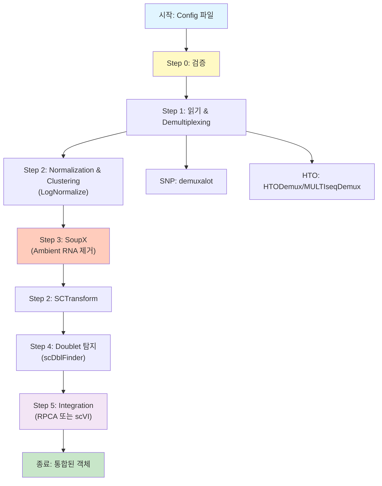

# 파이프라인 통합 가이드

## 1. 소개

단일세포 RNA-seq 처리 파이프라인은 raw 데이터로부터 demultiplexing, quality control, normalization, ambient RNA correction, doublet detection, integration까지 수행하는 config 기반 시스템입니다. SNP 기반 및 HTO 기반 multiplexing 방법을 모두 지원하며, 여러 integration 옵션(RPCA, scVI)을 제공합니다.

### 주요 기능

- **Config 기반**: 모든 파라미터, 파일 경로, 방법 선택이 CSV 설정 파일로 지정됨
- **모듈화 설계**: 각 처리 단계가 독립적으로 실행 가능한 별도 스크립트
- **포괄적 로깅**: 디버깅을 위한 master log, run-specific log, step-level log
- **에러 처리**: 친절한 메시지와 함께 graceful error handling
- **데이터 재사용**: 중간 결과를 빠른 직렬화(qs)로 저장하여 쉽게 재개 가능

### 핵심 용어

- **GEM**: Gel Bead-in-Emulsion, 10X Genomics 데이터의 배치 식별자
- **SNP demultiplexing**: demuxalot 같은 도구를 사용한 유전적 변이 기반 샘플 할당
- **HTO demultiplexing**: Seurat의 HTODemux 또는 MULTIseqDemux를 사용한 hashtag oligonucleotide 기반 샘플 할당
- **SoupX**: Ambient RNA 오염 보정
- **scDblFinder**: 계산적 doublet 탐지
- **RPCA**: 배치 통합을 위한 Reciprocal Principal Component Analysis
- **scVI**: 배치 통합을 위한 Single-cell Variational Inference

## 2. 워크플로우 시각화



## 3. 개발 로그 및 개선사항

### 버전 1.0 (초기 구현)
- Config 기반 파이프라인 아키텍처
- SNP (demuxalot) 및 HTO (HTODemux/MULTIseqDemux) demultiplexing 지원
- LogNormalize 및 SCTransform normalization
- SoupX를 통한 ambient RNA correction 통합
- scDblFinder를 통한 doublet detection
- RPCA 및 scVI integration 방법
- 포괄적 로깅 시스템
- 친절한 에러 메시지가 포함된 검증 스크립트

## 4. 사용자 가이드 및 주의사항

### 중요 경고

1. **메모리 요구사항**: Integration 단계(특히 scVI)는 상당한 메모리가 필요합니다. `future.globals.maxSize`를 적절히 설정하세요 (기본값: 200GB).

2. **Python 환경**: scVI integration은 scvi-tools가 설치된 conda 환경이 필요합니다. 기본 경로: `/home/user3/miniconda3/envs/scvi-env/`

3. **Doublet 제거**: 기본적으로 doublet은 **제거되지 않습니다** (태그만 붙음). config에서 `scdblfinder_remove_doublets=TRUE`로 설정하여 제거할 수 있습니다.

4. **파일 경로**: config의 모든 파일 경로는 절대 경로이거나 작업 디렉토리 기준 상대 경로여야 합니다.

5. **Seurat 버전**: 파이프라인은 Seurat v5.0.0+를 위해 설계되었습니다. 이전 버전에서는 layer 처리 방식이 다를 수 있습니다.

### 사용법

#### 기본 사용법

```bash
cd /data/user3/git_repo/_wt/pipe
./scripts/pipe_wrapper.sh --config config/config.csv --run_id run1
```

#### 특정 단계 건너뛰기

```bash
./scripts/pipe_wrapper.sh --config config/config.csv --run_id run1 --skip_steps 3,4
```

#### 개별 단계 실행

```bash

# validation
Rscript scripts/pipe_validate.R --config config/config_complete.csv --run_id run_validation
Rscript scripts/pipe_validate.R --config config/config_complete2.csv --run_id run_validation

# Step 1: Demultiplexing
Rscript scripts/pipe1_read_demulti.R --config config/config.csv --run_id run1

# Step 2: Normalization (LogNormalize)
Rscript scripts/pipe2_nmz_clustering.R --config config/config.csv --run_id run1 \
  --input_step 1 --output_step 2 --nmz LogNormalize

# Step 3: SoupX
Rscript scripts/pipe3_ambient_removal.R --config config/config.csv --run_id run1 \
  --input_step 2 --output_step 3

# Step 2 다시: SCTransform
Rscript scripts/pipe2_nmz_clustering.R --config config/config.csv --run_id run1 \
  --input_step 3 --output_step 2 --nmz SCTransform

# Step 4: Doublet detection
Rscript scripts/pipe4_doubletfinder.R --config config/config.csv --run_id run1 \
  --input_step 2 --output_step 4

# Step 5: Integration (RPCA)
Rscript scripts/pipe5_integration.R --config config/config.csv --run_id run1 \
  --input_step 4 --output_step 5 --method RPCA
```

### 설정 파일

#### config.csv

샘플당 한 행의 메인 설정 파일. 필수 컬럼:
- `no`: 샘플 번호
- `name`: 샘플 식별자
- `sample_name`: 고유 샘플 이름
- `gem_name`: GEM/배치 식별자
- `multiplex_method`: "SNP", "HTO", 또는 "CMO"
- `demultiplex_method`: "demuxalot" (SNP용) 또는 "HTODemux"/"MULTIseqDemux" (HTO용)
- `dir_input_filtered_barcode_matrix`: 필터링된 count matrix 경로
- `dir_input_raw_barcode_matrix`: raw count matrix 경로 (SoupX용)
- `dir_demultiplex_output`: demultiplexing 출력 경로 (SNP용)
- `dir_meta_data`: 임상 메타데이터 파일 경로

#### config_default.csv

config.csv에서 지정되지 않을 때 사용되는 기본 파라미터 값. 포함 내용:
- QC 임계값
- Normalization 파라미터
- Integration 파라미터
- 출력 파일 이름

#### methods.csv

참고용 방법별 파라미터.

## 5. 방법론

### Step 1: Demultiplexing

**SNP 기반 (demuxalot)**:
1. demuxalot 출력에서 posterior 확률 행렬 로드
2. 확률 임계값 기반으로 세포를 샘플에 할당
3. Doublet 태그 (샘플 이름에 "+" 포함된 세포)
4. 메타데이터가 포함된 barcode mapping 생성

**HTO 기반**:
1. HTO assay가 포함된 10X 데이터 로드
2. HTODemux 또는 MULTIseqDemux 수행
3. HTO 신호 기반으로 세포를 샘플에 할당
4. Doublet 태그

### Step 2: Normalization & Clustering

**LogNormalize** (SoupX 전):
- Scale factor로 데이터 정규화
- Variable features 찾기
- 데이터 스케일링
- PCA 실행
- 세포 클러스터링

**SCTransform** (SoupX 후):
- glmGamPoi 방법으로 SCTransform
- scale.data layer에서 PCA 실행

### Step 3: SoupX

1. Raw count matrix 로드
2. SoupChannel 생성
3. 이전 단계의 클러스터 설정
4. 오염 추정 (autoEstCont)
5. Count 조정
6. 진단 플롯 저장

### Step 4: Doublet Detection

1. 아직 안 했다면 SCTransform 실행
2. SingleCellExperiment로 변환
3. scDblFinder 실행
4. Doublet 점수 및 분류를 메타데이터에 추가
5. 선택적으로 doublet 제거 (기본값: 모두 유지)

### Step 5: Integration

**RPCA**:
1. 모든 샘플 병합
2. 배치(GEM)별로 분할
3. 각 배치 SCTransform
4. Integration anchors 찾기
5. 데이터 통합
6. Downstream 분석 실행 (PCA, clustering, UMAP)

**scVI**:
1. 모든 샘플 병합
2. Python 환경 설정
3. SeuratWrappers를 통한 scVIIntegration 실행
4. Downstream 분석 실행

## 6. 부록

### 출력 구조

```
/data/user3/sobj/pipe/
└── run1/
    ├── step1/
    │   └── step1_demulti_list.qs
    ├── step2/
    │   ├── step2_nmz_list.qs
    │   └── step2_sct_list.qs
    ├── step3/
    │   └── step3_soupx_list.qs
    ├── step4/
    │   └── step4_doublet_list.qs
    ├── step5/
    │   ├── step5_integration_rpca.qs
    │   └── step5_integration_scvi.qs
    └── plots/
        ├── SoupX_*.pdf
        └── Doublet_*.png
```

### 로그 파일

```
logs/
├── total.log                    # Master log
└── run1/
    ├── run1_log.log            # Run-specific log
    └── step*_log.log           # Step-specific logs (구현된 경우)
```

### 주요 파라미터

모든 설정 가능한 파라미터는 `config_default.csv` 참조. 주요 항목:
- `qc_min_nfeature`, `qc_max_nfeature`, `qc_max_percent_mt`: QC 임계값
- `sct_method`, `sct_vst_flavor`: SCTransform 파라미터
- `rpca_npcs`, `rpca_dims`: RPCA integration 파라미터
- `scvi_conda_env`, `scvi_python_path`: scVI Python 환경

### 문제 해결

1. **"No common cells found"**: Count matrix와 demux 결과 간 barcode 매칭 확인
2. **"Batch column not found"**: 메타데이터에 GEM 컬럼이 있는지 확인
3. **scVI 실패**: Python 환경 및 scvi-tools 설치 확인
4. **메모리 오류**: `future.globals.maxSize`를 줄이거나 한 번에 처리하는 샘플 수 감소

