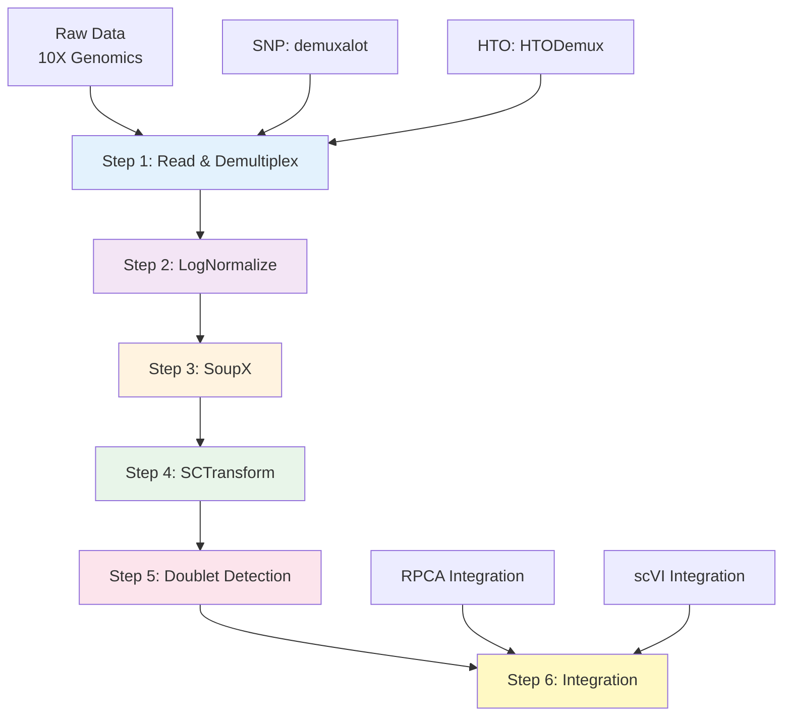

# 파이프라인 단계별 기능 설명

이 문서는 scRNAseq/Spatial Transcriptomics 데이터 분석 파이프라인의 각 단계(Step 1~6)에서 수행되는 주요 기능과 처리 과정을 상세히 설명합니다.

## 목차

1. [전체 파이프라인 개요](#1-전체-파이프라인-개요)
2. [Step 1: 데이터 읽기 및 Demultiplexing](#2-step-1-데이터-읽기-및-demultiplexing)
3. [Step 2: LogNormalize 정규화 및 클러스터링](#3-step-2-lognormalize-정규화-및-클러스터링)
4. [Step 3: SoupX를 이용한 Ambient RNA 제거](#4-step-3-soupx를-이용한-ambient-rna-제거)
5. [Step 4: SCTransform 정규화](#5-step-4-sctransform-정규화)
6. [Step 5: Doublet 탐지](#6-step-5-doublet-탐지)
7. [Step 6: Integration (배치 효과 보정)](#7-step-6-integration-배치-효과-보정)

---

## 1. 전체 파이프라인 개요



### 데이터 흐름

각 단계는 이전 단계의 출력을 입력으로 받아 처리하며, 중간 결과를 `.qs` 파일로 저장합니다:

- **Step 1** → `step1_demulti_list.qs`
- **Step 2** → `step2_nmz_list.qs`
- **Step 3** → `step3_soupx_list.qs`
- **Step 4** → `step4_sct_list.qs`
- **Step 5** → `step5_doublet_list.qs`
- **Step 6** → `step6_integration_rpca.qs` 또는 `step6_integration_scvi.qs`

---

## 2. Step 1: 데이터 읽기 및 Demultiplexing

**스크립트**: `scripts/pipe1_read_demulti.R`

### 목적

Raw count matrix를 읽고, multiplexed 샘플의 경우 demultiplexing을 수행하여 각 cell이 어느 sample에 속하는지 식별합니다.

### 주요 기능

#### 1. 데이터 읽기
- **Filtered count matrix**: `Read10X()`로 10X Genomics 형식의 필터링된 count matrix 읽기
- **Raw count matrix** (HTO의 경우): HTO assay 정보 포함

#### 2. Demultiplexing 방법

**SNP 기반 (multiplex_method = "SNP")**
- Demuxalot posterior 파일 읽기
- `process_demuxalot()` 함수로 처리:
  - Posterior 확률 행렬에서 `get_barcode_mapping()` 호출
  - Singlet threshold (기본값: 0.5) 이상 → singlet
  - Doublet threshold (기본값: 0.3) 이상 → doublet (예: "Sample1+Sample2")
  - 그 외 → Negative
- 각 cell에 `Best_Sample`, `droplet_demulti` (singlet_demulti/doublet_demulti) 메타데이터 추가

**HTO 기반 (multiplex_method = "HTO" 또는 "CMO")**
- HTO assay에서 `HTODemux()` 또는 `MULTIseqDemux()` 실행
- Positive quantile (기본값: 0.99) 기준으로 doublet/singlet 분류
- `HTO_classification`, `HTO_maxID` 메타데이터 추가

#### 3. Seurat 객체 생성
- Demultiplexing 결과를 메타데이터로 포함하여 Seurat 객체 생성
- GEM 정보 추가 (`obj$GEM <- gem_name`)
- 샘플 이름에서 time_point 추출 (정규식 패턴 매칭)

#### 4. 선택적 Downsampling
- 테스트를 위해 `--downsample` 옵션으로 cell 수 감소 가능

### 입력

- `dir_input_filtered_barcode_matrix`: 필터링된 count matrix 경로
- `dir_input_raw_barcode_matrix`: Raw count matrix 경로 (HTO의 경우)
- `dir_demultiplex_output`: Demuxalot posterior 파일 경로 (SNP의 경우)

### 출력

- **파일**: `{output_base_dir}/{run_id}/step1/step1_demulti_list.qs`
- **내용**: Seurat 객체 리스트 (각 샘플당 하나)
- **구조**: `list(sample1 = SeuratObject, sample2 = SeuratObject, ...)`
- **메타데이터**: `GEM`, `Best_Sample`, `droplet_demulti`, `time_point` (선택적)

### 특징

- SNP와 HTO demultiplexing을 자동으로 구분하여 처리
- Demuxalot 파일의 column 이름에서 sample 이름 자동 추출
- 에러 발생 시 해당 샘플만 건너뛰고 계속 진행

---

## 3. Step 2: LogNormalize 정규화 및 클러스터링

**스크립트**: `scripts/pipe2_nmz_clustering.R`

### 목적

SoupX를 위한 사전 클러스터링과 QC 메트릭 계산을 수행합니다. LogNormalize 정규화를 사용하여 빠른 클러스터링을 수행합니다.

### 주요 기능

#### 1. QC 메트릭 계산
- **Mitochondrial percentage**: `^MT-` 패턴으로 계산
- **Ribosomal percentage**: `^RPS`, `^RPL` 패턴으로 계산 (non-ribosomal gene 제외)

#### 2. QC 필터링 (선택적)
- `nFeature_RNA`: 기본값 200~5000
- `percent.mt`: 기본값 < 20%
- 최소 cell 수 미만이면 샘플 제외

#### 3. LogNormalize 정규화
- `NormalizeData()`: Scale factor 기본값 10,000
- `FindVariableFeatures()`: Selection method 기본값 "disp", nfeatures 기본값 2,000
- `ScaleData()`: Variable features만 scaling

#### 4. PCA 및 클러스터링
- `RunPCA()`: 기본값 20 PCs (SoupX를 위한 빠른 클러스터링)
- `FindNeighbors()`: 기본값 dims = 1:10
- `FindClusters()`: 기본값 resolution = 0.5

### 입력

- `step1_demulti_list.qs`: Step 1의 출력

### 출력

- **파일**: `{output_base_dir}/{run_id}/step2/step2_nmz_list.qs`
- **내용**: LogNormalize 정규화 및 클러스터링 완료된 Seurat 객체 리스트
- **추가된 정보**: `percent.mt`, `percent.ribo`, `seurat_clusters`, PCA reduction

### 특징

- SoupX를 위한 빠른 클러스터링 (20 PCs, resolution 0.5)
- SCTransform과 달리 빠르게 실행되지만, SoupX 이후에 SCTransform을 별도로 수행

---

## 4. Step 3: SoupX를 이용한 Ambient RNA 제거

**스크립트**: `scripts/pipe3_ambient_removal.R`

### 목적

Raw count matrix와 filtered count matrix를 비교하여 ambient RNA (배경 RNA)를 추정하고 제거합니다.

### 주요 기능

#### 1. Raw Count Matrix 읽기
- `dir_input_raw_barcode_matrix`에서 raw counts 로드
- SNP 샘플의 경우 barcode suffix 매칭 (`_1`, `_2`, ...)

#### 2. SoupChannel 생성
- Raw counts와 filtered counts를 비교
- Common features만 사용

#### 3. 클러스터 정보 설정
- Step 2에서 생성된 `seurat_clusters` 사용
- `setClusters()`로 SoupChannel에 클러스터 정보 전달

#### 4. Contamination 추정
- `autoEstCont()`: 자동으로 contamination level (rho) 추정
- `forceAccept = TRUE`: 마커 유전자가 없어도 강제 진행 (기본값)
- `doPlot = TRUE`: Rho 분포 플롯 생성

#### 5. Count 보정
- `adjustCounts()`: 추정된 contamination을 기반으로 count 보정
- 보정된 counts로 새로운 Seurat 객체 생성

#### 6. 플롯 저장
- `SoupX_Rho_Distribution_{sample_name}.pdf`: Rho 분포
- `SoupX_Marker_Distribution_{sample_name}.pdf`: 마커 유전자 분포 (선택적)

### 입력

- `step2_nmz_list.qs`: Step 2의 출력 (클러스터 정보 포함)
- `dir_input_raw_barcode_matrix`: Raw count matrix 경로

### 출력

- **파일**: `{output_base_dir}/{run_id}/step3/step3_soupx_list.qs`
- **내용**: Ambient RNA가 제거된 Seurat 객체 리스트
- **플롯**: `{output_base_dir}/{run_id}/plots/SoupX_*.pdf`

### 특징

- Raw counts가 없으면 SoupX 건너뛰고 원본 유지
- SoupX 실패 시 원본 counts 유지 (에러로 중단하지 않음)
- Downsampled 데이터의 경우 "No plausible marker genes found" 경고가 발생할 수 있으나 정상 처리됨

---

## 5. Step 4: SCTransform 정규화

**스크립트**: `scripts/pipe4_sctransform.R`

### 목적

SoupX 보정 후의 데이터에 SCTransform을 적용하여 variance stabilization과 정규화를 수행합니다.

### 주요 기능

#### 1. SCTransform 실행
- **Method**: 기본값 "glmGamPoi" (빠른 계산)
- **VST flavor**: 기본값 "v2"
- **Variable features**: 기본값 3,000개
- **Memory conservation**: 기본값 TRUE

#### 2. PCA 실행
- SCT assay의 `scale.data` layer 사용
- 기본값 50 PCs

### 입력

- `step3_soupx_list.qs`: Step 3의 출력 (SoupX 보정 완료)

### 출력

- **파일**: `{output_base_dir}/{run_id}/step4/step4_sct_list.qs`
- **내용**: SCTransform 완료된 Seurat 객체 리스트
- **Assay**: `SCT` assay 생성
- **Reduction**: `pca` reduction (SCT 기반)

### 특징

- SCTransform은 각 샘플별로 독립적으로 실행
- Integration을 위한 준비 단계 (Step 6에서 사용)
- SoupX와 호환: SoupX는 RNA assay에서 실행, SCTransform은 보정된 counts에 적용

---

## 6. Step 5: Doublet 탐지

**스크립트**: `scripts/pipe5_doubletfinder.R`

### 목적

scDblFinder를 사용하여 doublet을 탐지하고, 선택적으로 제거합니다.

### 주요 기능

#### 1. SCT Assay 확인
- Step 4에서 생성된 SCT assay 확인
- 없으면 SCTransform 실행 (경고 메시지)

#### 2. scDblFinder 실행
- Seurat 객체를 `SingleCellExperiment`로 변환
- `scDblFinder()` 실행 (기본값: `clusters = TRUE`)
- Doublet score와 classification 추가

#### 3. 시각화
- `scDblFinder.score`를 PCA 공간에 표시
- `scDblFinder.class` (singlet/doublet)를 PCA 공간에 표시
- 플롯 저장: `Doublet_Score_Plot_{sample_name}.png`, `Doublet_Class_Plot_{sample_name}.png`

#### 4. 선택적 Doublet 제거
- `scdblfinder_remove_doublets` 설정에 따라 결정 (기본값: FALSE)
- 제거 시: `subset(obj, subset = scDblFinder.class == "singlet")`
- 미제거 시: 모든 cell 유지 (metadata만 추가)

### 입력

- `step4_sct_list.qs`: Step 4의 출력 (SCTransform 완료)

### 출력

- **파일**: `{output_base_dir}/{run_id}/step5/step5_doublet_list.qs`
- **내용**: Doublet 탐지 완료된 Seurat 객체 리스트
- **메타데이터**: `scDblFinder.class`, `scDblFinder.score`
- **플롯**: `{output_base_dir}/{run_id}/plots/Doublet_*.png`

### 특징

- 기본적으로 doublet을 제거하지 않음 (metadata만 추가)
- Doublet 제거는 선택적 (`config_default.csv`에서 설정)
- scDblFinder 실패 시 원본 객체 유지

---

## 7. Step 6: Integration (배치 효과 보정)

**스크립트**: `scripts/pipe6_integration.R`

### 목적

여러 샘플(GEM)을 통합하고 배치 효과를 보정하여 통합 분석을 수행합니다.

### 주요 기능

#### 1. 샘플 병합
- 모든 샘플을 하나의 Seurat 객체로 병합
- `merge()` 함수 사용, cell ID에 샘플 이름 추가

#### 2. Integration 방법 선택

**RPCA Integration** (`--method RPCA`)
- **Split by batch**: GEM 컬럼으로 샘플 분리
- **SCTransform per batch**: 각 batch별로 독립적으로 SCTransform 실행
- **PrepSCTIntegration**: Integration features 선택 및 준비
- **FindIntegrationAnchors**: RPCA reduction 사용, SCT normalization
- **IntegrateData**: Anchors 기반으로 데이터 통합
- **Downstream analysis**: PCA → FindNeighbors → FindClusters → UMAP

**scVI Integration** (`--method scVI`)
- **Batch column**: GEM 컬럼을 batch로 사용
- **Layer handling**: Seurat v5의 경우 counts layer 확인 및 처리
- **scVIIntegration**: `IntegrateLayers()`로 scVI 실행
  - scVI는 자체적으로 normalization 및 dimensionality reduction 수행
  - `orig.reduction`은 선택적 (scVI가 자체적으로 처리 가능)
- **Downstream analysis**: integrated.scvi reduction 사용 → FindNeighbors → FindClusters → UMAP

#### 3. 병렬 처리
- `future::multisession` 사용
- Worker 수: 환경변수 `INTEGRATION_WORKERS` 또는 config (기본값: 4)
- 최대 8 workers로 제한 (안전성)

#### 4. 유연한 입출력 경로
- `--input_dir`: 이전 단계의 출력 디렉터리 직접 지정
- `--output_dir`: 출력 디렉터리 직접 지정
- `run_id` 기반 경로를 override 가능

### 입력

- `step5_doublet_list.qs`: Step 5의 출력 (모든 샘플 포함)

### 출력

- **파일**: 
  - RPCA: `{output_base_dir}/{run_id}/step6/step6_integration_rpca.qs`
  - scVI: `{output_base_dir}/{run_id}/step6/step6_integration_scvi.qs`
- **내용**: 통합된 Seurat 객체 (단일 객체)
- **Reduction**: 
  - RPCA: `integrated` (PCA 기반)
  - scVI: `integrated.scvi`
- **Metadata**: 모든 샘플의 메타데이터 통합

### 특징

#### RPCA Integration
- Seurat의 표준 integration 방법
- SCT 기반으로 각 batch를 독립적으로 정규화
- Anchor-based integration으로 배치 효과 보정

#### scVI Integration
- Deep learning 기반 integration
- Python 환경 필요 (conda environment)
- 더 강력한 배치 효과 보정 가능
- 대용량 데이터에 적합

#### 배치 효과 보정 검증
- UMAP에서 GEM별 분포 확인
- 배치 효과가 보정되었다면 GEM1~4와 GEM5~8이 섞여 있어야 함
- 분리되어 있다면 integration 파라미터 조정 필요

### 주의사항

- scVI는 Python 환경이 필요하며, conda environment 경로 설정 필요
- Integration 전에 GEM 정보가 모든 cell에 포함되어 있어야 함
- RPCA는 SCT assay가 필요하므로 Step 4에서 SCTransform이 완료되어야 함

---

## 전체 파이프라인 요약

| Step | 주요 기능 | 입력 | 출력 | 핵심 함수/패키지 |
|------|----------|------|------|-----------------|
| 1 | Read & Demultiplex | Raw data | `step1_demulti_list.qs` | `Read10X()`, `process_demuxalot()`, `HTODemux()` |
| 2 | LogNormalize | Step 1 | `step2_nmz_list.qs` | `NormalizeData()`, `FindClusters()` |
| 3 | SoupX | Step 2 + Raw | `step3_soupx_list.qs` | `SoupChannel()`, `autoEstCont()`, `adjustCounts()` |
| 4 | SCTransform | Step 3 | `step4_sct_list.qs` | `SCTransform()`, `RunPCA()` |
| 5 | Doublet Detection | Step 4 | `step5_doublet_list.qs` | `scDblFinder()` |
| 6 | Integration | Step 5 | `step6_integration_*.qs` | `FindIntegrationAnchors()`, `IntegrateData()`, `scVIIntegration()` |

### 데이터 변환 과정

```
Raw Counts (10X)
  ↓ [Step 1: Demultiplexing]
Filtered Counts + Metadata
  ↓ [Step 2: LogNormalize]
Normalized + Clustered
  ↓ [Step 3: SoupX]
Ambient RNA Corrected
  ↓ [Step 4: SCTransform]
Variance Stabilized (SCT assay)
  ↓ [Step 5: Doublet Detection]
Doublet Annotated
  ↓ [Step 6: Integration]
Batch Corrected + Integrated
```

### 각 Step의 목적

- **Step 1-2**: 데이터 읽기 및 초기 정규화 (SoupX 준비)
- **Step 3**: Ambient RNA 제거 (데이터 품질 개선)
- **Step 4**: SCTransform 정규화 (Integration 준비)
- **Step 5**: Doublet 탐지 (데이터 품질 검증)
- **Step 6**: Integration (배치 효과 보정 및 통합 분석)

---

## 참고사항

### 설정 파일

각 단계의 파라미터는 `config_default.csv`에서 설정할 수 있습니다:

- **Step 1**: `demuxalot_singlet_threshold`, `demuxalot_doublet_threshold`, `hto_positive_quantile`
- **Step 2**: `qc_min_nfeature`, `qc_max_nfeature`, `qc_max_percent_mt`, `lognorm_scale_factor`
- **Step 3**: `soupx_force_accept`, `soupx_do_plot`
- **Step 4**: `sct_method`, `sct_vst_flavor`, `sct_variable_features_n`
- **Step 5**: `scdblfinder_clusters`, `scdblfinder_remove_doublets`
- **Step 6**: `rpca_dims`, `rpca_resolution`, `scvi_batch_col`, `integration_workers`

### 로그 파일

각 단계의 실행 로그는 다음 위치에 저장됩니다:

- 전체 로그: `logs/total.log`
- Run별 로그: `logs/{run_id}/{run_id}_log.log`

### 중간 데이터 재사용

각 단계의 출력 파일(`.qs`)을 저장하므로, 특정 단계부터 재실행할 수 있습니다:

```bash
# Step 4부터 재실행
Rscript scripts/pipe4_sctransform.R --config config.csv --run_id run1 --input_step 3 --output_step 4
```

---

## 관련 문서

- [COMMANDS.md](COMMANDS.md): 명령어 사용법
- [DATA_FLOW.md](DATA_FLOW.md): 데이터 흐름 상세 설명
- [PIPELINE_REVIEW.md](PIPELINE_REVIEW.md): 배치 효과 보정 분석

