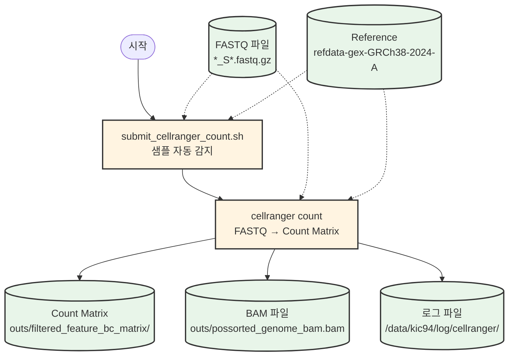
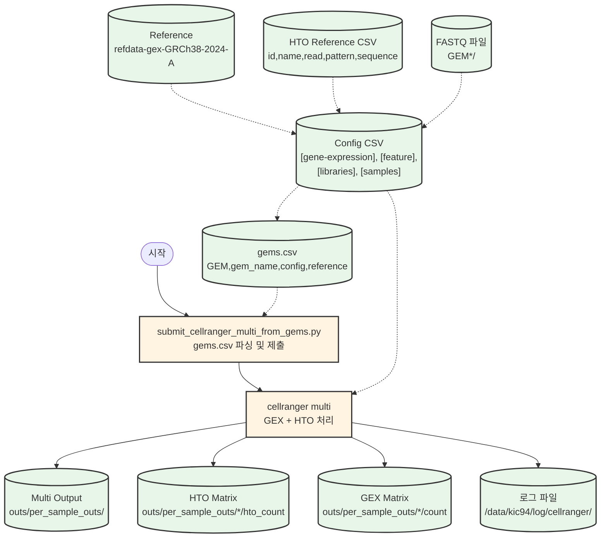
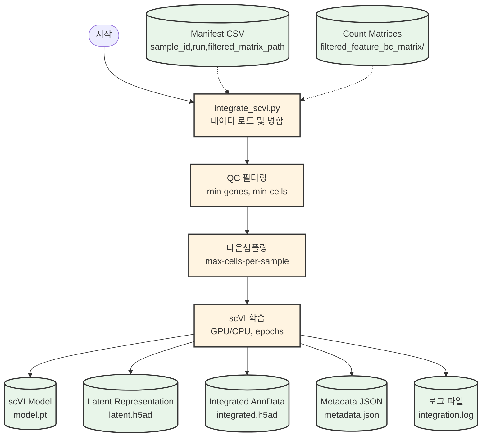
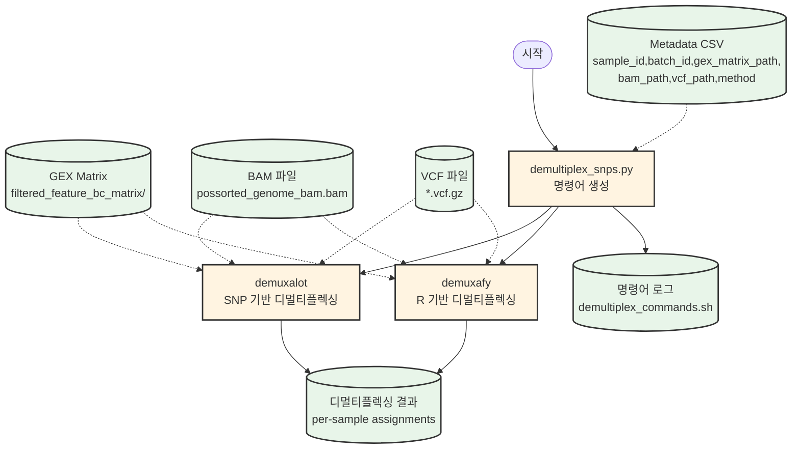
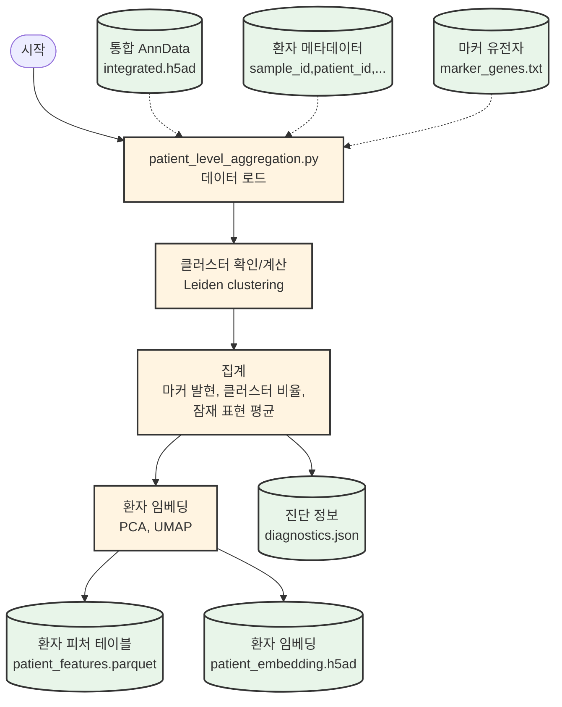
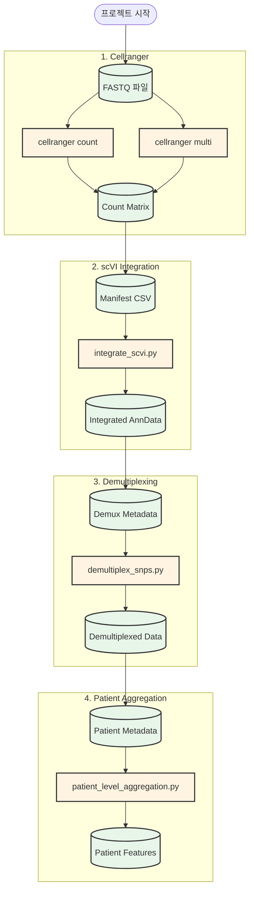

# 프로젝트 명령어 가이드

이 문서는 10M Inflammation Atlas 프로젝트에서 사용하는 주요 스크립트와 명령어를 정리한 가이드입니다.

## 목차

1. [Cellranger](#1-cellranger)
   - [cellranger count](#11-cellranger-count)
   - [cellranger multi](#12-cellranger-multi)
2. [scVI Integration](#2-scvi-integration)
3. [Demultiplexing](#3-demultiplexing)
4. [Patient Level Aggregation](#4-patient-level-aggregation)
5. [Job Monitoring](#5-job-monitoring)

---

## 1. Cellranger

### 1.1 cellranger count

단일 샘플의 FASTQ 파일을 count matrix로 변환합니다.

#### 명령어

```bash
# 자동 제출 (여러 샘플 자동 감지)
/home/kic94/git_repo/10m/scripts/cellranger/submit_cellranger_count.sh \
    --fastq /path/to/fastq/directory \
    --ref /path/to/reference/transcriptome \
    --out /data/kic94/000_Projects/P130_stroke/cellranger_out \
    --cpus 16

# 수동 제출 (단일 샘플)
sbatch /home/kic94/git_repo/10m/scripts/cellranger/cellranger_count.sbatch \
    /path/to/fastq \
    /path/to/reference \
    SAMPLE_NAME \
    16 \
    /data/kic94/000_Projects/P130_stroke/cellranger_out/SAMPLE_NAME
```

#### 필요한 파일

- **FASTQ 파일**: `*_S*.fastq.gz` 형식의 파일들이 있는 디렉터리
- **Reference transcriptome**: `/data/shared/snulit/data/Gene_reference/refdata-gex-GRCh38-2024-A/` (기본값)

#### 옵션

| 옵션 | 설명 | 기본값 |
|------|------|--------|
| `--fastq DIR` | FASTQ 파일이 있는 디렉터리 | `$FASTQ_DIR` |
| `--ref PATH` | Reference transcriptome 경로 | `/data/kic94/.../refdata-gex-GRCh38-2024-A` |
| `--out DIR` | 출력 루트 디렉터리 | `/data/kic94/.../001_cellranger_out` |
| `--cpus N` | CPU 코어 수 | `16` |
| `--partition NAME` | Slurm 파티션 | `cpu-farm` |
| `--qos NAME` | Slurm QoS | `normal` |

#### 출력 위치

- **Count matrix**: `/data/kic94/000_Projects/P130_stroke/cellranger_out/{SAMPLE_NAME}/outs/`
- **로그**: `/data/kic94/log/cellranger/{SAMPLE_NAME}_{timestamp}/`

#### 데이터 흐름



---

### 1.2 cellranger multi

다중 샘플 (GEX + HTO)을 동시에 처리합니다.

#### 명령어

```bash
# gems.csv 기반 자동 제출 (권장)
python /home/kic94/git_repo/10m/scripts/cellranger/submit_cellranger_multi_from_gems.py \
    --gems-csv /path/to/gems.csv \
    [--dry-run]  # 테스트용

# 수동 제출
sbatch /home/kic94/git_repo/10m/scripts/cellranger/cellranger_multi.sbatch \
    JOB_ID \
    /path/to/config.csv
```

#### 필요한 파일

1. **gems.csv** (자동 제출용):
   ```csv
   GEM,gem_name,fastq_name,config,reference
   11,GEM1,Stroke_GEX_1,/path/to/GEM1.csv,/path/to/reference.csv
   ```

2. **Config CSV** (cellranger multi 설정):
   ```csv
   [gene-expression],,
   reference,/data/shared/snulit/data/Gene_reference/refdata-gex-GRCh38-2024-A/,
   include-introns,FALSE,
   create-bam,TRUE,
   
   [feature]
   reference,/path/to/reference.csv
   ,,
   [libraries],,
   fastq_id,fastqs,feature_types
   Stroke_GEX_1,/path/to/GEM11/,Gene Expression
   Stroke_CSP_1,/path/to/GEM11/,Multiplexing Capture
   ,,
   [samples],,
   sample_id,cmo_ids,
   ICH_IVH_10_1,Hash-tag1,
   ```

3. **HTO Reference CSV**:
   ```csv
   id,name,read,pattern,sequence,feature_type
   Hash-tag1,HTO251,R2,5PNNNNNNNNNN(BC)NNNNNNNNN,GTCAACTCTTTAGCG,Multiplexing Capture
   ```
   - 전체 템플릿: `docs/hto_reference_template_251_266.csv` 참고

#### 옵션

**submit_cellranger_multi_from_gems.py**:
| 옵션 | 설명 |
|------|------|
| `--gems-csv PATH` | gems.csv 파일 경로 (필수) |
| `--dry-run` | 실제 제출 없이 테스트 |
| `--verbose` | 상세 로그 출력 |

#### 출력 위치

- **Multi output**: `/data/kic94/000_Projects/P130_stroke/cellranger_out/{JOB_ID}/outs/`
- **로그**: `/data/kic94/log/cellranger/{JOB_ID}_{timestamp}/`

#### 데이터 흐름



---

## 2. scVI Integration

여러 샘플의 count matrix를 scVI로 통합합니다.

#### 명령어

```bash
# CPU 스모크 테스트 (2 샘플, 50 에폭)
sbatch /home/kic94/git_repo/10m/scripts/run_scvi_cpu_test.sh

# CPU 전체 실행
sbatch /home/kic94/git_repo/10m/scripts/run_scvi_cpu_full.sh

# GPU 전체 실행 (권장)
sbatch /home/kic94/git_repo/10m/scripts/run_scvi_gpu_full.sh

# CPU 멀티 노드 DDP
sbatch /home/kic94/git_repo/10m/scripts/run_scvi_cpu_ddp.sh

# 직접 실행 (Python)
python /home/kic94/git_repo/10m/scripts/integrate_scvi.py \
    --manifest /path/to/filtered_matrix_manifest.csv \
    --output-dir /data/kic94/scvi/integration \
    --max-epochs 400 \
    --use-gpu \
    --save-anndata
```

#### 필요한 파일

**filtered_matrix_manifest.csv**:
```csv
sample_id,run,filtered_matrix_path
P130_sample1,run1,/data/.../P130_sample1/outs/filtered_feature_bc_matrix
P130_sample2,run1,/data/.../P130_sample2/outs/filtered_feature_bc_matrix
```

#### 옵션

| 옵션 | 설명 | 기본값 |
|------|------|--------|
| `--manifest PATH` | 매니페스트 CSV 경로 (필수) | - |
| `--output-dir PATH` | 출력 디렉터리 (필수) | - |
| `--sample-limit N` | 처리할 샘플 수 제한 (테스트용) | `None` |
| `--max-cells-per-sample N` | 샘플당 최대 세포 수 | `None` |
| `--max-epochs N` | 학습 에폭 수 | `200` |
| `--latent-dim N` | 잠재 차원 | `30` |
| `--use-gpu` | GPU 사용 | `False` |
| `--save-anndata` | 통합 AnnData 저장 | `False` |
| `--num-nodes N` | 분산 학습 노드 수 | `1` |
| `--devices N` | 노드당 디바이스 수 | `1` |
| `--strategy STR` | 분산 전략 (ddp 등) | `None` |

#### 출력 위치

- **모델**: `/data/kic94/scvi/{run_name}/artifacts/model.pt`
- **Latent representation**: `/data/kic94/scvi/{run_name}/artifacts/latent.h5ad`
- **통합 AnnData**: `/data/kic94/scvi/{run_name}/artifacts/integrated.h5ad` (--save-anndata 사용 시)
- **메타데이터**: `/data/kic94/scvi/{run_name}/artifacts/metadata.json`
- **로그**: `/data/kic94/scvi/{run_name}/integration.log`

#### 데이터 흐름



---

## 3. Demultiplexing

SNP 기반 디멀티플렉싱을 수행합니다.

#### 명령어

```bash
# 명령어 생성만 (dry-run)
python /home/kic94/git_repo/10m/scripts/demultiplex_snps.py \
    --metadata /path/to/demultiplex_metadata.csv \
    --output-root /data/kic94/demultiplex \
    --command-log /home/kic94/log/demultiplex_commands.sh

# 실제 실행
python /home/kic94/git_repo/10m/scripts/demultiplex_snps.py \
    --metadata /path/to/demultiplex_metadata.csv \
    --output-root /data/kic94/demultiplex \
    --execute
```

#### 필요한 파일

**demultiplex_metadata.csv**:
```csv
sample_id,batch_id,gex_matrix_path,bam_path,vcf_path,method,notes
P130_sample1,batch1,/data/.../count_matrix,/data/.../possorted_genome_bam.bam,/data/.../sample1.vcf.gz,demuxalot,
```

#### 옵션

| 옵션 | 설명 |
|------|------|
| `--metadata PATH` | 메타데이터 CSV 경로 (필수) |
| `--output-root PATH` | 출력 루트 디렉터리 (필수) |
| `--command-log PATH` | 생성된 명령어 로그 경로 | `/home/kic94/log/demultiplex_commands.sh` |
| `--execute` | 명령어 즉시 실행 | `False` (dry-run) |
| `--extra-demuxalot-args ARGS` | demuxalot 추가 인자 | `[]` |
| `--extra-demuxafy-args ARGS` | demuxafy 추가 인자 | `[]` |

#### 지원하는 방법

- **demuxalot**: Python 패키지
- **demuxafy**: R 패키지 (Rscript로 실행)

#### 출력 위치

- **디멀티플렉싱 결과**: `/data/kic94/demultiplex/{sample_id}/`
- **명령어 로그**: `/home/kic94/log/demultiplex_commands.sh`

#### 데이터 흐름



---

## 4. Patient Level Aggregation

통합된 단일세포 데이터를 환자 레벨로 집계합니다.

#### 명령어

```bash
python /home/kic94/git_repo/10m/scripts/patient_level_aggregation.py \
    --adata /data/kic94/scvi/integration/artifacts/integrated.h5ad \
    --metadata /path/to/patient_metadata.csv \
    --output-dir /data/kic94/patient_level \
    --cluster-key leiden \
    --marker-genes /path/to/marker_genes.txt \
    --normalize \
    --compute-umap
```

#### 필요한 파일

1. **통합 AnnData**: scVI 통합 결과 (`integrated.h5ad`)
2. **patient_metadata.csv**:
   ```csv
   sample_id,patient_id,disease_status,collection_batch,notes
   P130_sample1,P130,control,batch1,
   ```
3. **marker_genes.txt** (선택): 한 줄에 하나씩 유전자명

#### 옵션

| 옵션 | 설명 | 기본값 |
|------|------|--------|
| `--adata PATH` | 통합 AnnData 파일 (필수) | - |
| `--metadata PATH` | 환자 메타데이터 CSV (필수) | - |
| `--output-dir PATH` | 출력 디렉터리 (필수) | - |
| `--cluster-key STR` | 클러스터 컬럼명 | `None` (Leiden 자동 계산) |
| `--latent-key STR` | 잠재 표현 키 | `X_scvi` |
| `--marker-genes PATH` | 마커 유전자 목록 | `None` |
| `--normalize` | log1p CPM 정규화 수행 | `False` |
| `--min-cells-per-patient N` | 최소 세포 수 | `50` |
| `--n-pcs N` | PCA 차원 수 | `30` |
| `--compute-umap` | UMAP 계산 | `False` |

#### 출력 위치

- **환자 피처 테이블**: `/data/kic94/patient_level/patient_features.parquet`
- **환자 임베딩**: `/data/kic94/patient_level/patient_embedding.h5ad`
- **진단 정보**: `/data/kic94/patient_level/diagnostics.json`

#### 데이터 흐름



---

## 5. Job Monitoring

Slurm 작업 상태를 모니터링합니다.

#### 명령어

```bash
# 작업 상태 확인
python /home/kic94/git_repo/10m/scripts/check_scvi_jobs.py \
    --job-ids 184210 184211 184212 \
    --emit-summary

# 큐 상태 모니터링 (장기 작업용)
/home/kic94/git_repo/manual/poll_queue_status.sh <job_id>
```

#### 옵션

**check_scvi_jobs.py**:
| 옵션 | 설명 | 기본값 |
|------|------|--------|
| `--job-ids ID1 ID2 ...` | 확인할 Job ID 목록 (필수) | - |
| `--log-path PATH` | 로그 파일 경로 | `/data/kic94/log/scvi_job_status.log` |
| `--sacct-format STR` | sacct 출력 형식 | `JobID,State,ExitCode,Elapsed,Start,End,Partition` |
| `--emit-summary` | 한 줄 요약 출력 | `False` |
| `--summary-fields STR` | 요약에 포함할 필드 | `State,Elapsed,MaxRSS,TotalCPU,AveCPU,AllocCPUS` |

**poll_queue_status.sh**:
- 환경변수로 주기 조정:
  - `SHORT_INTERVAL`: 기본 1000초
  - `LONG_INTERVAL`: 기본 10000초
  - `SLEEP_INTERVAL`: 기본 600초

#### 출력 위치

- **작업 상태 로그**: `/data/kic94/log/scvi_job_status.log`
- **큐 모니터링 로그**: `/data/kic94/log/scvi_queue_watch.log`

---

## 공통 사항

### 데이터 저장 규칙

- **코드 및 설정**: `/home/kic94/git_repo/10m`
- **생성 데이터/아티팩트/로그**: `/data/kic94/<project>/...`
- **절대 `/home`에 데이터 생성 금지**

### Slurm 파티션 및 QoS

- **CPU 작업**: `cpu-farm` + `--qos=normal`
- **GPU 작업**: `gpu-4farm` + `--account=gpu` + `--gres=gpu:h100:4`

### Conda 환경

- **scVI 관련**: `scvi-tools` 환경
- **기타 Python**: 시스템 Python 또는 프로젝트별 환경

---

## 전체 워크플로우



---

## 참고 자료

- **Cellranger 워크플로우**: `docs/cellranger_rerun_workflow.md`
- **scVI 파이프라인**: `docs/scvi_integration_pipeline.md`
- **Cellranger Multi**: `docs/cellranger_multi_gems_workflow.md`
- **자산 개요**: `ASSET_OVERVIEW_KR.md`

