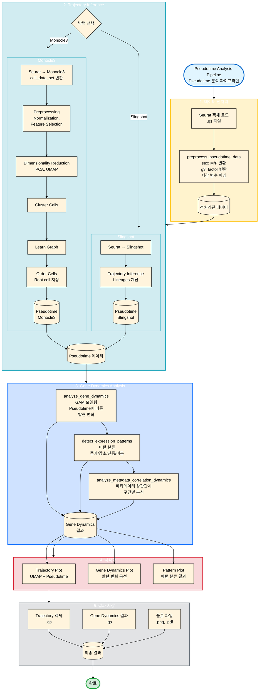

# Pseudotime Analysis Module 통합 가이드

이 문서는 Pseudotime Analysis 모듈의 통합 가이드입니다. Trajectory Inference부터 유전자 동역학(Gene Dynamics) 분석까지의 과정을 설명합니다.

## 1. 소개 (Introduction)

### 목적
단일세포 데이터에서 세포의 분화 경로나 상태 변화의 연속성(Trajectory)을 추론하고, 가상의 시간축(Pseudotime)을 따라 유전자 발현이 어떻게 변화하는지 분석합니다.

### 주요 도구
*   **Monocle3**: 널리 사용되는 Trajectory Inference 도구. 복잡한 분기(Branching) 구조 추론에 강점.
*   **Slingshot**: 유연하고 강력한 Trajectory Inference.
*   **GAM (Generalized Additive Models)**: Pseudotime에 따른 비선형적 유전자 발현 패턴 모델링.

## 2. 워크플로우 시각화 (Workflow Visualization)



## 3. 데이터 준비 (Data Preparation)

### 전처리 (Preprocessing)
Pseudotime 분석 전, 메타데이터의 정제와 형식 변환이 필수적입니다.
`preprocess_pseudotime_data()` 함수를 사용하여 다음을 수행합니다:
*   **sex**: `M`, `F` Factor로 표준화.
*   **g3**: Factor 변환 (`1`, `2`).
*   **시간 변수**: `icu_adm_dt`, `ia_start` 등을 datetime 형식으로 파싱하고 시간 차이(Duration) 계산.

### 주요 메타데이터
*   `nih_change`: NIH 점수 변화량 (임상 지표).
*   `sex`: 성별.
*   `g3`: 그룹 변수.
*   `arrival_gcs_score`, `age`: 임상 공변량.

## 4. 함수 및 사용법 (Functions & Usage)

### Trajectory Inference
1.  **`run_monocle3_from_seurat(sobj)`**:
    *   Seurat 객체를 Monocle3 객체로 변환.
    *   Preprocessing, Reduction, Cluster Cells, Learn Graph, Order Cells 수행.
    *   Root cell 자동/수동 지정 가능.

2.  **`run_slingshot_from_seurat(sobj)`**:
    *   Seurat 객체에서 Slingshot 실행.
    *   Lineages 및 Pseudotime 계산.

### Gene Dynamics Analysis
1.  **`analyze_gene_dynamics()`**:
    *   GAM을 사용하여 Pseudotime에 따른 유전자 발현 변화 모델링.
    *   p-value 계산 및 시각화.

2.  **`detect_expression_patterns()`**:
    *   유전자 발현 패턴 분류: 증가(Increasing), 감소(Decreasing), 진동(Oscillatory), 이봉(Bimodal) 등.

3.  **`analyze_metadata_correlation_dynamics()`**:
    *   Pseudotime 구간(Window)별로 유전자 발현과 메타데이터 간의 상관관계 변화 분석.

## 5. 워크플로우 예시 (Workflow Example)

```r
# 1. 데이터 전처리
source("scripts/pseudotime-dev/preprocess_data.R")
sobj_prep <- preprocess_pseudotime_data(
  input_file = "/data/user3/sobj/IS_scvi_251107_ds2500.qs",
  output_file = "/data/user3/sobj/IS_scvi_251107_prep.qs"
)

# 2. 기본 분석 (Trajectory + Gene Dynamics)
source("scripts/pseudotime-dev/test_pseudotime_basic.R")
# 스크립트 내에서 run_monocle3_from_seurat() 및 analyze_gene_dynamics() 호출
```

## 6. 부록 (Appendix)

### 스크립트 위치
*   `scripts/pseudotime-dev/preprocess_data.R`: 전처리 함수.
*   `scripts/pseudotime-dev/test_pseudotime_basic.R`: 기본 분석 테스트.
*   `scripts/pseudotime-dev/test_preprocessing.R`: 전처리 테스트.

### 주요 Feature (Target Genes)
`DDIT4`, `UTY`, `S100B`, `XIST`, `HLA-B`, `CCL4`, `HLA-C`, `TXNIP` 등.

