# Patient-Level Dimensionality Reduction and Anomaly Detection

## Overview

A pipeline for patient-level dimensionality reduction and anomaly detection in single-cell RNA-seq data. Aggregates cell-level data at the patient×cluster level to analyze similarities/differences between patients and explore associations with clinical variables (e.g., `g3`, `nih_change`).

## Key Concepts

### What is a "View"?

An **independent information source** that constitutes patient-level features. The current pipeline supports 3 views:

1. **Frequency view**: Cluster frequency (CLR transformation)
2. **Signature view**: Module scores of top marker genes per cluster
3. **Latent view**: Cluster-wise average of dimensionality reduction embeddings (e.g., scVI)

**Default**: If `markers_df` is provided, **all 3 views are used** (`include_frequency=TRUE`, `include_signatures=TRUE`, `include_latent=TRUE`).

Since each view contains different aspects of information, you can select only some or adjust weights when combining them (e.g., when a specific view is too noisy or unavailable).

### Feature Generation Process

1. **Cluster frequency (CLR transformation)**
   - Cell-level metadata → patient×cluster frequency matrix
   - Applies CLR (Centered Log-Ratio) transformation to preserve compositional data characteristics
   - Default weight: 1.5 (reflects importance of frequency information)

2. **Signature scores (top 20 gene module scores per cluster)**
   - Selects top 20 genes per cluster from `FindAllMarkers` results
   - Calculates cell-level scores with `Seurat::AddModuleScore()`
   - Aggregates to patient×cluster average
   - Default weight: 1.0

3. **Latent embeddings (cluster-wise average of reduction)**
   - Default reduction: `integrated.scvi`
   - Aggregates latent embeddings of cells within each cluster to patient×cluster average
   - Default weight: 1.0

### Pipeline Workflow

```
Cell-level data
    ↓
[View Creation] frequency + signatures + latent (default: all used)
    ↓
[Block Scaling] Independently Z-score normalize each view
    ↓
[Weight Application] frequency_weight × frequency + signature_weight × signatures + latent_weight × latent
    ↓
[Combination] Combine maintaining only patient intersection
    ↓
[Batch Correction] (Optional) limma::removeBatchEffect
    ↓
[PCA] Select safe number of PCs (elbow + rank fraction)
    ↓
[UMAP] UMAP embedding in PCA space
    ↓
[Metadata Combination] Merge clinical variables like g3, nih_change
    ↓
Final plot_df + embedding
```

## Main Functions

### End-to-end Pipeline

#### `patient_dimensionality_reduction()`

Main function that executes the entire workflow.

**Parameters:**
- `include_frequency`, `include_signatures`, `include_latent`: Whether to include each view
  - Default: `include_frequency=TRUE`, `include_signatures=!is.null(markers_df)`, `include_latent=TRUE`
  - That is, if `markers_df` is provided, **all views are used by default**
- `frequency_weight`, `signature_weight`, `latent_weight`: Weights for each view (default: 1.5, 1.0, 1.0)
- `batch_var`: Batch correction variable (skip if NULL)
- `reduction`: Name of latent embedding reduction (default: `"integrated.scvi"`)

**Return Value:**
- `embedding`: UMAP coordinate matrix (rows=patients, columns=UMAP1/UMAP2)
- `plot_df`: Data frame for plotting (UMAP coordinates + metadata)
- `pca`: PCA result object
- `combined_features`: Combined feature matrix (PCA input)
- `view_columns`: List of column names for each view

### Feature Generation Functions

#### `make_cluster_signatures()`
Converts `FindAllMarkers` results to signature list for `AddModuleScore`.

#### `compute_patient_cluster_frequency()`
Converts cell-level metadata to patient×cluster frequency matrix (with CLR transformation option).

#### `compute_patient_signature_matrix()`
Aggregates module scores to patient×cluster average.

#### `compute_patient_latent_matrix()`
Aggregates latent embeddings to patient×cluster average.

### Utility Functions

#### `clr_transform()`
Transforms compositional data with CLR (includes pseudo-count).

#### `combine_patient_feature_views()`
Combines multiple views after block scaling.

#### `remove_batch_effect_if()`
Performs optional batch correction (`limma::removeBatchEffect`).

#### `choose_pca_k()`, `run_pca_safely()`
Selects safe number of PCs and runs PCA (automatically selects `irlba` or `prcomp` based on data size).

### Visualization and Augmentation

#### `plot_patient_umap()`
Patient UMAP plotting function. Wraps `plot_embedding()` to support both continuous and discrete variables.

#### `augment_plot_df()`
Augments metadata:
- ID matching validation
- Duplicate/conflict checking (whether same ID has different values)
- NA count reporting

## Usage Examples

### Basic Usage

```r
# 1. Run FindAllMarkers
markers_df <- FindAllMarkers(
  seurat_obj,
  group.by = "anno3.scvi",
  only.pos = TRUE,
  logfc.threshold = 0.25,
  min.pct = 0.1
)

# 2. Run pipeline
res <- patient_dimensionality_reduction(
  seurat_obj = seurat_obj,
  markers_df = markers_df,
  reduction = "integrated.scvi",
  verbose = TRUE
)

# 3. Plotting
plot_patient_umap(res$plot_df, color_by = "g3")
plot_patient_umap(res$plot_df, color_by = "nih_change")
```

### View Selection and Weight Adjustment (Advanced Options)

By default, all views are used, but you can select only some or adjust weights as needed:

```r
# Use only frequency view (e.g., when signatures are noisy or latent is unavailable)
res <- patient_dimensionality_reduction(
  seurat_obj = seurat_obj,
  markers_df = markers_df,
  include_signatures = FALSE,
  include_latent = FALSE,
  frequency_weight = 2.0  # Higher weight on frequency information
)

# Use only signatures and latent (exclude frequency)
res <- patient_dimensionality_reduction(
  seurat_obj = seurat_obj,
  markers_df = markers_df,
  include_frequency = FALSE
)
```

### Metadata Augmentation

```r
# Get additional variables from original Seurat object metadata
aug <- augment_plot_df(
  plot_df = res$plot_df,
  metadata = is5@meta.data,
  id = "hos_no",
  add = c("g3", "nih_change", "GEM")
)

# Plot with augmented data
plot_patient_umap(aug$data, color_by = "g3")

# Check diagnostic report
aug$report  # missing IDs, NA counts, duplicates, etc.
```

## Unbiased Clustering and Separation Evaluation

This pipeline generates patient-level embeddings in an **unsupervised** manner. That is, it performs dimensionality reduction purely based on features without using clinical variables (`g3`, `nih_change`, etc.).

### Separation Evaluation Methods

To evaluate how well the generated embeddings are associated with clinical variables:

1. **PERMANOVA (Permutational Multivariate Analysis of Variance)**
   - Uses `vegan::adonis2()`
   - Tests statistical significance of distance differences between `g3` groups
   - Example:
     ```r
     library(vegan)
     dist_mat <- dist(res$embedding)
     adonis2(dist_mat ~ g3, data = res$plot_df, permutations = 9999)
     ```

2. **LISI (Local Inverse Simpson's Index)**
   - Measures `g3` group diversity among neighbors around each patient
   - Low LISI = good separation (neighbors are in same group)
   - High LISI = poor separation (neighbors are mixed across multiple groups)
   - Example:
     ```r
     library(lisi)
     lisi_scores <- compute_lisi(res$embedding, res$plot_df, c("g3"))
     # Low LISI values indicate good separation
     ```

### Interpretation

- **PERMANOVA p-value < 0.05**: Distance differences between `g3` groups are statistically significant → features/embedding separate `g3` to some extent
- **PERMANOVA p-value ≥ 0.05**: Difficult to separate `g3` with features/embedding alone → need additional features or different approach
- **낮은 LISI**: 임베딩 공간에서 `g3` 그룹이 잘 분리됨
- **높은 LISI**: 임베딩 공간에서 `g3` 그룹이 섞여 있음

## 설계 원칙

1. **다중 뷰 통합**: 빈도/시그니처/잠재축을 독립적으로 스케일링 후 가중 결합
2. **조성 데이터 처리**: 빈도는 CLR 변환으로 처리하여 조성 특성 보존
3. **안전한 차원 축소**: 데이터 크기에 따라 PCA 백엔드 자동 선택
4. **검증 및 진단**: 메타데이터 보강 시 충돌/NA 자동 체크

## 함수 구조 및 알고리즘 플로우

### 알고리즘 플로우차트

다음은 `patient_dimensionality_reduction()` 파이프라인의 모듈별 실행 흐름을 나타낸 알고리즘 다이어그램입니다. 각 큰 박스는 하나의 처리 모듈을 나타내며, 모듈 내부에서 조건부 실행되는 함수들이 표시됩니다.
VS code IDE에서는 Markdown Preview Mermaid Support 확장프로그램을 설치해야 렌더링 됩니다.

```mermaid
%%{init: {'theme':'base', 'themeVariables': {'primaryEdgeColor':'#000000', 'primaryEdgeThickness':4, 'primaryTextColor':'#000000', 'primaryBorderColor':'#000000', 'edgeLabelBackground':'#ffffff', 'tertiaryColor':'#000000'}}}%%
flowchart TD
    Start([patient_dimensionality_reduction<br/>메인 파이프라인]) --> ViewModule
    
    subgraph ViewModule["1. View Computation Module<br/>(뷰 생성 모듈)"]
        direction TB
        
        CheckFreq{include_frequency<br/>= TRUE?}
        CheckFreq -->|Yes| FreqWrapper
        CheckFreq -->|No| CheckSig
        
        subgraph FreqWrapper["compute_patient_cluster_frequency()"]
            direction TB
            FreqCalc[셀 메타데이터<br/>→ 환자×클러스터 빈도 계산]
            FreqCalc --> FreqMatRaw[(빈도 행렬)]
            
            FreqMatRaw --> TransformSelect{transform<br/>선택}
            
            TransformSelect -->|clr| CLRBox[clr_transform]
            TransformSelect -->|alr| ALRBox[alr_transform]
            TransformSelect -->|ilr| ILRBox[ilr_transform]
            
            CLRBox --> FreqMatOut[(frequency matrix)]
            ALRBox --> FreqMatOut
            ILRBox --> FreqMatOut
        end
        
        CheckSig{include_signatures<br/>= TRUE?}
        CheckSig -->|Yes| CheckSigInput{signature_score_cols<br/>!= NULL?}
        CheckSig -->|No| CheckLatent
        
        CheckSigInput -->|Yes| SigDirectWrapper
        CheckSigInput -->|No| SigComputeWrapper
        
        subgraph SigDirectWrapper["compute_patient_signature_from_scores()"]
            direction TB
            SigExtract[메타데이터에서<br/>signature_score_cols 추출]
            SigExtract --> SigAggDirect[환자×클러스터<br/>평균 집계]
            SigAggDirect --> SigMatDirect[(signatures matrix)]
        end
        
        subgraph SigComputeWrapper["compute_patient_signature_matrix()"]
            direction TB
            SigMakeWrapper
            
            subgraph SigMakeWrapper["make_cluster_signatures()"]
                direction TB
                SigValidate[markers_df 무결성 확인<br/>$gene, $cluster,<br/>$p_val/$p_val_adj,<br/>$avg_log2FC/$avg_logFC]
                SigValidate --> SigFilter[p_adj_cut 필터링<br/>+ top_n 선택]
                SigFilter --> SigBackground[background_genes<br/>필터링]
                SigBackground --> SigList[(gene set list)]
            end
            
            SigMakeWrapper --> AddModule[Seurat::AddModuleScore<br/>layer='data', nbin=24, ctrl=100]
            AddModule --> SigAggCompute[환자×클러스터<br/>평균 집계]
            SigAggCompute --> SigMatCompute[(signatures matrix)]
        end
        
        CheckLatent{include_latent<br/>= TRUE?}
        CheckLatent -->|Yes| LatentWrapper
        CheckLatent -->|No| EndView
        
        subgraph LatentWrapper["compute_patient_latent_matrix()"]
            direction TB
            LatentExtract[Embeddings 추출<br/>reduction]
            LatentExtract --> LatentAgg[환자×클러스터<br/>평균 집계]
            LatentAgg --> LatentMat[(latent matrix)]
        end
        
        FreqMatOut --> EndView
        SigMatDirect --> EndView
        SigMatCompute --> EndView
        LatentMat --> EndView
    end
    
    ViewModule --> PreprocessModule
    
    subgraph PreprocessModule["2. Preprocessing Module<br/>(결합 및 배치 보정 모듈)"]
        direction TB
        
        CombineWrapper
        
        subgraph CombineWrapper["combine_patient_feature_views()"]
            direction TB
            ViewAlign[뷰 정렬<br/>환자 교집합]
            ViewAlign --> ScaleWrapper
            
            subgraph ScaleWrapper["scale_feature_block()"]
                direction TB
                ScaleZ[각 뷰 독립적으로<br/>Z-score 정규화]
                ScaleZ --> WeightApply[가중치 적용<br/>frequency_weight,<br/>signature_weight,<br/>latent_weight]
            end
            
            ScaleWrapper --> ViewCombine[뷰 결합<br/>cbind]
        end
        
        CombineWrapper --> CombinedMat[(combined matrix)]
        
        CombinedMat --> CheckBatch{batch_var<br/>!= NULL?}
        CheckBatch -->|Yes| BatchWrapper
        CheckBatch -->|No| BatchMat
        
        subgraph BatchWrapper["remove_batch_effect_if()"]
            direction TB
            BatchExtract[배치 정보 추출]
            BatchExtract --> BatchRemove[limma::removeBatchEffect]
        end
        
        BatchWrapper --> BatchMat[(batch-corrected matrix)]
    end
    
    PreprocessModule --> DimRedModule
    
    subgraph DimRedModule["3. Dimensionality Reduction Module<br/>(차원 축소 모듈)"]
        direction TB
        
        ChooseKWrapper
        
        subgraph ChooseKWrapper["choose_pca_k()"]
            direction TB
            KElbow[Elbow method<br/>초기 k 추정]
            KElbow --> KRank[Rank fraction<br/>상한 설정]
            KRank --> KFinal[최종 k 선택<br/>max_k 제한]
        end
        
        ChooseKWrapper --> PCASafeWrapper
        
        subgraph PCASafeWrapper["run_pca_safely()"]
            direction TB
            CheckRank{PC 수 / rank<br/>>= 0.35?}
            CheckRank -->|Yes| FullPCA[stats::prcomp<br/>전체 SVD]
            CheckRank -->|No| IRLBA[irlba::prcomp_irlba<br/>부분 SVD]
            FullPCA --> PCResult[(PCA 결과)]
            IRLBA --> PCResult
        end
        
        PCASafeWrapper --> UMAP[uwot::umap<br/>UMAP 임베딩]
        UMAP --> Embedding[(UMAP embedding<br/>23 x 2)]
    end
    
    DimRedModule --> OutputModule
    
    subgraph OutputModule["4. Output Preparation Module<br/>(출력 준비 모듈)"]
        direction TB
        JoinMeta[메타데이터 결합<br/>g3, nih_change 등]
        JoinMeta --> PlotDF[plot_df 생성]
        PlotDF --> Result[(최종 결과)]
    end
    
    OutputModule --> End([반환값:<br/>embedding, plot_df,<br/>pca, combined_features,<br/>view_columns, settings])
    
    style Start fill:#e1f5ff,stroke:#0066cc,stroke-width:3px
    style End fill:#d4edda,stroke:#28a745,stroke-width:3px
    style ViewModule fill:#fff3cd,stroke:#ffc107,stroke-width:3px
    style PreprocessModule fill:#d1ecf1,stroke:#17a2b8,stroke-width:3px
    style DimRedModule fill:#cfe2ff,stroke:#0d6efd,stroke-width:3px
    style OutputModule fill:#f8d7da,stroke:#dc3545,stroke-width:3px
    style FreqWrapper fill:#ffeaa7,stroke:#fdcb6e,stroke-width:2px
    style SigDirectWrapper fill:#ffeaa7,stroke:#fdcb6e,stroke-width:2px
    style SigComputeWrapper fill:#ffeaa7,stroke:#fdcb6e,stroke-width:2px
    style LatentWrapper fill:#ffeaa7,stroke:#fdcb6e,stroke-width:2px
    style CombineWrapper fill:#a8e6cf,stroke:#55efc4,stroke-width:2px
    style BatchWrapper fill:#a8e6cf,stroke:#55efc4,stroke-width:2px
    style ChooseKWrapper fill:#b2d4ff,stroke:#74b9ff,stroke-width:2px
    style PCASafeWrapper fill:#b2d4ff,stroke:#74b9ff,stroke-width:2px
    style SigMakeWrapper fill:#fdcb6e,stroke:#e17055,stroke-width:1px
    style ScaleWrapper fill:#55efc4,stroke:#00b894,stroke-width:1px
    style CheckFreq fill:#ffebcd
    style CheckSig fill:#ffebcd
    style CheckLatent fill:#ffebcd
    style CheckBatch fill:#ffebcd
    style TransformSelect fill:#ffebcd
    style CheckSigInput fill:#ffebcd
    style CheckRank fill:#ffebcd
```



### 모듈별 상세 설명

#### 1. View Computation Module (뷰 생성 모듈)

**목적**: 셀 레벨 데이터를 환자×클러스터 단위로 집계하여 3가지 뷰(frequency, signatures, latent)를 생성

| 뷰 | 실행 조건 | 함수 | 유틸리티 함수 | 출력 |
|----|----------|------|--------------|------|
| **Frequency** | `include_frequency = TRUE` (기본값) | `compute_patient_cluster_frequency()` | `clr_transform()` / `alr_transform()` / `ilr_transform()` | 환자×클러스터 빈도 행렬 (변환 적용) |
| **Signatures** | `include_signatures = TRUE` AND (`markers_df != NULL` OR `signature_score_cols != NULL`) (기본값: `!is.null(markers_df) \|\| !is.null(signature_score_cols)`) | `compute_patient_signature_matrix()` (markers_df 사용) 또는 `compute_patient_signature_from_scores()` (직접 입력) | `make_cluster_signatures()` → `Seurat::AddModuleScore()` (markers_df 경로만) | 환자×클러스터 모듈 스코어 행렬 |
| **Latent** | `include_latent = TRUE` (기본값) | `compute_patient_latent_matrix()` | 없음 | 환자×클러스터 잠재 임베딩 평균 행렬 |

**알고리즘**:

##### Frequency View

셀 레벨 메타데이터에서 환자별 클러스터 빈도를 계산한 후, 조성 데이터의 특성을 보존하기 위해 로그 비율 변환을 적용합니다.

1. **빈도 계산**: 각 환자(`sample_col`)별로 클러스터(`cluster_col`) 빈도를 계산하여 환자×클러스터 빈도 행렬 생성
2. **조성 변환**: `clr_transform()` 함수를 통해 CLR (Centered Log-Ratio) 변환 적용

**`clr_transform()` 함수**:

클러스터별 빈도 벡터를 합이 1인 벡터(조성 데이터)에서 합이 0인 벡터로 변환하며, 각 구성요소의 자연로그값이 다른 구성요소에 비해 상대적으로 얼마나 큰지를 보여줍니다.

**수식**:
$$CLR(x_i) = \log\left(\frac{x_i + \epsilon}{g(x)}\right) = \log(x_i + \epsilon) - \frac{1}{D}\sum_{j=1}^{D}\log(x_j + \epsilon)$$

여기서 $x_i$는 $i$번째 클러스터의 빈도, $D$는 클러스터 수, $\epsilon$은 pseudo-count (기본값: $10^{-6}$), $g(x)$는 기하평균입니다.

**장점**:
- 조성 데이터의 제약 조건(합이 1)을 제거하여 PCA 입력으로 적합하게 변환
- 각 클러스터의 상대적 중요도를 보존
- 0 값 처리 (pseudo-count 추가)
- 기준 클러스터 선택이 필요 없음 (ALR과 비교)

**단점**:
- 변환된 좌표들이 선형 종속적 (합이 0이므로 하나의 좌표는 나머지로부터 결정됨)
- 유클리드 거리를 완전히 보존하지 않음 (ILR과 비교)
- 해석이 ALR보다 덜 직관적일 수 있음

**다른 변환 옵션**:

**`alr_transform()` (Additive Log-Ratio)**:
기준 클러스터(reference)를 선택하여 나머지 클러스터와의 비율을 계산합니다.

$$ALR(x_i) = \log\left(\frac{x_i + \epsilon}{x_{ref} + \epsilon}\right)$$

- 장점: 해석이 직관적 (기준 대비 상대적 크기)
- 단점: 기준 클러스터 선택에 따라 결과가 달라짐, 기준 클러스터가 0에 가까우면 불안정

**`ilr_transform()` (Isometric Log-Ratio)**:
직교 좌표계로 변환하여 기하학적 거리를 보존합니다.

$$ILR(x) = \Psi^T \log(x + \epsilon)$$

여기서 $\Psi$는 직교 기저 행렬입니다.

- 장점: 유클리드 거리를 보존하여 통계적 분석에 적합
- 단점: 해석이 복잡함

##### Signatures View

Signature view는 두 가지 입력 방식으로 나뉩니다:

**방식 1: `markers_df`를 통한 계산** (기본)

`FindAllMarkers` 결과를 기반으로 클러스터별 마커 유전자 시그니처를 생성하고, 각 셀에서 모듈 스코어를 계산한 후 환자×클러스터 단위로 집계합니다.

1. **`make_cluster_signatures()`**: `markers_df`의 무결성을 확인하고 `AddModuleScore`에 적합한 형태로 변환
   - **입력 요구사항**: `markers_df`는 다음 컬럼을 포함해야 함
     - `gene`: 유전자 이름
     - `cluster`: 클러스터 식별자
     - `p_val` 또는 `p_val_adj`: 유의성 지표
     - `avg_log2FC` 또는 `avg_logFC`: 효과 크기
   - **필터링**: `p_adj_cut` (기본: 0.05) 미만인 유전자만 선택
   - **선택**: 각 클러스터별로 `top_n` (기본: 20)개의 상위 유전자 선택 (logFC 기준)
   - **`background_genes` 필터링**: `markers_df`의 유전자가 Seurat 객체에 실제로 존재하는지 확인하여 존재하지 않는 유전자를 제거 (필수). 이는 `markers_df`에 포함된 유전자가 Seurat 객체의 assay에 실제로 존재하지 않을 수 있기 때문입니다.

2. **`Seurat::AddModuleScore()`**: 각 셀에서 유전자 세트별 모듈 스코어 계산
   - **입력**: `layer = "data"` (normalized expression data 사용, raw count 아님)
   - **배경 노이즈 제거**: 
     - Expression level을 `nbin` (기본: 24)개의 bin으로 분할
     - 각 bin에서 `ctrl` (기본: 100)개의 control 유전자를 무작위 선택
     - 모듈 스코어 = (모듈 유전자 평균 expression) - (control 유전자 평균 expression)
   - **출력**: 각 셀의 메타데이터에 모듈 스코어 컬럼 추가

3. **집계**: 각 환자×클러스터 조합에서 모듈 스코어의 **단순 평균**을 계산하여 환자 수준 feature로 사용

**방식 2: `signature_score_cols`를 통한 직접 입력**

이미 계산된 signature score가 Seurat 객체의 메타데이터에 있는 경우, 이를 직접 사용할 수 있습니다.

1. **`compute_patient_signature_from_scores()`**: 메타데이터에서 지정된 컬럼들을 추출
2. **집계**: 각 환자×클러스터 조합에서 signature score의 **단순 평균**을 계산

이 방식은 `compute_patient_signature_matrix()`와 동급이지만 독립적인 기능으로, 외부에서 계산된 signature score를 재사용할 때 유용합니다.

##### Latent View

차원 축소 임베딩(reduction)을 환자×클러스터 단위로 집계합니다.

1. **임베딩 추출**: `Seurat::Embeddings()`로 reduction 임베딩 추출
2. **집계**: 각 환자×클러스터 조합에서 임베딩 차원별 **평균** 계산 (기본 aggregator: `mean`)
3. **출력**: 환자×클러스터×latent_dim 행렬을 환자×feature 행렬로 변환

#### 2. Preprocessing Module (결합 및 배치 보정 모듈)

**목적**: 생성된 뷰들을 블록 스케일링 후 가중 결합하고, 선택적으로 배치 보정 수행

**항상 실행**:
1. `combine_patient_feature_views()`: 활성화된 모든 뷰를 환자 교집합으로 결합
2. `scale_feature_block()`: 각 뷰를 독립적으로 Z-score 정규화 후 가중치 적용
   - `frequency_weight` (기본: 1.5)
   - `signature_weight` (기본: 1.0)
   - `latent_weight` (기본: 1.0)

**조건부 실행**:
- `batch_var != NULL` (기본: `"GEM"`) → `remove_batch_effect_if()` → `limma::removeBatchEffect()`

#### 3. Dimensionality Reduction Module (차원 축소 모듈)

**목적**: 결합된 feature 행렬을 PCA로 차원 축소 후 UMAP으로 2D 임베딩 생성

**항상 실행**:
1. `choose_pca_k()`: 안전한 PC 수 선택
   - Elbow method로 초기 k 추정
   - Rank fraction (기본: 0.3)으로 상한 설정
   - `max_k` (기본: 50)로 최종 제한
2. `run_pca_safely()`: 데이터 크기에 따라 PCA 백엔드 자동 선택
   - PC 수 / rank ≥ 0.35 → `stats::prcomp` (전체 SVD)
   - PC 수 / rank < 0.35 → `irlba::prcomp_irlba` (부분 SVD)
3. `uwot::umap()`: PCA 공간에서 UMAP 임베딩
   - 입력: 상위 `max_umap_dims` (기본: 30) PCs
   - 출력: 2D UMAP 좌표 (환자 × 2)

#### 4. Output Preparation Module (출력 준비 모듈)

**목적**: UMAP 임베딩에 메타데이터를 결합하여 플로팅용 데이터프레임 생성

**항상 실행**:
1. UMAP 좌표를 `plot_df`로 변환
2. 메타데이터 결합: `sample_col`, `extra_plot_cols` (기본: `c("g3", "nih_change")`), `batch_var`
3. 최종 반환값 구성:
   - `embedding`: UMAP 좌표 행렬
   - `plot_df`: 플로팅용 데이터프레임
   - `pca`: PCA 결과 객체
   - `combined_features`: 결합된 feature 행렬
   - `view_columns`: 각 뷰의 컬럼명 리스트
   - `settings`: 실행 파라미터 설정

### 실행 조건 요약

| 모듈 | 구성 요소 | 실행 조건 | 기본값 |
|------|----------|----------|-------|
| **View Computation** | Frequency View | `include_frequency = TRUE` | `TRUE` |
| | Signature View (markers_df) | `include_signatures = TRUE` AND `markers_df != NULL` | `!is.null(markers_df)` |
| | Signature View (직접 입력) | `include_signatures = TRUE` AND `signature_score_cols != NULL` | `!is.null(signature_score_cols)` |
| | Latent View | `include_latent = TRUE` | `TRUE` |
| **Preprocessing** | View 결합 | 항상 실행 | - |
| | 배치 보정 | `batch_var != NULL` | `"GEM"` |
| **Dimensionality Reduction** | PCA | 항상 실행 | - |
| | PCA 백엔드 선택 | PC 수 / rank ≥ 0.35 | 자동 |
| | UMAP | 항상 실행 | - |
| **Output Preparation** | 메타데이터 결합 | 항상 실행 | - |

## 참고

- 원본 구현: `st/KDW_251110.Rmd` (lines 4303-4428)
- 관련 함수: `myR/R/patient_dim_reduction.R`
- 테스트 스크립트: `scripts/pt.umap/patient_dim_reduction_downsample.R`, `scripts/pt.umap/test_is5s.R`, `scripts/pt.umap/test_is5.R`

