# Patient-Level Dimensionality Reduction and Anomaly Detection

## 개요

단일세포 RNA-seq 데이터에서 환자 수준의 차원 축소 및 이상 탐지를 위한 파이프라인입니다. 셀 레벨 데이터를 환자×클러스터 단위로 집계하여, 환자 간 유사성/차이를 분석하고 임상 변수(예: `g3`, `nih_change`)와의 연관성을 탐색합니다.

## 핵심 개념

### "뷰(View)"란?

환자 수준의 feature를 구성하는 **독립적인 정보 소스**를 의미합니다. 현재 파이프라인은 3가지 뷰를 지원합니다:

1. **Frequency view**: 클러스터 빈도 (CLR 변환)
2. **Signature view**: 클러스터별 top marker 유전자들의 모듈 스코어
3. **Latent view**: 차원 축소 임베딩(예: scVI)의 클러스터별 평균

**기본값**: `markers_df`를 제공하면 **모든 3가지 뷰를 모두 사용**합니다 (`include_frequency=TRUE`, `include_signatures=TRUE`, `include_latent=TRUE`).

각 뷰는 서로 다른 측면의 정보를 담고 있으므로, 필요시 일부만 선택하거나 가중치를 조정하여 결합할 수 있습니다 (예: 특정 뷰가 노이즈가 많거나 사용 불가능한 경우).

### Feature 생성 과정

1. **Cluster frequency (CLR 변환)**
   - 셀 레벨 메타데이터 → 환자×클러스터 빈도 행렬
   - 조성 데이터 특성을 보존하기 위해 CLR(Centered Log-Ratio) 변환 적용
   - 기본 가중치: 1.5 (빈도 정보의 중요도 반영)

2. **Signature scores (클러스터별 top 20 유전자 모듈 스코어)**
   - `FindAllMarkers` 결과에서 클러스터별 상위 20개 유전자 선택
   - `Seurat::AddModuleScore()`로 셀 레벨 스코어 계산
   - 환자×클러스터 평균으로 집계
   - 기본 가중치: 1.0

3. **Latent embeddings (reduction의 클러스터별 평균)**
   - 기본 reduction: `integrated.scvi`
   - 각 클러스터 내 셀들의 잠재 임베딩을 환자×클러스터 평균으로 집계
   - 기본 가중치: 1.0

### 파이프라인 워크플로우

```
셀 레벨 데이터
    ↓
[뷰 생성] frequency + signatures + latent (기본: 모두 사용)
    ↓
[블록 스케일링] 각 뷰를 독립적으로 Z-score 정규화
    ↓
[가중치 적용] frequency_weight × frequency + signature_weight × signatures + latent_weight × latent
    ↓
[결합] 환자 교집합만 유지하여 결합
    ↓
[배치 보정] (선택) limma::removeBatchEffect
    ↓
[PCA] 안전한 PC 수 선택 (elbow + rank fraction)
    ↓
[UMAP] PCA 공간에서 UMAP 임베딩
    ↓
[메타데이터 결합] g3, nih_change 등 임상 변수 병합
    ↓
최종 plot_df + embedding
```

## 주요 함수

### End-to-end 파이프라인

#### `patient_dimensionality_reduction()`

전체 워크플로우를 실행하는 메인 함수입니다.

**파라미터:**
- `include_frequency`, `include_signatures`, `include_latent`: 각 뷰 포함 여부
  - 기본값: `include_frequency=TRUE`, `include_signatures=!is.null(markers_df)`, `include_latent=TRUE`
  - 즉, `markers_df`를 제공하면 **모든 뷰를 기본적으로 사용**
- `frequency_weight`, `signature_weight`, `latent_weight`: 각 뷰의 가중치 (기본: 1.5, 1.0, 1.0)
- `batch_var`: 배치 보정 변수 (NULL이면 스킵)
- `reduction`: 잠재 임베딩 reduction 이름 (기본: `"integrated.scvi"`)

**반환값:**
- `embedding`: UMAP 좌표 행렬 (행=환자, 열=UMAP1/UMAP2)
- `plot_df`: 플로팅용 데이터프레임 (UMAP 좌표 + 메타데이터)
- `pca`: PCA 결과 객체
- `combined_features`: 결합된 feature 행렬 (PCA 입력)
- `view_columns`: 각 뷰의 컬럼명 리스트

### Feature 생성 함수들

#### `make_cluster_signatures()`
`FindAllMarkers` 결과를 `AddModuleScore`용 시그니처 리스트로 변환합니다.

#### `compute_patient_cluster_frequency()`
셀 레벨 메타데이터를 환자×클러스터 빈도 행렬로 변환합니다 (CLR 변환 옵션).

#### `compute_patient_signature_matrix()`
모듈 스코어를 환자×클러스터 평균으로 집계합니다.

#### `compute_patient_latent_matrix()`
잠재 임베딩을 환자×클러스터 평균으로 집계합니다.

### 유틸리티 함수들

#### `clr_transform()`
조성 데이터를 CLR 변환합니다 (pseudo-count 포함).

#### `combine_patient_feature_views()`
여러 뷰를 블록 스케일링 후 결합합니다.

#### `remove_batch_effect_if()`
선택적 배치 보정을 수행합니다 (`limma::removeBatchEffect`).

#### `choose_pca_k()`, `run_pca_safely()`
안전한 PC 수를 선택하고 PCA를 실행합니다 (데이터 크기에 따라 `irlba` 또는 `prcomp` 자동 선택).

### 시각화 및 보강

#### `plot_patient_umap()`
환자 UMAP 플로팅 함수입니다. `plot_embedding()`을 래핑하여 연속/이산 변수 모두 지원합니다.

#### `augment_plot_df()`
메타데이터를 보강합니다:
- ID 매칭 검증
- 중복/충돌 검사 (같은 ID에 서로 다른 값이 있는지)
- NA 카운트 리포트

## 사용 예시

### 기본 사용법

```r
# 1. FindAllMarkers 실행
markers_df <- FindAllMarkers(
  seurat_obj,
  group.by = "anno3.scvi",
  only.pos = TRUE,
  logfc.threshold = 0.25,
  min.pct = 0.1
)

# 2. 파이프라인 실행
res <- patient_dimensionality_reduction(
  seurat_obj = seurat_obj,
  markers_df = markers_df,
  reduction = "integrated.scvi",
  verbose = TRUE
)

# 3. 플로팅
plot_patient_umap(res$plot_df, color_by = "g3")
plot_patient_umap(res$plot_df, color_by = "nih_change")
```

### 뷰 선택 및 가중치 조정 (고급 옵션)

기본적으로는 모든 뷰를 사용하지만, 필요시 일부만 선택하거나 가중치를 조정할 수 있습니다:

```r
# frequency 뷰만 사용 (예: signatures가 노이즈가 많거나 latent가 없는 경우)
res <- patient_dimensionality_reduction(
  seurat_obj = seurat_obj,
  markers_df = markers_df,
  include_signatures = FALSE,
  include_latent = FALSE,
  frequency_weight = 2.0  # 빈도 정보에 더 높은 가중치
)

# signatures와 latent만 사용 (frequency 제외)
res <- patient_dimensionality_reduction(
  seurat_obj = seurat_obj,
  markers_df = markers_df,
  include_frequency = FALSE
)
```

### 메타데이터 보강

```r
# 원본 Seurat 객체의 메타데이터에서 추가 변수 가져오기
aug <- augment_plot_df(
  plot_df = res$plot_df,
  metadata = is5@meta.data,
  id = "hos_no",
  add = c("g3", "nih_change", "GEM")
)

# 보강된 데이터로 플로팅
plot_patient_umap(aug$data, color_by = "g3")

# 진단 리포트 확인
aug$report  # missing IDs, NA counts, duplicates 등
```

## Unbiased Clustering 및 분리 평가

이 파이프라인은 **unsupervised** 방식으로 환자 수준의 임베딩을 생성합니다. 즉, 임상 변수(`g3`, `nih_change` 등)를 사용하지 않고 순수하게 feature 기반으로 차원 축소를 수행합니다.

### 분리 평가 방법

생성된 임베딩이 임상 변수와 얼마나 잘 연관되어 있는지 평가하려면:

1. **PERMANOVA (Permutational Multivariate Analysis of Variance)**
   - `vegan::adonis2()` 사용
   - `g3` 그룹 간 거리 차이의 통계적 유의성 검정
   - 예시:
     ```r
     library(vegan)
     dist_mat <- dist(res$embedding)
     adonis2(dist_mat ~ g3, data = res$plot_df, permutations = 9999)
     ```

2. **LISI (Local Inverse Simpson's Index)**
   - 각 환자 주변의 이웃들 중 `g3` 그룹 다양성 측정
   - 낮은 LISI = 좋은 분리 (이웃들이 같은 그룹)
   - 높은 LISI = 나쁜 분리 (이웃들이 여러 그룹에 섞임)
   - 예시:
     ```r
     library(lisi)
     lisi_scores <- compute_lisi(res$embedding, res$plot_df, c("g3"))
     # 낮은 LISI 값이 좋은 분리를 의미
     ```

### 해석

- **PERMANOVA p-value < 0.05**: `g3` 그룹 간 거리 차이가 통계적으로 유의함 → feature/embedding이 `g3`를 어느 정도 분리함
- **PERMANOVA p-value ≥ 0.05**: feature/embedding만으로는 `g3`를 분리하기 어려움 → 추가 feature나 다른 접근 필요
- **낮은 LISI**: 임베딩 공간에서 `g3` 그룹이 잘 분리됨
- **높은 LISI**: 임베딩 공간에서 `g3` 그룹이 섞여 있음

## 설계 원칙

1. **다중 뷰 통합**: 빈도/시그니처/잠재축을 독립적으로 스케일링 후 가중 결합
2. **조성 데이터 처리**: 빈도는 CLR 변환으로 처리하여 조성 특성 보존
3. **안전한 차원 축소**: 데이터 크기에 따라 PCA 백엔드 자동 선택
4. **검증 및 진단**: 메타데이터 보강 시 충돌/NA 자동 체크

## 함수 구조 및 알고리즘 플로우

### 알고리즘 플로우차트

다음은 `patient_dimensionality_reduction()` 파이프라인의 모듈별 실행 흐름을 나타낸 알고리즘 다이어그램입니다. 각 큰 박스는 하나의 처리 모듈을 나타내며, 모듈 내부에서 조건부 실행되는 함수들이 표시됩니다.
VS code IDE에서는 Markdown Preview Mermaid Support 확장프로그램을 설치해야 렌더링 됩니다.

```mermaid
%%{init: {'theme':'base', 'themeVariables': {'primaryEdgeColor':'#000000', 'primaryEdgeThickness':4, 'primaryTextColor':'#000000', 'primaryBorderColor':'#000000', 'edgeLabelBackground':'#ffffff', 'tertiaryColor':'#000000'}}}%%
flowchart TD
    Start([patient_dimensionality_reduction<br/>메인 파이프라인]) --> ViewModule
    
    subgraph ViewModule["1. View Computation Module<br/>(뷰 생성 모듈)"]
        direction TB
        
        CheckFreq{include_frequency<br/>= TRUE?}
        CheckFreq -->|Yes| FreqWrapper
        CheckFreq -->|No| CheckSig
        
        subgraph FreqWrapper["compute_patient_cluster_frequency()"]
            direction TB
            FreqCalc[셀 메타데이터<br/>→ 환자×클러스터 빈도 계산]
            FreqCalc --> FreqMatRaw[(빈도 행렬)]
            
            FreqMatRaw --> TransformSelect{transform<br/>선택}
            
            TransformSelect -->|clr| CLRBox[clr_transform]
            TransformSelect -->|alr| ALRBox[alr_transform]
            TransformSelect -->|ilr| ILRBox[ilr_transform]
            
            CLRBox --> FreqMatOut[(frequency matrix)]
            ALRBox --> FreqMatOut
            ILRBox --> FreqMatOut
        end
        
        CheckSig{include_signatures<br/>= TRUE?}
        CheckSig -->|Yes| CheckSigInput{signature_score_cols<br/>!= NULL?}
        CheckSig -->|No| CheckLatent
        
        CheckSigInput -->|Yes| SigDirectWrapper
        CheckSigInput -->|No| SigComputeWrapper
        
        subgraph SigDirectWrapper["compute_patient_signature_from_scores()"]
            direction TB
            SigExtract[메타데이터에서<br/>signature_score_cols 추출]
            SigExtract --> SigAggDirect[환자×클러스터<br/>평균 집계]
            SigAggDirect --> SigMatDirect[(signatures matrix)]
        end
        
        subgraph SigComputeWrapper["compute_patient_signature_matrix()"]
            direction TB
            SigMakeWrapper
            
            subgraph SigMakeWrapper["make_cluster_signatures()"]
                direction TB
                SigValidate[markers_df 무결성 확인<br/>$gene, $cluster,<br/>$p_val/$p_val_adj,<br/>$avg_log2FC/$avg_logFC]
                SigValidate --> SigFilter[p_adj_cut 필터링<br/>+ top_n 선택]
                SigFilter --> SigBackground[background_genes<br/>필터링]
                SigBackground --> SigList[(gene set list)]
            end
            
            SigMakeWrapper --> AddModule[Seurat::AddModuleScore<br/>layer='data', nbin=24, ctrl=100]
            AddModule --> SigAggCompute[환자×클러스터<br/>평균 집계]
            SigAggCompute --> SigMatCompute[(signatures matrix)]
        end
        
        CheckLatent{include_latent<br/>= TRUE?}
        CheckLatent -->|Yes| LatentWrapper
        CheckLatent -->|No| EndView
        
        subgraph LatentWrapper["compute_patient_latent_matrix()"]
            direction TB
            LatentExtract[Embeddings 추출<br/>reduction]
            LatentExtract --> LatentAgg[환자×클러스터<br/>평균 집계]
            LatentAgg --> LatentMat[(latent matrix)]
        end
        
        FreqMatOut --> EndView
        SigMatDirect --> EndView
        SigMatCompute --> EndView
        LatentMat --> EndView
    end
    
    ViewModule --> PreprocessModule
    
    subgraph PreprocessModule["2. Preprocessing Module<br/>(결합 및 배치 보정 모듈)"]
        direction TB
        
        CombineWrapper
        
        subgraph CombineWrapper["combine_patient_feature_views()"]
            direction TB
            ViewAlign[뷰 정렬<br/>환자 교집합]
            ViewAlign --> ScaleWrapper
            
            subgraph ScaleWrapper["scale_feature_block()"]
                direction TB
                ScaleZ[각 뷰 독립적으로<br/>Z-score 정규화]
                ScaleZ --> WeightApply[가중치 적용<br/>frequency_weight,<br/>signature_weight,<br/>latent_weight]
            end
            
            ScaleWrapper --> ViewCombine[뷰 결합<br/>cbind]
        end
        
        CombineWrapper --> CombinedMat[(combined matrix)]
        
        CombinedMat --> CheckBatch{batch_var<br/>!= NULL?}
        CheckBatch -->|Yes| BatchWrapper
        CheckBatch -->|No| BatchMat
        
        subgraph BatchWrapper["remove_batch_effect_if()"]
            direction TB
            BatchExtract[배치 정보 추출]
            BatchExtract --> BatchRemove[limma::removeBatchEffect]
        end
        
        BatchWrapper --> BatchMat[(batch-corrected matrix)]
    end
    
    PreprocessModule --> DimRedModule
    
    subgraph DimRedModule["3. Dimensionality Reduction Module<br/>(차원 축소 모듈)"]
        direction TB
        
        ChooseKWrapper
        
        subgraph ChooseKWrapper["choose_pca_k()"]
            direction TB
            KElbow[Elbow method<br/>초기 k 추정]
            KElbow --> KRank[Rank fraction<br/>상한 설정]
            KRank --> KFinal[최종 k 선택<br/>max_k 제한]
        end
        
        ChooseKWrapper --> PCASafeWrapper
        
        subgraph PCASafeWrapper["run_pca_safely()"]
            direction TB
            CheckRank{PC 수 / rank<br/>>= 0.35?}
            CheckRank -->|Yes| FullPCA[stats::prcomp<br/>전체 SVD]
            CheckRank -->|No| IRLBA[irlba::prcomp_irlba<br/>부분 SVD]
            FullPCA --> PCResult[(PCA 결과)]
            IRLBA --> PCResult
        end
        
        PCASafeWrapper --> UMAP[uwot::umap<br/>UMAP 임베딩]
        UMAP --> Embedding[(UMAP embedding<br/>23 x 2)]
    end
    
    DimRedModule --> OutputModule
    
    subgraph OutputModule["4. Output Preparation Module<br/>(출력 준비 모듈)"]
        direction TB
        JoinMeta[메타데이터 결합<br/>g3, nih_change 등]
        JoinMeta --> PlotDF[plot_df 생성]
        PlotDF --> Result[(최종 결과)]
    end
    
    OutputModule --> End([반환값:<br/>embedding, plot_df,<br/>pca, combined_features,<br/>view_columns, settings])
    
    style Start fill:#e1f5ff,stroke:#0066cc,stroke-width:3px
    style End fill:#d4edda,stroke:#28a745,stroke-width:3px
    style ViewModule fill:#fff3cd,stroke:#ffc107,stroke-width:3px
    style PreprocessModule fill:#d1ecf1,stroke:#17a2b8,stroke-width:3px
    style DimRedModule fill:#cfe2ff,stroke:#0d6efd,stroke-width:3px
    style OutputModule fill:#f8d7da,stroke:#dc3545,stroke-width:3px
    style FreqWrapper fill:#ffeaa7,stroke:#fdcb6e,stroke-width:2px
    style SigDirectWrapper fill:#ffeaa7,stroke:#fdcb6e,stroke-width:2px
    style SigComputeWrapper fill:#ffeaa7,stroke:#fdcb6e,stroke-width:2px
    style LatentWrapper fill:#ffeaa7,stroke:#fdcb6e,stroke-width:2px
    style CombineWrapper fill:#a8e6cf,stroke:#55efc4,stroke-width:2px
    style BatchWrapper fill:#a8e6cf,stroke:#55efc4,stroke-width:2px
    style ChooseKWrapper fill:#b2d4ff,stroke:#74b9ff,stroke-width:2px
    style PCASafeWrapper fill:#b2d4ff,stroke:#74b9ff,stroke-width:2px
    style SigMakeWrapper fill:#fdcb6e,stroke:#e17055,stroke-width:1px
    style ScaleWrapper fill:#55efc4,stroke:#00b894,stroke-width:1px
    style CheckFreq fill:#ffebcd
    style CheckSig fill:#ffebcd
    style CheckLatent fill:#ffebcd
    style CheckBatch fill:#ffebcd
    style TransformSelect fill:#ffebcd
    style CheckSigInput fill:#ffebcd
    style CheckRank fill:#ffebcd
```



### 모듈별 상세 설명

#### 1. View Computation Module (뷰 생성 모듈)

**목적**: 셀 레벨 데이터를 환자×클러스터 단위로 집계하여 3가지 뷰(frequency, signatures, latent)를 생성

| 뷰 | 실행 조건 | 함수 | 유틸리티 함수 | 출력 |
|----|----------|------|--------------|------|
| **Frequency** | `include_frequency = TRUE` (기본값) | `compute_patient_cluster_frequency()` | `clr_transform()` / `alr_transform()` / `ilr_transform()` | 환자×클러스터 빈도 행렬 (변환 적용) |
| **Signatures** | `include_signatures = TRUE` AND (`markers_df != NULL` OR `signature_score_cols != NULL`) (기본값: `!is.null(markers_df) \|\| !is.null(signature_score_cols)`) | `compute_patient_signature_matrix()` (markers_df 사용) 또는 `compute_patient_signature_from_scores()` (직접 입력) | `make_cluster_signatures()` → `Seurat::AddModuleScore()` (markers_df 경로만) | 환자×클러스터 모듈 스코어 행렬 |
| **Latent** | `include_latent = TRUE` (기본값) | `compute_patient_latent_matrix()` | 없음 | 환자×클러스터 잠재 임베딩 평균 행렬 |

**알고리즘**:

##### Frequency View

셀 레벨 메타데이터에서 환자별 클러스터 빈도를 계산한 후, 조성 데이터의 특성을 보존하기 위해 로그 비율 변환을 적용합니다.

1. **빈도 계산**: 각 환자(`sample_col`)별로 클러스터(`cluster_col`) 빈도를 계산하여 환자×클러스터 빈도 행렬 생성
2. **조성 변환**: `clr_transform()` 함수를 통해 CLR (Centered Log-Ratio) 변환 적용

**`clr_transform()` 함수**:

클러스터별 빈도 벡터를 합이 1인 벡터(조성 데이터)에서 합이 0인 벡터로 변환하며, 각 구성요소의 자연로그값이 다른 구성요소에 비해 상대적으로 얼마나 큰지를 보여줍니다.

**수식**:
$$CLR(x_i) = \log\left(\frac{x_i + \epsilon}{g(x)}\right) = \log(x_i + \epsilon) - \frac{1}{D}\sum_{j=1}^{D}\log(x_j + \epsilon)$$

여기서 $x_i$는 $i$번째 클러스터의 빈도, $D$는 클러스터 수, $\epsilon$은 pseudo-count (기본값: $10^{-6}$), $g(x)$는 기하평균입니다.

**장점**:
- 조성 데이터의 제약 조건(합이 1)을 제거하여 PCA 입력으로 적합하게 변환
- 각 클러스터의 상대적 중요도를 보존
- 0 값 처리 (pseudo-count 추가)
- 기준 클러스터 선택이 필요 없음 (ALR과 비교)

**단점**:
- 변환된 좌표들이 선형 종속적 (합이 0이므로 하나의 좌표는 나머지로부터 결정됨)
- 유클리드 거리를 완전히 보존하지 않음 (ILR과 비교)
- 해석이 ALR보다 덜 직관적일 수 있음

**다른 변환 옵션**:

**`alr_transform()` (Additive Log-Ratio)**:
기준 클러스터(reference)를 선택하여 나머지 클러스터와의 비율을 계산합니다.

$$ALR(x_i) = \log\left(\frac{x_i + \epsilon}{x_{ref} + \epsilon}\right)$$

- 장점: 해석이 직관적 (기준 대비 상대적 크기)
- 단점: 기준 클러스터 선택에 따라 결과가 달라짐, 기준 클러스터가 0에 가까우면 불안정

**`ilr_transform()` (Isometric Log-Ratio)**:
직교 좌표계로 변환하여 기하학적 거리를 보존합니다.

$$ILR(x) = \Psi^T \log(x + \epsilon)$$

여기서 $\Psi$는 직교 기저 행렬입니다.

- 장점: 유클리드 거리를 보존하여 통계적 분석에 적합
- 단점: 해석이 복잡함

##### Signatures View

Signature view는 두 가지 입력 방식으로 나뉩니다:

**방식 1: `markers_df`를 통한 계산** (기본)

`FindAllMarkers` 결과를 기반으로 클러스터별 마커 유전자 시그니처를 생성하고, 각 셀에서 모듈 스코어를 계산한 후 환자×클러스터 단위로 집계합니다.

1. **`make_cluster_signatures()`**: `markers_df`의 무결성을 확인하고 `AddModuleScore`에 적합한 형태로 변환
   - **입력 요구사항**: `markers_df`는 다음 컬럼을 포함해야 함
     - `gene`: 유전자 이름
     - `cluster`: 클러스터 식별자
     - `p_val` 또는 `p_val_adj`: 유의성 지표
     - `avg_log2FC` 또는 `avg_logFC`: 효과 크기
   - **필터링**: `p_adj_cut` (기본: 0.05) 미만인 유전자만 선택
   - **선택**: 각 클러스터별로 `top_n` (기본: 20)개의 상위 유전자 선택 (logFC 기준)
   - **`background_genes` 필터링**: `markers_df`의 유전자가 Seurat 객체에 실제로 존재하는지 확인하여 존재하지 않는 유전자를 제거 (필수). 이는 `markers_df`에 포함된 유전자가 Seurat 객체의 assay에 실제로 존재하지 않을 수 있기 때문입니다.

2. **`Seurat::AddModuleScore()`**: 각 셀에서 유전자 세트별 모듈 스코어 계산
   - **입력**: `layer = "data"` (normalized expression data 사용, raw count 아님)
   - **배경 노이즈 제거**: 
     - Expression level을 `nbin` (기본: 24)개의 bin으로 분할
     - 각 bin에서 `ctrl` (기본: 100)개의 control 유전자를 무작위 선택
     - 모듈 스코어 = (모듈 유전자 평균 expression) - (control 유전자 평균 expression)
   - **출력**: 각 셀의 메타데이터에 모듈 스코어 컬럼 추가

3. **집계**: 각 환자×클러스터 조합에서 모듈 스코어의 **단순 평균**을 계산하여 환자 수준 feature로 사용

**방식 2: `signature_score_cols`를 통한 직접 입력**

이미 계산된 signature score가 Seurat 객체의 메타데이터에 있는 경우, 이를 직접 사용할 수 있습니다.

1. **`compute_patient_signature_from_scores()`**: 메타데이터에서 지정된 컬럼들을 추출
2. **집계**: 각 환자×클러스터 조합에서 signature score의 **단순 평균**을 계산

이 방식은 `compute_patient_signature_matrix()`와 동급이지만 독립적인 기능으로, 외부에서 계산된 signature score를 재사용할 때 유용합니다.

##### Latent View

차원 축소 임베딩(reduction)을 환자×클러스터 단위로 집계합니다.

1. **임베딩 추출**: `Seurat::Embeddings()`로 reduction 임베딩 추출
2. **집계**: 각 환자×클러스터 조합에서 임베딩 차원별 **평균** 계산 (기본 aggregator: `mean`)
3. **출력**: 환자×클러스터×latent_dim 행렬을 환자×feature 행렬로 변환

#### 2. Preprocessing Module (결합 및 배치 보정 모듈)

**목적**: 생성된 뷰들을 블록 스케일링 후 가중 결합하고, 선택적으로 배치 보정 수행

**항상 실행**:
1. `combine_patient_feature_views()`: 활성화된 모든 뷰를 환자 교집합으로 결합
2. `scale_feature_block()`: 각 뷰를 독립적으로 Z-score 정규화 후 가중치 적용
   - `frequency_weight` (기본: 1.5)
   - `signature_weight` (기본: 1.0)
   - `latent_weight` (기본: 1.0)

**조건부 실행**:
- `batch_var != NULL` (기본: `"GEM"`) → `remove_batch_effect_if()` → `limma::removeBatchEffect()`

#### 3. Dimensionality Reduction Module (차원 축소 모듈)

**목적**: 결합된 feature 행렬을 PCA로 차원 축소 후 UMAP으로 2D 임베딩 생성

**항상 실행**:
1. `choose_pca_k()`: 안전한 PC 수 선택
   - Elbow method로 초기 k 추정
   - Rank fraction (기본: 0.3)으로 상한 설정
   - `max_k` (기본: 50)로 최종 제한
2. `run_pca_safely()`: 데이터 크기에 따라 PCA 백엔드 자동 선택
   - PC 수 / rank ≥ 0.35 → `stats::prcomp` (전체 SVD)
   - PC 수 / rank < 0.35 → `irlba::prcomp_irlba` (부분 SVD)
3. `uwot::umap()`: PCA 공간에서 UMAP 임베딩
   - 입력: 상위 `max_umap_dims` (기본: 30) PCs
   - 출력: 2D UMAP 좌표 (환자 × 2)

#### 4. Output Preparation Module (출력 준비 모듈)

**목적**: UMAP 임베딩에 메타데이터를 결합하여 플로팅용 데이터프레임 생성

**항상 실행**:
1. UMAP 좌표를 `plot_df`로 변환
2. 메타데이터 결합: `sample_col`, `extra_plot_cols` (기본: `c("g3", "nih_change")`), `batch_var`
3. 최종 반환값 구성:
   - `embedding`: UMAP 좌표 행렬
   - `plot_df`: 플로팅용 데이터프레임
   - `pca`: PCA 결과 객체
   - `combined_features`: 결합된 feature 행렬
   - `view_columns`: 각 뷰의 컬럼명 리스트
   - `settings`: 실행 파라미터 설정

### 실행 조건 요약

| 모듈 | 구성 요소 | 실행 조건 | 기본값 |
|------|----------|----------|-------|
| **View Computation** | Frequency View | `include_frequency = TRUE` | `TRUE` |
| | Signature View (markers_df) | `include_signatures = TRUE` AND `markers_df != NULL` | `!is.null(markers_df)` |
| | Signature View (직접 입력) | `include_signatures = TRUE` AND `signature_score_cols != NULL` | `!is.null(signature_score_cols)` |
| | Latent View | `include_latent = TRUE` | `TRUE` |
| **Preprocessing** | View 결합 | 항상 실행 | - |
| | 배치 보정 | `batch_var != NULL` | `"GEM"` |
| **Dimensionality Reduction** | PCA | 항상 실행 | - |
| | PCA 백엔드 선택 | PC 수 / rank ≥ 0.35 | 자동 |
| | UMAP | 항상 실행 | - |
| **Output Preparation** | 메타데이터 결합 | 항상 실행 | - |

## 참고

- 원본 구현: `st/KDW_251110.Rmd` (lines 4303-4428)
- 관련 함수: `myR/R/patient_dim_reduction.R`
- 테스트 스크립트: `scripts/pt.umap/patient_dim_reduction_downsample.R`, `scripts/pt.umap/test_is5s.R`, `scripts/pt.umap/test_is5.R`

