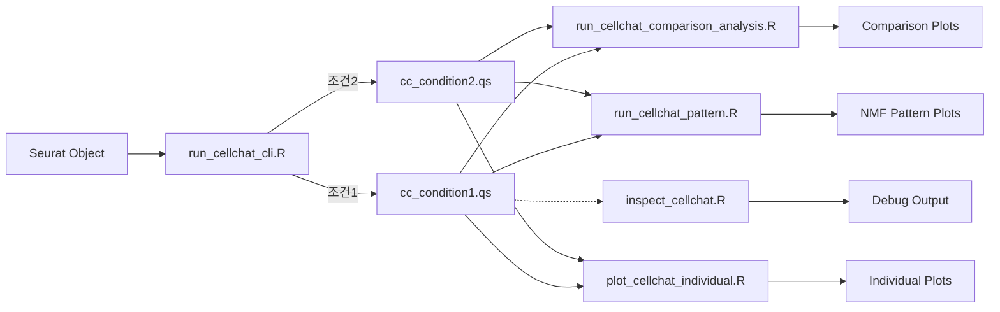

# CellChat 스크립트 가이드 (CELLCHAT_SCRIPTS.md)

이 문서는 `scripts/cellchat/` 디렉토리에 있는 스크립트들의 기능과 상호 관계를 설명합니다.

## 개요 (Executive Summary)

```
┌─────────────────────────────────────────────────────────────────────────────────┐
│                           CellChat Script Workflow                               │
├─────────────────────────────────────────────────────────────────────────────────┤
│                                                                                 │
│   [Seurat Object (.qs)]                                                         │
│           │                                                                     │
│           ▼                                                                     │
│   ┌───────────────────────┐                                                     │
│   │ run_cellchat_cli.R   │  ◄──  Main Entry Point (CLI)                        │
│   │  (Production 사용)    │      분석 실행 → CellChat objects 생성              │
│   └───────────────────────┘                                                     │
│           │                                                                     │
│           ▼                                                                     │
│   [CellChat Objects (.qs)]                                                      │
│           │                                                                     │
│     ┌─────┴─────────────────────────────────────────────────────┐               │
│     │                     │                  │                  │               │
│     ▼                     ▼                  ▼                  ▼               │
│ ┌──────────────┐   ┌──────────────┐   ┌─────────────┐   ┌─────────────┐         │
│ │ plot_...     │   │ run_...      │   │ run_...     │   │ inspect_... │         │
│ │ individual.R │   │ comparison_  │   │ pattern.R   │   │ cellchat.R  │         │
│ │              │   │ analysis.R   │   │             │   │             │         │
│ └──────────────┘   └──────────────┘   └─────────────┘   └─────────────┘         │
│      (개별 플롯)       (비교 분석)       (NMF 패턴)        (디버깅)              │
│                                                                                 │
│   ──────────────────────────────────────────────────────────────────────────    │
│                                                                                 │
│   [plot_cellchat_comparison.R]   ◄──  Simple wrapper (Legacy)                   │
│   [test_cellchat.R]              ◄──  개발용 테스트 스크립트 (Not for prod)      │
│                                                                                 │
└─────────────────────────────────────────────────────────────────────────────────┘
```

---

## 스크립트 분류

### 1. 🟢 Production 스크립트 (실제 사용)

| 스크립트 | 용도 | 상태 |
|---------|------|------|
| `run_cellchat_cli.R` | **메인 분석 실행** (CLI) | ✅ Production |
| `run_cellchat_comparison_analysis.R` | 두 조건 비교 분석 | ✅ Production |
| `run_cellchat_pattern.R` | NMF 패턴 분석 | ✅ Production |
| `plot_cellchat_individual.R` | 개별 객체 플롯 생성 | ✅ Production |
| `inspect_cellchat.R` | CellChat 객체 구조 검사 | ✅ Production (디버깅) |

### 2. 🟡 Legacy/Deprecated 스크립트

| 스크립트 | 용도 | 상태 |
|---------|------|------|
| `plot_cellchat_comparison.R` | 비교 플롯 생성 (단순 래퍼) | ⚠️ `run_cellchat_comparison_analysis.R`로 대체됨 |
| `test_cellchat.R` | 개발 테스트용 | 🔵 개발용 (Production 아님) |

---

## 상세 설명

### 1. `run_cellchat_cli.R` - **메인 분석 실행 (CLI)**

**목적**: Seurat 객체에서 CellChat 분석을 **실행**하는 핵심 스크립트

**기능**:
- Seurat `.qs` / `.rds` 파일 로드
- Cell type별 상호작용 확률 계산
- Sample-level 분석 (`--split_by`) 및 조건별 병합 (`--aggregate_by`) 지원
- DB 타입 선택 (`Secreted Signaling`, `ECM-Receptor`, `Cell-Cell Contact`)
- `cci_cellchat_wrapper.R` 함수 호출

**주요 옵션**:
```bash
Rscript run_cellchat_cli.R \
  -i /data/sobj/sample.qs \
  -g "anno3.scvi" \              # Cell type 컬럼
  -s "hos_no" \                   # 환자별 분리 (Optional)
  -a "g3" \                       # 조건별 병합 (Optional)
  --subset_aggregate "2,1" \      # 특정 조건만 분석
  -d "Secreted Signaling" \       # DB 타입
  -o /output/dir
```

---

### 2. `run_cellchat_comparison_analysis.R` - **비교 분석**

**목적**: 서로 다른 조건 (예: Control vs Stroke)의 **CellChat 객체를 비교**

**기능**:
- 두 CellChat 객체 로드 및 `mergeCellChat()`
- Replicate collapse (여러 환자 결과를 하나로 합침)
- Comparison 시각화:
  - `compareInteractions()`: 상호작용 통계 비교
  - `netVisual_diffInteraction()`: 차등 상호작용 Circle Plot
  - `netVisual_heatmap()`: 차등 상호작용 Heatmap
  - `rankNet()`: Information Flow 비교
  - `netVisual_bubble()`: Bubble Plot

**예시**:
```bash
Rscript run_cellchat_comparison_analysis.R \
  --file1 control_cellchat.qs \
  --file2 stroke_cellchat.qs \
  --name1 "Control" \
  --name2 "Stroke" \
  -o /output/comparison/
```

---

### 3. `run_cellchat_pattern.R` - **NMF 패턴 분석**

**목적**: **Communication Pattern**을 NMF(Non-negative Matrix Factorization)로 분해

**기능**:
- Outgoing (Sender) 및 Incoming (Receiver) 패턴 분석
- `identifyCommunicationPatterns()`
- `netAnalysis_river()`: Sankey (Alluvial) 다이어그램
- `netAnalysis_dot()`: Dot plot
- `selectK()`: 최적 패턴 수(k) 추정 (Optional)

**예시**:
```bash
Rscript run_cellchat_pattern.R \
  -i cellchat_object.qs \
  -o /output/patterns/ \
  -k 5                    # 패턴 수
```

---

### 4. `plot_cellchat_individual.R` - **개별 객체 플롯**

**목적**: 단일 또는 병합된 CellChat 객체에서 **기본 플롯** 생성

**기능**:
- Aggregated Network Circle Plot
- Bubble Plot
- Quantile 필터링 (`-t`): 약한 상호작용 제거
- Top-N Interaction 필터링 (`-k`): 링크당 상위 N개만 표시

**예시**:
```bash
Rscript plot_cellchat_individual.R \
  -i /path/to/merged_objects/ \
  -o /output/plots/ \
  -t 0.5                   # 상위 50% 상호작용만
```

---

### 5. `inspect_cellchat.R` - **디버깅용 구조 검사**

**목적**: CellChat 객체의 **내부 슬롯을 검사**하여 디버깅

**기능**:
- `@net$prob`: 상호작용 확률 3D 배열 확인
- `@net$count`, `@net$weight`: 집계된 네트워크 확인
- `@LR$LRsig`: 유효한 Ligand-Receptor 쌍 확인
- `@netP$pathways`: 유의미한 Pathway 목록 확인

**예시**:
```bash
Rscript inspect_cellchat.R \
  -i cellchat_object.qs \
  -n 30                    # Top-N 결과 출력
```

---

### 6. `plot_cellchat_comparison.R` - **[Legacy]**

**상태**: ⚠️ `run_cellchat_comparison_analysis.R`로 대체됨

**기능**: 두 CellChat 객체를 병합하고 비교 플롯 생성 (단순 래퍼)

**Note**: 이 스크립트는 `cci_cellchat_plotting.R`의 `plot_cellchat_comparison()` 함수만 호출합니다. 고급 분석 (information flow, bubble plot 등)은 `run_cellchat_comparison_analysis.R`를 사용하세요.

---

### 7. `test_cellchat.R` - **[개발용]**

**상태**: 🔵 개발 테스트용 (Production 아님)

**기능**: 
- Wrapper 함수 테스트
- 다운샘플링된 데이터로 파이프라인 검증

---

## 권장 워크플로우



---

## Git History (최근 변경 이력)

| Commit | 설명 |
|--------|------|
| `d5c2c1b` | `plot_cellchat_individual.R`: Quantile/Top-N 필터링 옵션 추가 |
| `e957154` | `plot_cellchat_comparison.R` 추가 |
| `0ddc7e6` | 플로팅 스크립트 추가, 병렬 처리 최적화 |
| `57c62e7` | Sample-level 적절한 집계 방식 구현 |
| `1b36c69` | `db.use` 파라미터 추가 (상호작용 타입 필터) |
| `abf0bf5` | CLI 지원, 로깅, 체크포인트 기능 추가 |

---

## 관련 문서

- `docs/cellchat/CELLCHAT_FLOW.md`: CellChat 방법론 상세
- `docs/cci/CCI_INTEGRATED_GUIDE_KR.md`: CCI 분석 통합 가이드
- `docs/cci/commands_KR.md`: CLI 명령어 예시
